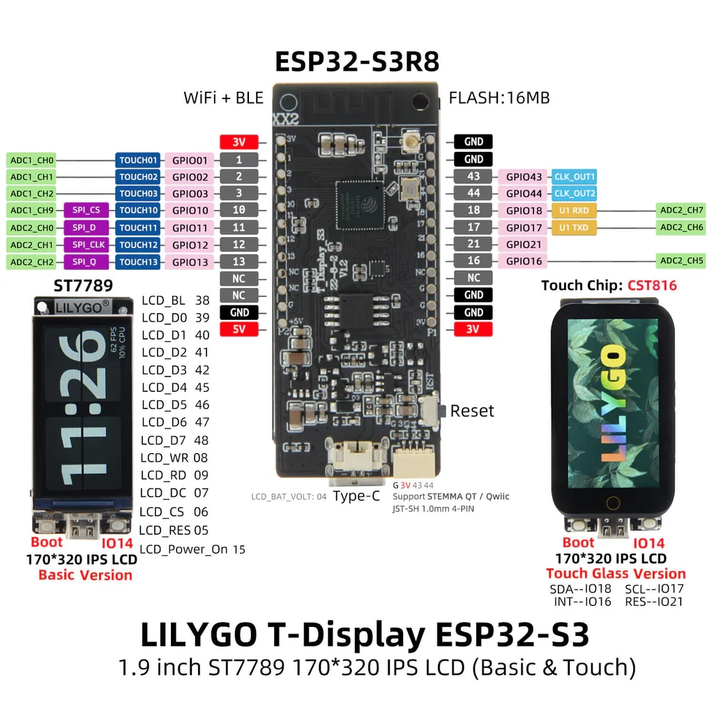

## Schematic

Modified form original Image to fix I2C SDA \<-\> SCL GPIO error



## Basic Configuration

Below example is for Lilygo T-Display S3 touch (ESP32-S3 1.9 inch ST7789 LCD Display), with ESPHome 2026.1.x.

```yaml
esphome:
  name: s3
  friendly_name: ESP32-S3 T-Display Touch

esp32:
  variant: esp32s3
  framework:
    type: esp-idf
  flash_size: 16MB

logger:

api:

ota:
  - platform: esphome

wifi:
  ssid: !secret wifi_ssid
  password: !secret wifi_password

binary_sensor:
  - platform: gpio
    pin:
      number: GPIO0
      inverted: true
    name: "Button 1"
  - platform: gpio
    pin:
      number: GPIO14
      inverted: true
    name: "Button 2"

output:
  - platform: ledc
    frequency: 2000
    pin: GPIO38
    id: backlight_output

light:
  - platform: monochromatic
    output: backlight_output
    name: LCD Backlight
    id: led
    restore_mode: ALWAYS_ON
    default_transition_length: 0s

spi:
  type: octal
  clk_pin: 8
  data_pins:
    - 39
    - 40
    - 41
    - 42
    - ignore_strapping_warning: true
      number: 45
    - ignore_strapping_warning: true
      number: 46
    - 47
    - 48

i2c:
  - scl: 17
    sda: 18
    scan: false
    id: i2c_onboard
    frequency: 400kHz

psram:
  speed: 80MHz
  mode: octal

touchscreen:
  - platform: cst816
    id: my_touchscreen
    i2c_id: i2c_onboard
    interrupt_pin: 16
    reset_pin: 21
    skip_probe: false
    on_touch:
    - lambda: |-
          ESP_LOGI("cal", "x=%d, y=%d, x_raw=%d, y_raw=%0d",
              touch.x, touch.y, touch.x_raw, touch.y_raw);

display:
  - platform: mipi_spi
    model: t-display-s3
    rotation: 270
    show_test_card: true # display basic hello-world

```
