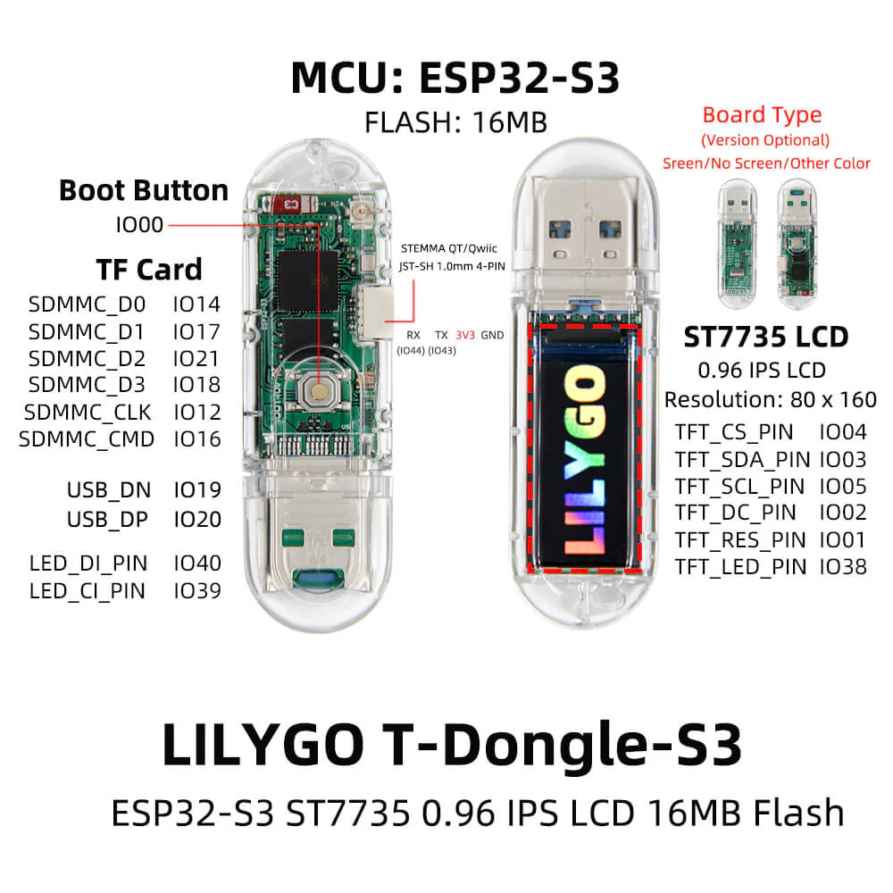

## Overview



## Basic Configuration

```yaml
esphome:
  name: tdongle
  friendly_name: tdongle

esp32:
  board: esp32-s3-devkitc-1
  framework:
    type: esp-idf
  flash_size: 16MB    

logger:

binary_sensor:
  - platform: gpio
    pin: GPIO0
    name: Button

spi:
  - id: spi_led
    clk_pin: GPIO39
    mosi_pin: GPIO40
  - id: spi_lcd
    clk_pin: 5
    mosi_pin: 3  

display:
  - platform: st7735
    spi_id: spi_lcd
    model: "INITR_MINI160X80"
    reset_pin: 1
    cs_pin: 4
    dc_pin: 2
    rotation: 270
    device_width: 82
    device_height: 161
    col_start: 0
    row_start: 0
    eight_bit_color: true
    invert_colors: true
    use_bgr: true
    auto_clear_enabled: false

output:
  - platform: ledc
    frequency: 2000
    pin: 38
    inverted: True
    id: backlight_output

light:
  - platform: monochromatic
    output: backlight_output
    name: "LCD Backlight"
    id: lcd_backlight
    restore_mode: ALWAYS_OFF
# RGB Led, APA102 on GPIO39/GPIO40
  - platform: spi_led_strip
    spi_id: spi_led
    num_leds: 1
    name: "FastLED SPI Light"
    data_rate: 1MHz # Adjust as needed, APA102 supports up to 20MHz, 1MHz is a safe starting point
```
