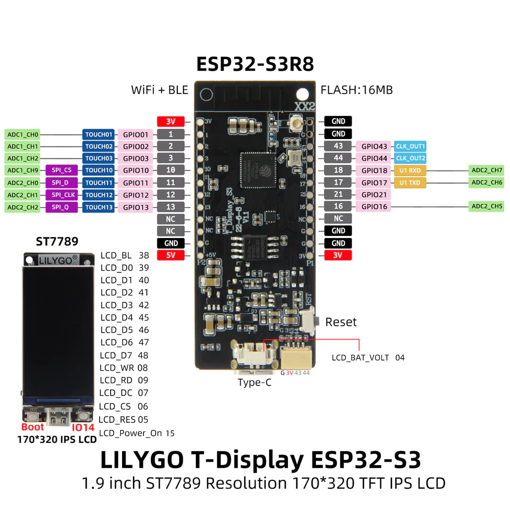

## Schematic



## Basic Configuration

```yaml
esphome:
  name: s3
  friendly_name: ESP32-S3 T-Display
  platformio_options:
    board_build.f_flash: 80000000L
    board_build.partitions: default_16MB.csv
    board_build.arduino.memory_type: qio_opi

external_components:
  - source: github://landonr/lilygo-tdisplays3-esphome
    components: [tdisplays3]

esp32:
  board: esp32-s3-devkitc-1
  variant: esp32s3
  framework:
    type: arduino
  flash_size: 16MB
  
# OTA flashing
ota:
  - platform: esphome

wifi: # Your Wifi network details
  
# Enable fallback hotspot in case wifi connection fails  
  ap:

# Enabling the logging component
logger:

# Enable Home Assistant API
api:

# Enable the captive portal
captive_portal:

binary_sensor:
  - platform: gpio
    pin:
      number: GPIO0
      inverted: true
    name: "Button 1"
  - platform: gpio
    pin:
      number: GPIO14
      inverted: true
    name: "Button 2"

output:
  - platform: ledc
    pin: GPIO38
    id: gpio38
    frequency: 2000

light:
  - platform: monochromatic
    output: gpio38
    name: "Backlight"
    restore_mode: RESTORE_DEFAULT_ON

# You can either setup the backlight as a switch like below or make it dimmable using a light output like above
# switch:
#   - platform: gpio
#     pin: GPIO38
#     name: "Backlight"
#     id: backlight
#     internal: true
#     restore_mode: RESTORE_DEFAULT_ON

display:
  - platform: tdisplays3
    id: disp
    update_interval: 1s
    rotation: 270
    lambda: |-
      it.printf(20, 70, id(roboto), Color(255, 0, 0), id(ha_time).now().strftime("%Y-%m-%d %H:%M:%S").c_str());

# Used for example above

font:
  - file: "gfonts://Roboto"
    id: roboto
    size: 30

time:
  - platform: homeassistant
    id: ha_time
```
