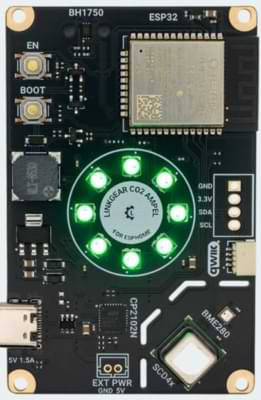

## Available for purchase on LinkGear

You can get your own LinkGear CO2 Ampel for ESPHome from the [LinkGear](https://linkgear.net/product/co2-ampel-multisensor-display-esphome/) website!

CO2 measurement in a room matters because high CO2 levels indicate poor air quality, which can lead to fatigue, impaired cognitive function, and potential health risks. The LinkGear CO2 Ampel features a high-accuracy SCD41 CO2 sensor, a BME280 temperature/humidity/pressure sensor, an illuminance sensor, and 8 RGB LEDs that can meaningfully output sensor readings.

You can use our pre-configured ESPHome configuration to output the CO2 status on the LEDs or change it to your liking (e.g., to control the LEDs independently).
If you want to learn more, please check [our manual and instructions page](https://docs.linkgear.net/books/lg-eca1/)

## Flashing

While all of our boards come pre-flashed and pre-tested, you can always re-flash it over at at [flash.linkgear.net](https://flash.linkgear.net/)

## Sensors

The device is equipped with the following sensors:

- SDC41 for accurate CO2 measurements
- BME280 for temperature/humidty measurements
- BH1750 for illuminance measurements (e.g. to control LED brightness)

## Pinout

| uC Pin | PCB Header        |
|--------|-------------------|
| IO18   | RGB LEDs (SK6812) |
| IO19   | Buzzer (passive)  |
| IO21   | SDA               |
| IO22   | SCL               |
| IO0    | SW0 (Boot)        |

## Basic Configuration

The configuration is available on [the GitHub page.](https://github.com/performeon/LinkGearMisc/tree/main/products/lg-eca)
