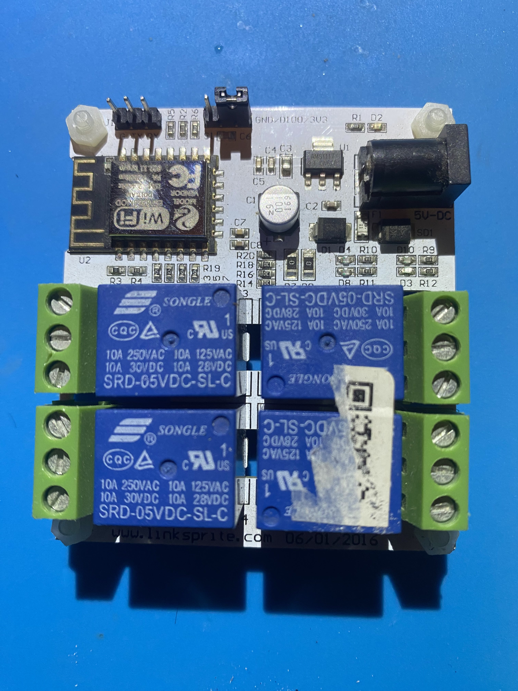

## Product Images



## GPIO Pinout

| Pin    | Function                                      |
| ------ | --------------------------------------------- |
| GPIO2  | Status LED (active low)                       |
| GPIO12 | Relay 1 (Switch)                              |
| GPIO13 | Relay 2 (Switch)                              |
| GPIO14 | Relay 3 (Switch)                              |
| GPIO16 | Relay 4 (Switch)                              |

## Basic Configuration

```yaml
substitutions:
  name: "esphome-linknoder4-01"
  friendly_name: "LinkNodeR4-01"

esphome:
  name: ${name}
  friendly_name: ${friendly_name}

esp8266:
  board: esp12e

wifi:

logger:

api:

ota:

status_led:
  pin:
    number: GPIO2
    inverted: True
switch:
  - platform: gpio
    pin: GPIO12
    id: relay1
    name: "${friendly_name} Relay 1"
  - platform: gpio
    pin: GPIO13
    id: relay2
    name: "${friendly_name} Relay 2"
  - platform: gpio
    pin: GPIO14
    id: relay3
    name: "${friendly_name} Relay 3"
  - platform: gpio
    pin: GPIO16
    id: relay4
    name: "${friendly_name} Relay 4"
```
