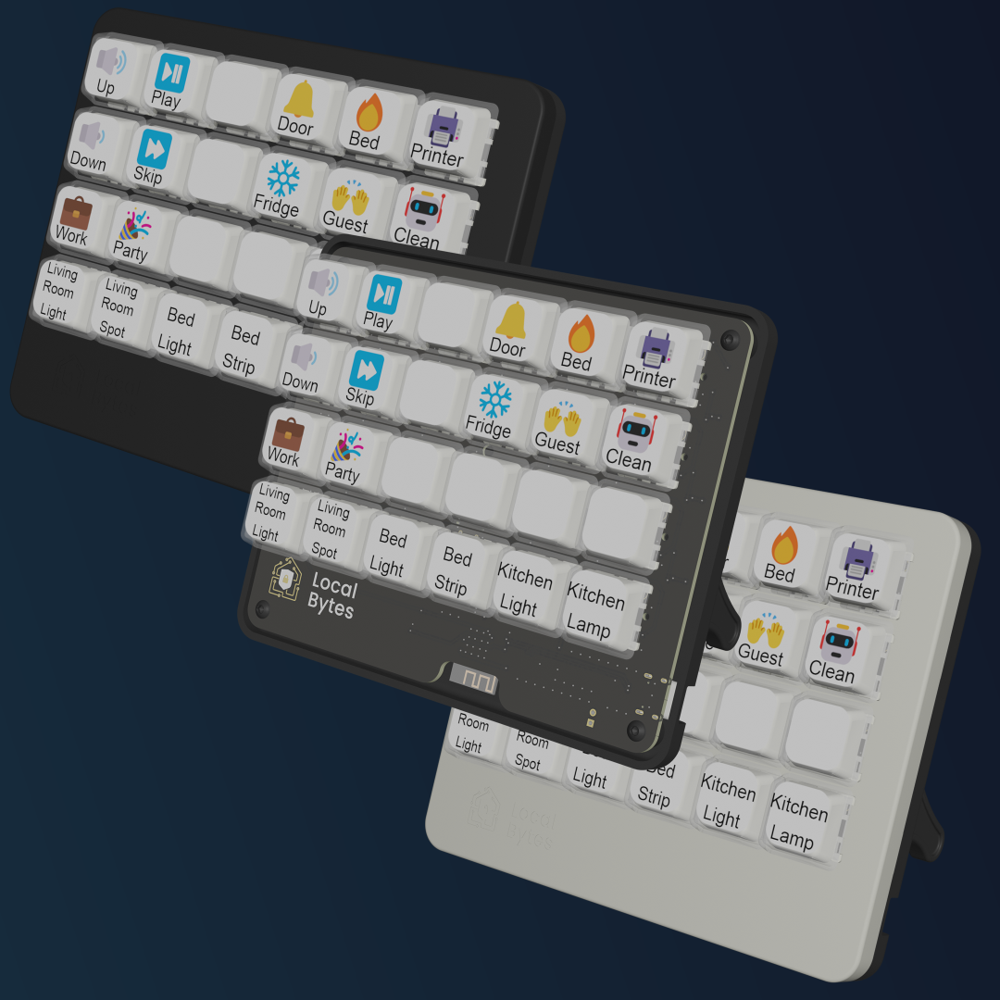

Maker: https://mylocalbytes.com/

Preflashed with ESPHome


The LocalDeck keypad lets you control your smart home in one convenient place.  
With 24 buttons – customisable and RGB backlit – this keypad makes controlling your home easy and instant for the whole family. (Yes, even your significant other).  
And we’re just going to say it – it looks pretty cool.  
Designed with super durable Kailh MX Brown Switches, you can be sure your deck will suit the style of any room.  

## Basic Configuration

```yaml
substitutions:
  name: localbytes-localdeck-<NAME>
  friendly_name: Localbytes LocalDeck <NAME>

packages:
  localbytes.plug-pm: github://LocalBytes/localdeck-config/blob/main/packages/localdeck-codegen/esphome-localdeck.yaml

esphome:
  name: ${name}
  name_add_mac_suffix: false
  friendly_name: ${friendly_name}

wifi:
  ssid: !secret wifi_ssid
  password: !secret wifi_password
```
