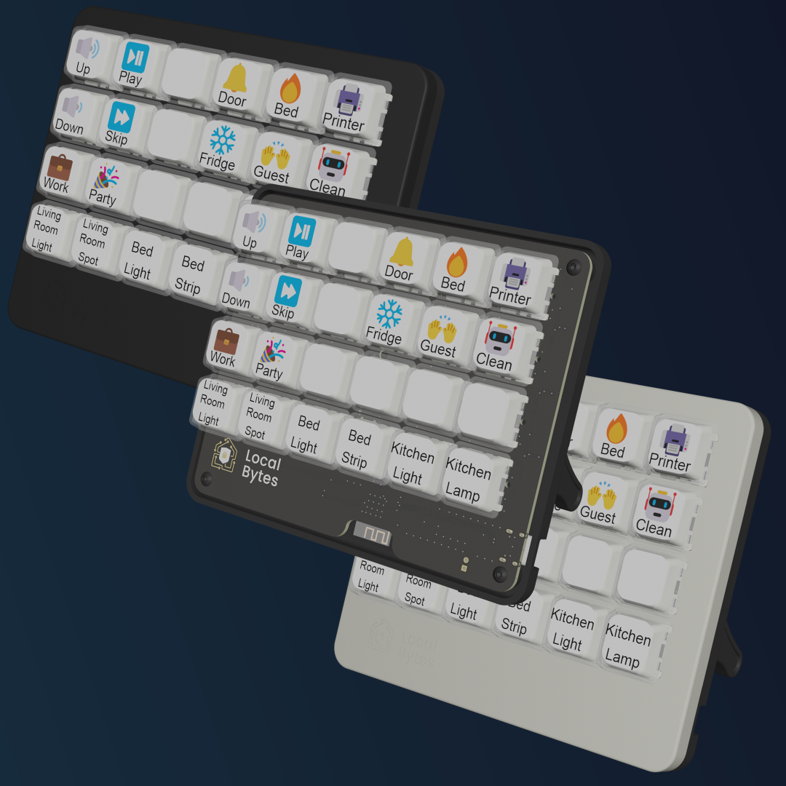

Maker: [https://mylocalbytes.com/](https://mylocalbytes.com/)

Preflashed with ESPHome

The LocalDeck keypad lets you control your smart home in one convenient place.  
With 24 buttons – customisable and RGB backlit – this keypad makes controlling your home easy and instant for the whole
family. (Yes, even your significant other).  
And we’re just going to say it – it looks pretty cool.  
Designed with super durable Kailh MX Brown Switches, you can be sure your deck will suit the style of any room.

## Configuration

The LocalDeck firmware is published as an ESPHome package
([github://LocalBytes/localdeck-config](https://github.com/LocalBytes/localdeck-config)). Pull it into
your own config with
`packages.localbytes.plug-pm: github://LocalBytes/localdeck-config/packages/localdeck-codegen/esphome-localdeck.yaml`,
then set the device `name`/`friendly_name` and your own `wifi:` credentials.

The upstream package:

```yaml url=https://github.com/LocalBytes/localdeck-config/blob/main/packages/localdeck-codegen/esphome-localdeck.yaml
```
