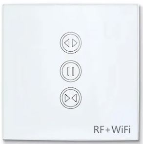

## GPIO Pinout

| Pin    | Function                            |
| ------ | ----------------------------------- |
| P6     | Green LED all buttons (inverted)    |
| P24    | Yellow Led top button (inverted)    |
| P8     | Yellow Led middle button (inverted) |
| P14    | Open Relay L2                       |
| P26    | Close Relay L1                      |
| P23    | Open button                         |
| P7     | Stop button                         |
| P9     | Close button                        |

## Basic Config

The LoraTap Sc411WSC curtain switch has 3 buttons, 2 yellow LED, 2 relay output (blue LED tied to buttons).



```yaml
substitutions:
  device_friendly_name: Blind Switch
  device_description: Cover
  open_duration: 10sec
  close_duration: 10sec
  ledlinki: P6
  open_switch: P23
  close_switch: P9
  stop_switch: P7
  close_relay: P14
  open_relay: P26

  interlock_time: 200ms

bk72xx:
  board: generic-bk7231n-qfn32-tuya

status_led:
  pin:
    number: P6
    inverted: true

binary_sensor:
  - platform: gpio
    name: ${device_friendly_name} S1 switch input
    pin: ${open_switch}
    id: open_cover_switch
    disabled_by_default: true
    filters:
      - invert:
    on_press:
      then:
        - lambda: |
            if (id(cover1).current_operation == COVER_OPERATION_IDLE) {
              // Cover is idle, check current state and open cover.
              id(cover1).make_call().set_command_open().perform();
            }
            else {
              // Cover is opening/closing. Stop it.
              id(cover1).make_call().set_command_stop().perform();
            }

  - platform: gpio
    name: ${device_friendly_name} S2 switch input
    pin: ${close_switch}
    id: close_cover_switch
    disabled_by_default: true
    filters:
      - invert:
    on_press:
      then:
        - lambda: |
            if (id(cover1).current_operation == COVER_OPERATION_IDLE) {
              // Cover is idle, check current state and close cover.
              id(cover1).make_call().set_command_close().perform();
            }
            else {
              // Cover is opening/closing. Stop it.
              id(cover1).make_call().set_command_stop().perform();
            }

  - platform: gpio
    name: ${device_friendly_name} remote stop switch
    pin: ${stop_switch}
    id: stop_cover_switch
    disabled_by_default: true
    filters:
      - invert:
    on_press:
      then:
        - lambda: |
            //Stop cover.
            id(cover1).make_call().set_command_stop().perform();

switch:
  - platform: gpio
    pin: ${open_relay}
    name: "Relay #1"
    internal: true
    id: relay1
    interlock_wait_time: ${interlock_time}
    interlock: &interlock_group [relay1, relay2]
    restore_mode: always off

  - platform: gpio
    pin: ${close_relay}
    name: "Relay #2"
    internal: true
    id: relay2
    interlock_wait_time: ${interlock_time}
    interlock: *interlock_group
    restore_mode: always off

cover:
  - platform: time_based
    name: "${device_friendly_name}"
    id: cover1
    #has_built_in_endstop: True

    open_action:
      - switch.turn_on: relay2
    open_duration: ${open_duration}

    close_action:
      - switch.turn_on: relay1
    close_duration: ${close_duration}

    stop_action:
      - switch.turn_off: relay2
      - switch.turn_off: relay1
```
