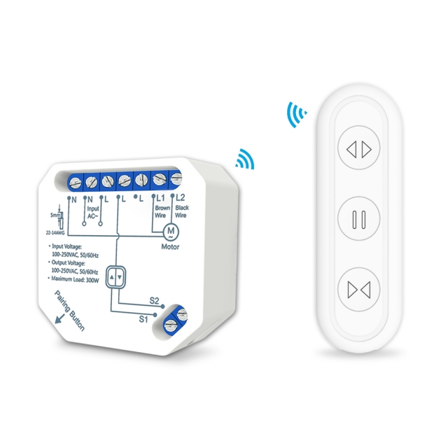

[Product Link](https://www.loratap.com/tuya-smart-life-wifi-curtain-blind-switch-module-with-remote-for-roller-shutter-electric-motor-google-home-aelxa-echo-smart-home-p0109.html)

Works with RF Remote

## GPIO Pinout

| Pin    | Function                   |
| ------ | -------------------------- |
| GPIO03 | LED (inverted)             |
| GPIO04 | S1 (external open switch input)/Open switch from remote |
| GPIO05 | S2 (external close switch input)/Open switch from remote |
| GPIO12 | Open Relay L1                   |
| GPIO13 | Stop switch from remote                     |
| GPIO14 | close Relay L2                   |

## Basic Config

The configuration below will simply set up the device as a 2-gang switch for lights.

```yaml
#SC511WSC
substitutions:
  device_name: "SC511WSC"
  friendly_name: "SC511WSC"
  device_ip: 192.168.X.X
  device_description: Cover
  open_duration: 19.80sec
  close_duration: 16.40sec
  ledlinki: GPIO03
  open_switch: GPIO04
  close_switch: GPIO05
  stop_switch: GPIO13
  close_relay: GPIO14
  open_relay: GPIO12
  pin_relay3: GPIO15
  interlock_time: 200ms

esphome:
  name: ${device_name}
  comment: "${device_description}"
#  platform: ESP8266

esp8266:
  restore_from_flash: true #writes each state change to flash for switch or light with restore_mode: RESTORE_DEFAULT_OFF/ON, see https://esphome.io/components/esphome.html#esp8266-restore-from-flash
  board: esp01_1m

# Enable logging
logger:
  esp8266_store_log_strings_in_flash: False # recommanded for ESP8266 https://esphome.io/components/sensor/custom.html
  #  baud_rate : 115200
  baud_rate: 0

wifi:
  ssid: !secret wifi_ssid
  password: !secret wifi_password
  manual_ip:
    static_ip: ${device_ip}
    gateway: 192.168.0.1
    subnet: 255.255.255.0
  # Enable fallback hotspot (captive portal) in case wifi connection fails
  ap:
    ssid: "ESPHOME"
    password: "12345678"

# Enable Home Assistant API
api:
  reboot_timeout: 15min
  encryption:
    key: !secret encryption_key

ota:
  password: !secret ota_password

# Example configuration entry
web_server:
  port: 80

sensor:
  - platform: wifi_signal
    name: ${device_name} Wifi Signal Strength
    update_interval: 60s
  - platform: uptime
    name: ${device_name} Uptime

#######################################
# Device specific Config Begins Below #
#######################################

binary_sensor:
#  - platform: gpio
#    pin: ${reset_button}
#    id: reset_switch
#    internal: true
#    on_press:
#      then:
#        - switch.toggle: reset
#
  - platform: gpio
    name: ${friendly_name} S1 switch input
    pin: ${open_switch}
    id: open_cover_switch
    disabled_by_default: true
    filters:
      - invert:
    on_press:
      then:
        - lambda: |
            if (id(cover1).current_operation == COVER_OPERATION_IDLE) {
              // Cover is idle, check current state and open cover.
              id(cover1).make_call().set_command_open().perform();
            }
            else {
              // Cover is opening/closing. Stop it.
              id(cover1).make_call().set_command_stop().perform();
            }
#
  - platform: gpio
    name: ${friendly_name} S2 switch input
    pin: ${close_switch}
    id: close_cover_switch
    disabled_by_default: true
    filters:
      - invert:
    on_press:
      then:
        - lambda: |
            if (id(cover1).current_operation == COVER_OPERATION_IDLE) {
              // Cover is idle, check current state and close cover.
              id(cover1).make_call().set_command_close().perform();
            }
            else {
              // Cover is opening/closing. Stop it.
              id(cover1).make_call().set_command_stop().perform();
            }
#
  - platform: gpio
    name: ${friendly_name} remote stop switch
    pin: ${stop_switch}
    id: stop_cover_switch
    disabled_by_default: true
    filters:
      - invert:
    on_press:
      then:
        - lambda: |
            //Stop cover.
            id(cover1).make_call().set_command_stop().perform();

#
switch:
#  - platform: restart
#    id: reset
#    name: "${friendly_name} Restart"

  - platform: gpio
    pin: ${open_relay}
    name: "Relay #1"
    internal: true
    id: relay1
    interlock_wait_time: ${interlock_time}
    interlock: &interlock_group [relay1, relay2]
    restore_mode: always off

  - platform: gpio
    pin: ${close_relay}
    name: "Relay #2"
    internal: true
    id: relay2
    interlock_wait_time: ${interlock_time}
    interlock: *interlock_group
    restore_mode: always off

  - platform: gpio
    pin: ${pin_relay3}
    id: relay3

status_led:
  pin:
    number: GPIO3
    inverted: true

#######################################
# Device Time based cover #
#######################################
cover:
  - platform: time_based
    name: "${friendly_name}"
    id: cover1
    has_built_in_endstop: True

    open_action:
      - switch.turn_on: relay2
    open_duration: ${open_duration}

    close_action:
      - switch.turn_on: relay1
    close_duration: ${close_duration}

    stop_action:
      - switch.turn_off: relay2
      - switch.turn_off: relay1
```
