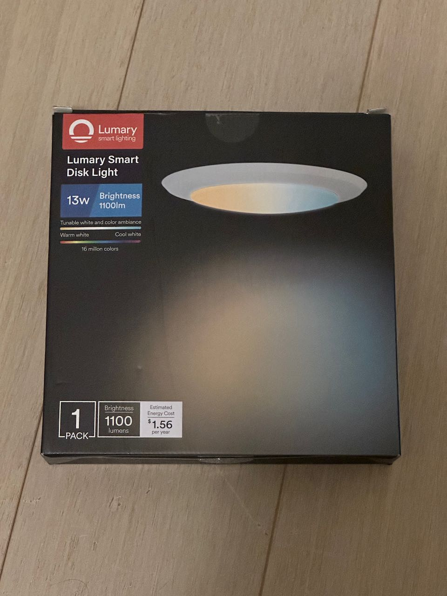
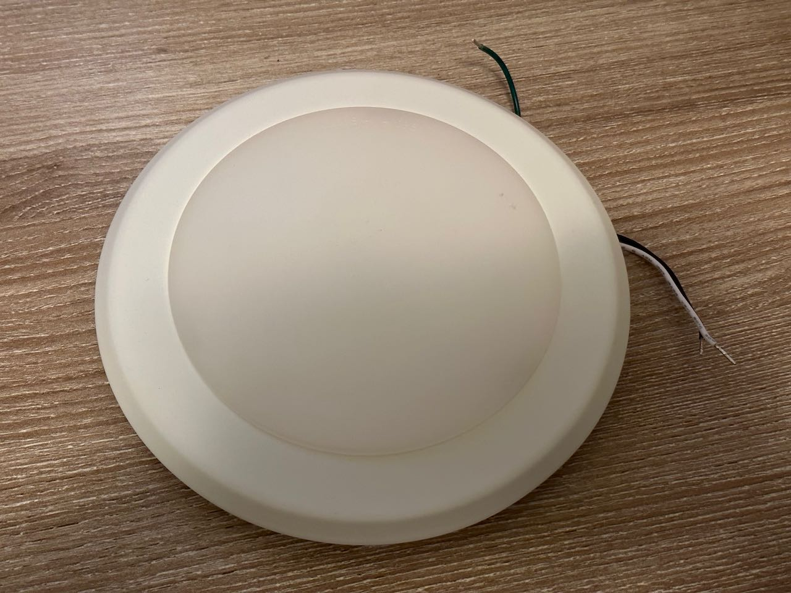
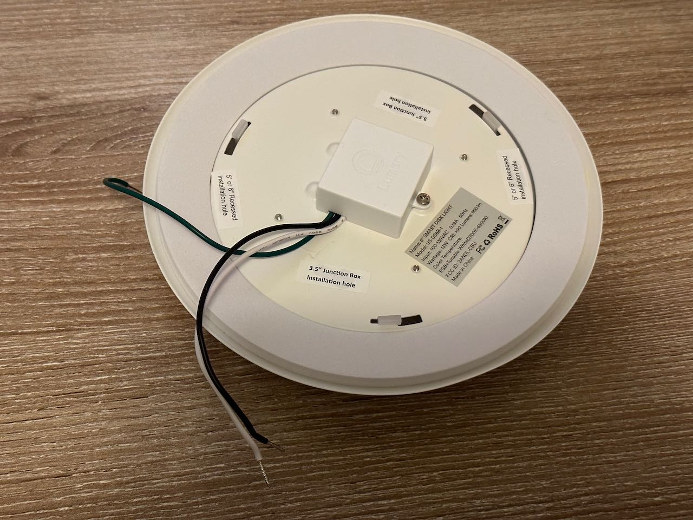
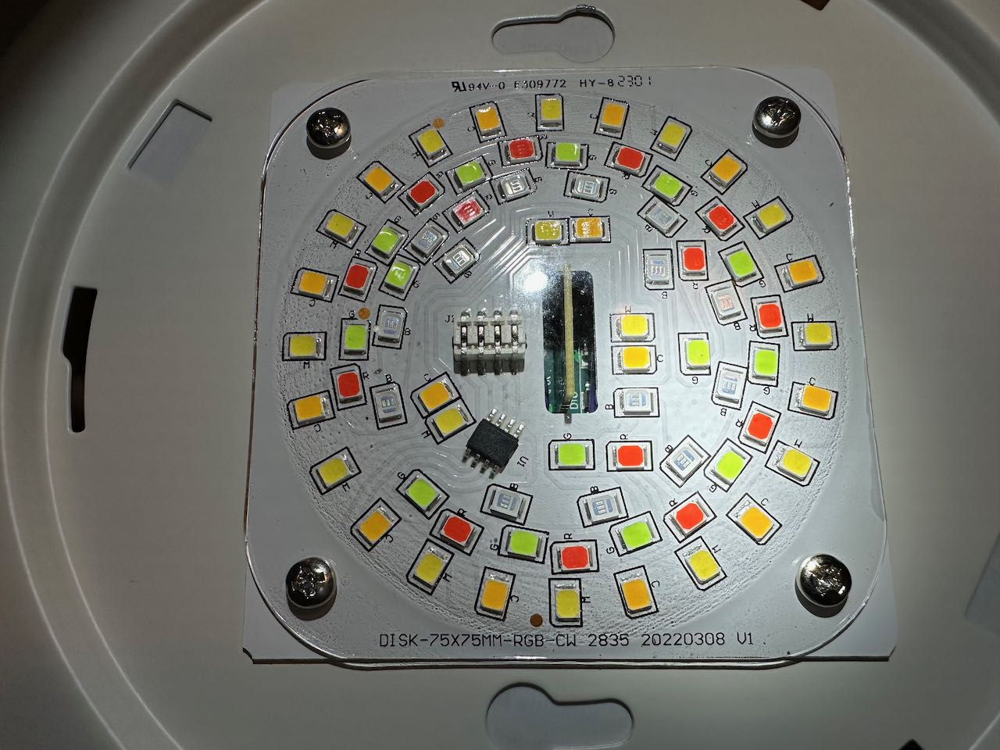
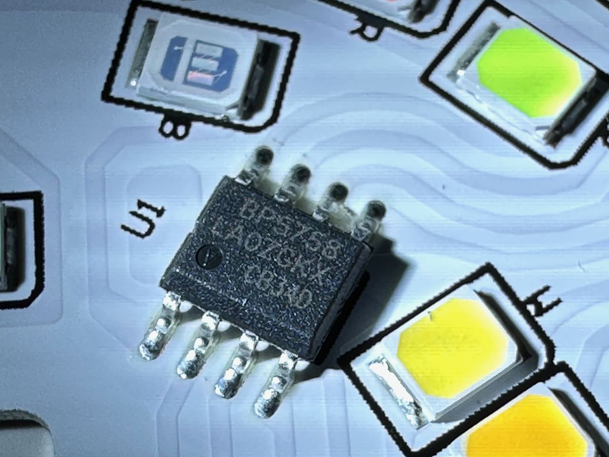
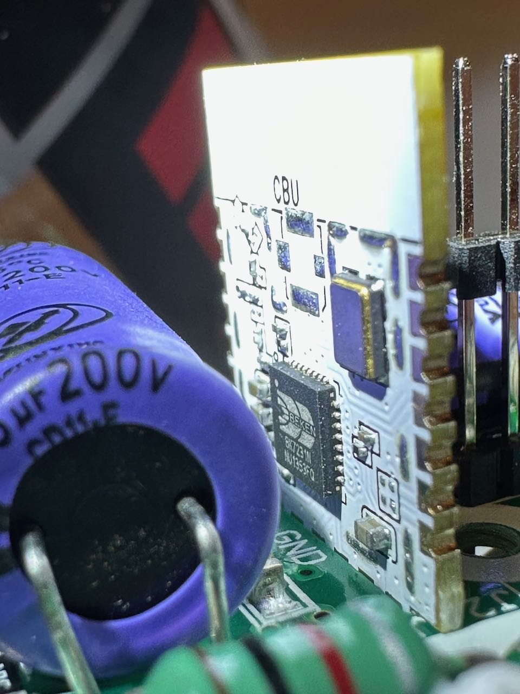

## Custom Firmware Needed

This device uses Beken BK7231N chip on CBU PCB module that comes with Tuya firmware. It can be flashed with ESPHome using cloudcutter following instructions [here](https://docs.libretiny.eu/docs/projects/esphome/).

This requires a custom fork of ESPHome to complie the firmware for the Beken MCU as it is not natively support by ESPHome yet (<https://github.com/esphome/esphome/pull/3509>).

Cloudcutter relies on a vulnerability in the original Tuya firmware to work, so before attempting to use cloudcutter, pair the light using Tuya app on your phone (you can use a guest account), and check the firmware version (under Software Update section - be careful not to trigger the update though). The list of incompatible firmware versions is [here](https://github.com/tuya-cloudcutter/tuya-cloudcutter/wiki/Known-Patched-Firmware). In case your version is not compatible, you can either resort to alternative flashing methods that requires disassembly and wiring, or you can try buying another unit of the same model (e.g., try alternative pacakaging - 4 pack instead of 1-pack, or vice versa).

## GPIO Pinout

Due to the fact that this uses a custom ESPHome firmware the pin numbers start with a P instead of the usual GPIO

| Pin | Name   | Function         |
| --- | ------ | ---------------- |
| P6  | LED    | LED Driver Clock |
| P7  | LED    | LED Driver Data  |

## Basic Configuration

```yaml
substitutions:
  device_name: My Lumary Disk Light

esphome:
  name: ${device_name}

libretiny:
  board: generic-bk7231n-qfn32-tuya
  framework:
    version: latest
  
# OTA flashing
ota:
  - platform: esphome

wifi: # Your Wifi network details
  
# Enable fallback hotspot in case wifi connection fails  
  ap:

# Enabling the logging component
logger:

# Enable Home Assistant API
api:

# Enable the captive portal
captive_portal:

bp5758d:
  data_pin: P7
  clock_pin: P6

output:
  - platform: bp5758d
    id: output_red
    channel: 3
  - platform: bp5758d
    id: output_green
    channel: 2
  - platform: bp5758d
    id: output_blue
    channel: 1
  - platform: bp5758d
    id: output_white
    channel: 5
  - platform: bp5758d
    id: output_warmwhite
    channel: 4

light:
  - platform: rgbww
    name: ${device_name}
    red: output_red
    green: output_green
    blue: output_blue
    cold_white: output_white
    warm_white: output_warmwhite
    cold_white_color_temperature: 6500 K
    warm_white_color_temperature: 2700 K
    color_interlock: true
```
