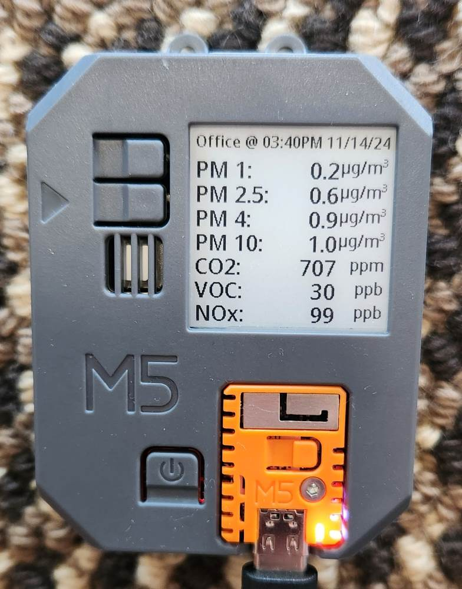
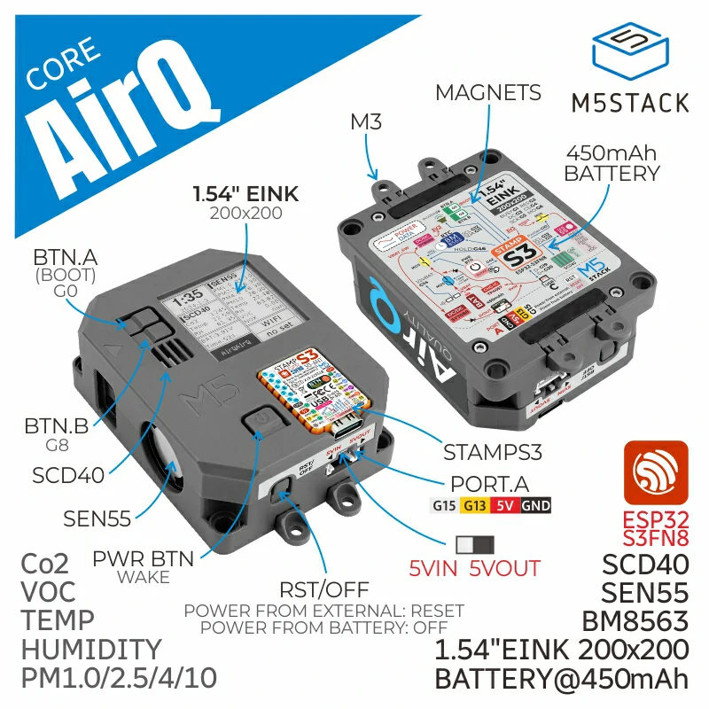

## Product Images




## Description

M5Stack AirQ is an integrated, low-power air quality monitoring device designed to provide comprehensive air quality monitoring solutions. It features multiple components, including the SEN55 air quality sensor and the SCD40 CO2 sensor, enabling the monitoring of PM1.0, PM2.5, PM4, PM10 particles, temperature, humidity, VOC, and CO2 concentrations. Powered by the M5stack StampS3 main controller utilizing ESP32-S3FN8 and equipped with 8M Flash memory.

This ESPhome YAML will enable the ability to display some of the sensor data on the integrated paperwhite display, as well as send all of the sensor data to Home Assistant.

The device comes with a 1.54-inch e-ink display with a resolution of 200x200, providing a clear visual representation of the data.

This YAML was adapted from a sample provided by **joshblake87** at https://www.reddit.com/r/Esphome/comments/1e2q8jj/m5_stack_airq_air_quality_sensor/

## Known Issues

- It doesn't utilize the onboard 450mAh battery.

## GPIO Pinout

|  Pin   | Function       |
| ------ | -------------- |
| GPIO1 | Ink Screen Busy |
| GPIO2 | Ink Screen RST  |
| GPIO3 | Ink Screen D/C  |
| GPIO4 | Ink Screen CS   |
| GPIO5 | Ink Screen SCK  |
| GPIO6 | Ink Screen MOSI |
| GPIO8 | Button B        |
| GPIO9 | beep            |
| GPIO10 | SEN55 Power Switch |
| GPIO11 | SEN55 SDA      |
| GPIO12 | SEN55 SCL      |
| GPIO26 | Speaker Pin 2  |
| GPIO15 | GROVE A SCL    |
| GPIO13 | GROVE A SDA    |

## Example Configuration

```yml
# M5Stack AirQ ESPHome Configuration
# ------------------------------------------
# Before using this configuration:
# 1. Update the substitutions section with your values from Home Assistant:
#    - encryption_key: 32-character key for API encryption
#    - ota_password: Password for OTA updates
#    - ap_password: Password for fallback AP mode (optional)
# 2. Ensure your secrets.yaml contains:
#    wifi_ssid: "YOUR_WIFI_SSID"
#    wifi_password: "YOUR_WIFI_PASSWORD"
# 3. Adjust other substitutions as needed (devicename, location, etc)

substitutions:
  devicename: airq
  friendlyname: AirQ
  location: Office
  sensor_interval: 60s

# Security related substitutions - CHANGE THESE VALUES!
  encryption_key: "YOUR_32_CHARACTER_ENCRYPTION_KEY_HERE"
  ota_password: "YOUR_OTA_PASSWORD_HERE"
  ap_password: "airq-device"  # Fallback AP password
# Sensor calibration
  altitude_compensation: "207m"  # Local altitude for CO2 sensor

esphome:
  name: ${devicename}
  friendly_name: ${friendlyname}
  area: ${location}
  platformio_options:
    board_build.mcu: esp32s3
    board_build.name: "M5Stack StampS3"
    board_build.upload.flash_size: 8MB
    board_build.upload.maximum_size: 8388608
    board_build.vendor: M5Stack
  on_boot:
  - priority: 800
    then:
      - output.turn_on: enable
  - priority: 800
    then:
      - pcf8563.read_time

esp32:
  board: esp32-s3-devkitc-1 #m5stack-stamps3
  variant: esp32s3
  framework:
    type: arduino

# Enable logging
logger:

# Enable Home Assistant API
api:
  encryption:
    key: "${encryption_key}"

ota:
  - platform: esphome
    password: "${ota_password}"

wifi:
  ssid: !secret wifi_ssid
  password: !secret wifi_password

  # Enable fallback hotspot (captive portal) in case wifi connection fails
  ap:
    ssid: "${devicename} Fallback Hotspot"
    password: "${ap_password}"

captive_portal:

output:
  - platform: gpio
    pin: GPIO10
    id: enable

web_server:
   port: 80
   include_internal: true

i2c:
  sda: GPIO11
  scl: GPIO12
  scan: true
  frequency: 50kHz
  id: bus_a

spi:
  clk_pin: GPIO05
  mosi_pin: GPIO06

time:
  - platform: pcf8563
    address: 0x51
    update_interval: 10min
  - platform: sntp
    id: sntp_time
    timezone: CST6CDT,M3.2.0,M11.1.0
#   US Central Time zone, update with your own
#    servers:
#      - YOUR HOME ASSISTANT IP HERE
    on_time_sync:
      then:
        pcf8563.write_time:

light:
  - platform: esp32_rmt_led_strip
    rgb_order: GRB
    pin: GPIO21
    num_leds: 1
    rmt_channel: 0
    chipset: SK6812
    name: "LED"
    restore_mode: RESTORE_AND_ON
    id: id_led

text_sensor:
  - platform: wifi_info
    ip_address:
      name: IP
    ssid:
      name: SSID
    bssid:
      name: BSSID
    mac_address:
      name: MAC
    dns_address:
      name: DNS

  - platform: template
    name: "VOC IAQ Classification"
    id: iaq_voc
    icon: "mdi:checkbox-marked-circle-outline"
    lambda: |-
      if (int(id(voc).state) < 100.0) {
        return {"Great"};
      }
      else if (int(id(voc).state) <= 200.0) {
        return {"Good"};
      }
      else if (int(id(voc).state) <= 300.0) {
        return {"Light"};
      }
      else if (int(id(voc).state) <= 400.0) {
        return {"Moderate"};
      }
      else if (int(id(voc).state) <= 500.0) {
        return {"Heavy"};
      }
      else {
        return {"unknown"};
      }

  - platform: template
    name: "NOX IAQ Classification"
    id: iaq_nox
    icon: "mdi:checkbox-marked-circle-outline"
    lambda: |-
      if (int(id(nox).state) < 100.0) {
        return {"Great"};
      }
      else if (int(id(nox).state) <= 200.0) {
        return {"Good"};
      }
      else if (int(id(nox).state) <= 300.0) {
        return {"Light"};
      }
      else if (int(id(nox).state) <= 400.0) {
        return {"Moderate"};
      }
      else if (int(id(nox).state) <= 500.0) {
        return {"Heavy"};
      }
      else {
        return {"unknown"};
      }

sensor:
  - platform: scd4x
    co2:
      name: CO2
      id: CO2
      filters:
        - lambda: |-
            float MIN_VALUE = 300.0;
            float MAX_VALUE = 2500.0;
            if (MIN_VALUE <= x && x <= MAX_VALUE) return x;
            else return {};
    temperature:
      name: CO2 Temperature
      id: CO2_temperature
      filters:
        - lambda: |-
            float MIN_VALUE = -40.0;
            float MAX_VALUE = 100.0;
            if (MIN_VALUE <= x && x <= MAX_VALUE) return x;
            else return {};
    humidity:
      name: CO2 Humidity
      id: CO2_humidity
      filters:
        - lambda: |-
            float MIN_VALUE = 0.0;
            float MAX_VALUE = 100.0;
            if (MIN_VALUE <= x && x <= MAX_VALUE) return x;
            else return {};
    altitude_compensation: 207m
    address: 0x62
    update_interval: $sensor_interval

  - platform: wifi_signal # Reports the WiFi signal strength/RSSI in dB
    name: "Wifi Signal dB"
    id: wifi_signal_db
    update_interval: 60s
    entity_category: "diagnostic"

  - platform: sen5x
    id: sen55
    pm_1_0:
      name: "PM 1"
      id: PM1_0
      accuracy_decimals: 2
    pm_2_5:
      name: "PM 2.5"
      id: PM2_5
      accuracy_decimals: 2
    pm_4_0:
      name: "PM 4"
      id: PM4_0
      accuracy_decimals: 2
    pm_10_0:
      name: "PM 10"
      id: PM10_0
      accuracy_decimals: 2
    temperature:
      name: "SEN55 Temperature"
      id: sen55_temperature
      accuracy_decimals: 2
    humidity:
      name: "SEN55 Humidity"
      id: sen55_humidity
      accuracy_decimals: 2
    voc:
      name: VOC
      id: voc
      accuracy_decimals: 2
      algorithm_tuning:
        index_offset: 100
        learning_time_offset_hours: 12
        learning_time_gain_hours: 12
        gating_max_duration_minutes: 180
        std_initial: 50
        gain_factor: 230
    nox:
      name: NOX
      id: nox
      accuracy_decimals: 2
      algorithm_tuning:
        index_offset: 100
        learning_time_offset_hours: 12
        learning_time_gain_hours: 12
        gating_max_duration_minutes: 180
        std_initial: 50
        gain_factor: 230
    temperature_compensation:
      offset: 0
      normalized_offset_slope: 0
      time_constant: 0
    acceleration_mode: low
    store_baseline: true
    address: 0x69
    update_interval: $sensor_interval

  - platform: template
    name: Temperature
    id: temperature
    lambda: |-
      return (( id(sen55_temperature).state + id(CO2_temperature).state ) / 2 ) - id(temperature_offset).state;
    unit_of_measurement: "°C"
    icon: "mdi:thermometer"
    device_class: "temperature"
    state_class: "measurement"
    update_interval: $sensor_interval
    accuracy_decimals: 2

  - platform: template
    name: Humidity
    id: humidity
    lambda: |-
      return (( id(sen55_humidity).state + id(CO2_humidity).state ) / 2) - id(humidity_offset).state;
    unit_of_measurement: "%"
    icon: "mdi:water-percent"
    device_class: "humidity"
    state_class: "measurement"
    update_interval: $sensor_interval
    accuracy_decimals: 2

binary_sensor:
  - platform: gpio
    name: Button A
    pin:
      number: GPIO0
      ignore_strapping_warning: true
      mode:
        input: true
      inverted: true
    on_press:
      then:
        - component.update: disp

  - platform: gpio
    pin:
      number: GPIO08
#      ignore_strapping_warning: true
      mode:
        input: true
        pullup: true
      inverted: true
    name: Button B

  - platform: gpio
    pin:
      number: GPIO46
      ignore_strapping_warning: true
    name: Button Hold

  - platform: gpio
    pin:
      number: GPIO42
#      ignore_strapping_warning: true
    name: Button Power

button:
  - platform: restart
    name: Restart

  - platform: template
    name: "CO2 Force Manual Calibration"
    entity_category: "config"
    on_press:
      then:
        - scd4x.perform_forced_calibration:
            value: !lambda 'return id(co2_cal).state;'

  - platform: template
    name: "SEN55 Force Manual Clean"
    entity_category: "config"
    on_press:
      then:
        - sen5x.start_fan_autoclean: sen55

number:
  - platform: template
    name: "CO2 Calibration Value"
    optimistic: true
    min_value: 400
    max_value: 1000
    step: 5
    id: co2_cal
    icon: "mdi:molecule-co2"
    entity_category: "config"

  - platform: template
    name: Humidity Offset
    id: humidity_offset
    restore_value: true
    initial_value: 0.0
    min_value: -70.0
    max_value: 70.0
    entity_category: "CONFIG"
    unit_of_measurement: "%"
    optimistic: true
    update_interval: never
    step: 0.1
    mode: box

  - platform: template
    name: Temperature Offset
    id: temperature_offset
    restore_value: true
    initial_value: 0.0
    min_value: -70.0
    max_value: 70.0
    entity_category: "CONFIG"
    unit_of_measurement: "°C"
    optimistic: true
    update_interval: never
    step: 0.1
    mode: box

display:
  - platform: waveshare_epaper
    model: 1.54inv2
    id: disp
    cs_pin: GPIO04
    dc_pin: GPIO03
    reset_pin: GPIO02
    busy_pin:
      number: GPIO01
      inverted: false
    full_update_every: 6
    reset_duration: 2ms
    update_interval: 10s
    lambda: |-
      auto now = id(sntp_time).now().strftime("%I:%M%p %m/%d/%y").c_str();
      it.printf(it.get_width()/2, 0, id(f16), TextAlign::TOP_CENTER, "${location} @ %s", now);

      it.print(0, 23, id(f24), TextAlign::TOP_LEFT, "PM 1: ");
      it.print(0, 48, id(f24), TextAlign::TOP_LEFT, "PM 2.5: ");
      it.print(0, 73, id(f24), TextAlign::TOP_LEFT, "PM 4: ");
      it.print(0, 98, id(f24), TextAlign::TOP_LEFT, "PM 10: ");
      it.print(0, 123, id(f24), TextAlign::TOP_LEFT, "CO2: ");
      it.print(0, 148, id(f24), TextAlign::TOP_LEFT, "VOC: ");
      it.print(0, 173, id(f24), TextAlign::TOP_LEFT, "NOx: ");

      it.printf(it.get_width() - 50, 23, id(f24), TextAlign::TOP_RIGHT, "%.1f", id(PM1_0).state);
      it.print(it.get_width(), 23, id(f18), TextAlign::TOP_RIGHT, "µg/m³");

      it.printf(it.get_width() - 50, 48, id(f24), TextAlign::TOP_RIGHT, "%.1f", id(PM2_5).state);
      it.print(it.get_width(), 48, id(f18), TextAlign::TOP_RIGHT, "µg/m³");

      it.printf(it.get_width() - 50, 73, id(f24), TextAlign::TOP_RIGHT, "%.1f", id(PM4_0).state);
      it.print(it.get_width(), 73, id(f18), TextAlign::TOP_RIGHT, "µg/m³");

      it.printf(it.get_width() - 50, 98, id(f24), TextAlign::TOP_RIGHT, "%.1f", id(PM10_0).state);
      it.print(it.get_width(), 98, id(f18), TextAlign::TOP_RIGHT, "µg/m³");

      it.printf(it.get_width() - 50, 123, id(f24), TextAlign::TOP_RIGHT, "%.0f", id(CO2).state);
      it.print(it.get_width(), 123, id(f18), TextAlign::TOP_RIGHT, "ppm");

      it.printf(it.get_width() - 50, 148, id(f24), TextAlign::TOP_RIGHT, "%.0f", id(voc).state);
      it.print(it.get_width(), 148, id(f18), TextAlign::TOP_RIGHT, "ppb");

      it.printf(it.get_width() - 50, 173, id(f24), TextAlign::TOP_RIGHT, "%.0f", id(nox).state);
      it.print(it.get_width(), 173, id(f18), TextAlign::TOP_RIGHT, "ppb");

font:
  - file:
      type: gfonts
      family: Noto Sans Display
      weight: 500
    glyphs: ['&', '@', '!', ',', '.', '"', '%', '(', ')', '+', '-', '_', ':', '°', '0',
        '1', '2', '3', '4', '5', '6', '7', '8', '9', 'A', 'B', 'C', 'D', 'E',
        'F', 'G', 'H', 'I', 'J', 'K', 'L', 'M', 'N', 'O', 'P', 'Q', 'R', 'S',
        'T', 'U', 'V', 'W', 'X', 'Y', 'Z', ' ', 'a', 'b', 'c', 'd', 'e', 'f',
        'g', 'h', 'i', 'j', 'k', 'l', 'm', 'n', 'o', 'p', 'q', 'r', 's', 't',
        'u', 'v', 'w', 'x', 'y', 'z','å', 'ä', 'ö', '/', 'µ', '³', '’']
    id: f16
    size: 16
  - file:
      type: gfonts
      family: Noto Sans Display
      weight: 500
    glyphs: ['&', '@', '!', ',', '.', '"', '%', '(', ')', '+', '-', '_', ':', '°', '0',
        '1', '2', '3', '4', '5', '6', '7', '8', '9', 'A', 'B', 'C', 'D', 'E',
        'F', 'G', 'H', 'I', 'J', 'K', 'L', 'M', 'N', 'O', 'P', 'Q', 'R', 'S',
        'T', 'U', 'V', 'W', 'X', 'Y', 'Z', ' ', 'a', 'b', 'c', 'd', 'e', 'f',
        'g', 'h', 'i', 'j', 'k', 'l', 'm', 'n', 'o', 'p', 'q', 'r', 's', 't',
        'u', 'v', 'w', 'x', 'y', 'z','å', 'ä', 'ö', '/', 'µ', '³', '’']
    id: f18
    size: 18
  - file:
      type: gfonts
      family: Noto Sans Display
      weight: 500
    id: f12
    size: 12
    glyphs: ['&', '@', '!', ',', '.', '"', '%', '(', ')', '+', '-', '_', ':', '°', '0',
        '1', '2', '3', '4', '5', '6', '7', '8', '9', 'A', 'B', 'C', 'D', 'E',
        'F', 'G', 'H', 'I', 'J', 'K', 'L', 'M', 'N', 'O', 'P', 'Q', 'R', 'S',
        'T', 'U', 'V', 'W', 'X', 'Y', 'Z', ' ', 'a', 'b', 'c', 'd', 'e', 'f',
        'g', 'h', 'i', 'j', 'k', 'l', 'm', 'n', 'o', 'p', 'q', 'r', 's', 't',
        'u', 'v', 'w', 'x', 'y', 'z','å', 'ä', 'ö', '/', 'µ', '³', '’']
  - file:
      type: gfonts
      family: Noto Sans Display
      weight: 500
    id: f24
    size: 24
    glyphs: ['&', '@', '!', ',', '.', '"', '%', '(', ')', '+', '-', '_', ':', '°', '0',
        '1', '2', '3', '4', '5', '6', '7', '8', '9', 'A', 'B', 'C', 'D', 'E',
        'F', 'G', 'H', 'I', 'J', 'K', 'L', 'M', 'N', 'O', 'P', 'Q', 'R', 'S',
        'T', 'U', 'V', 'W', 'X', 'Y', 'Z', ' ', 'a', 'b', 'c', 'd', 'e', 'f',
        'g', 'h', 'i', 'j', 'k', 'l', 'm', 'n', 'o', 'p', 'q', 'r', 's', 't',
        'u', 'v', 'w', 'x', 'y', 'z','å', 'ä', 'ö', '/', 'µ', '³', '’']
  - file:
      type: gfonts
      family: Noto Sans Display
      weight: 500
    id: f36
    size: 36
    glyphs: ['&', '@', '!', ',', '.', '"', '%', '(', ')', '+', '-', '_', ':', '°', '0',
        '1', '2', '3', '4', '5', '6', '7', '8', '9', 'A', 'B', 'C', 'D', 'E',
        'F', 'G', 'H', 'I', 'J', 'K', 'L', 'M', 'N', 'O', 'P', 'Q', 'R', 'S',
        'T', 'U', 'V', 'W', 'X', 'Y', 'Z', ' ', 'a', 'b', 'c', 'd', 'e', 'f',
        'g', 'h', 'i', 'j', 'k', 'l', 'm', 'n', 'o', 'p', 'q', 'r', 's', 't',
        'u', 'v', 'w', 'x', 'y', 'z','å', 'ä', 'ö', '/', 'µ', '³', '’']
  - file:
      type: gfonts
      family: Noto Sans Display
      weight: 500
    id: f48
    size: 48
    glyphs: ['&', '@', '!', ',', '.', '"', '%', '(', ')', '+', '-', '_', ':', '°', '0',
        '1', '2', '3', '4', '5', '6', '7', '8', '9', 'A', 'B', 'C', 'D', 'E',
        'F', 'G', 'H', 'I', 'J', 'K', 'L', 'M', 'N', 'O', 'P', 'Q', 'R', 'S',
        'T', 'U', 'V', 'W', 'X', 'Y', 'Z', ' ', 'a', 'b', 'c', 'd', 'e', 'f',
        'g', 'h', 'i', 'j', 'k', 'l', 'm', 'n', 'o', 'p', 'q', 'r', 's', 't',
        'u', 'v', 'w', 'x', 'y', 'z','å', 'ä', 'ö', '/', 'µ', '³', '’']
  - file:
      type: gfonts
      family: Noto Sans Display
      weight: 500
    id: f32
    size: 32
    glyphs: ['&', '@', '!', ',', '.', '"', '%', '(', ')', '+', '-', '_', ':', '°', '0',
        '1', '2', '3', '4', '5', '6', '7', '8', '9', 'A', 'B', 'C', 'D', 'E',
        'F', 'G', 'H', 'I', 'J', 'K', 'L', 'M', 'N', 'O', 'P', 'Q', 'R', 'S',
        'T', 'U', 'V', 'W', 'X', 'Y', 'Z', ' ', 'a', 'b', 'c', 'd', 'e', 'f',
        'g', 'h', 'i', 'j', 'k', 'l', 'm', 'n', 'o', 'p', 'q', 'r', 's', 't',
        'u', 'v', 'w', 'x', 'y', 'z','å', 'ä', 'ö', '/', 'µ', '³', '’']

  - file:
      type: gfonts
      family: Noto Sans Display
      weight: 500
    id: f64
    size: 64
    glyphs: ['&', '@', '!', ',', '.', '"', '%', '(', ')', '+', '-', '_', ':', '°', '0',
        '1', '2', '3', '4', '5', '6', '7', '8', '9', 'A', 'B', 'C', 'D', 'E',
        'F', 'G', 'H', 'I', 'J', 'K', 'L', 'M', 'N', 'O', 'P', 'Q', 'R', 'S',
        'T', 'U', 'V', 'W', 'X', 'Y', 'Z', ' ', 'a', 'b', 'c', 'd', 'e', 'f',
        'g', 'h', 'i', 'j', 'k', 'l', 'm', 'n', 'o', 'p', 'q', 'r', 's', 't',
        'u', 'v', 'w', 'x', 'y', 'z','å', 'ä', 'ö', '/', 'µ', '³', '’']

  - file:
      type: gfonts
      family: Noto Sans Display
      weight: 800
    id: f64b
    size: 64
    glyphs: ['&', '@', '!', ',', '.', '"', '%', '(', ')', '+', '-', '_', ':', '°', '0',
        '1', '2', '3', '4', '5', '6', '7', '8', '9', 'A', 'B', 'C', 'D', 'E',
        'F', 'G', 'H', 'I', 'J', 'K', 'L', 'M', 'N', 'O', 'P', 'Q', 'R', 'S',
        'T', 'U', 'V', 'W', 'X', 'Y', 'Z', ' ', 'a', 'b', 'c', 'd', 'e', 'f',
        'g', 'h', 'i', 'j', 'k', 'l', 'm', 'n', 'o', 'p', 'q', 'r', 's', 't',
        'u', 'v', 'w', 'x', 'y', 'z','å', 'ä', 'ö', '/', 'µ', '³', '’']

  - file:
      type: gfonts
      family: Noto Sans Display
      weight: 800
    id: f55b
    size: 55
    glyphs: ['&', '@', '!', ',', '.', '"', '%', '(', ')', '+', '-', '_', ':', '°', '0',
        '1', '2', '3', '4', '5', '6', '7', '8', '9', 'A', 'B', 'C', 'D', 'E',
        'F', 'G', 'H', 'I', 'J', 'K', 'L', 'M', 'N', 'O', 'P', 'Q', 'R', 'S',
        'T', 'U', 'V', 'W', 'X', 'Y', 'Z', ' ', 'a', 'b', 'c', 'd', 'e', 'f',
        'g', 'h', 'i', 'j', 'k', 'l', 'm', 'n', 'o', 'p', 'q', 'r', 's', 't',
        'u', 'v', 'w', 'x', 'y', 'z','å', 'ä', 'ö', '/', 'µ', '³', '’']

  - file:
      type: gfonts
      family: Material Symbols Sharp
      weight: 400
    id: font_weather_icons_xsmall
    size: 20
    glyphs:
      - "\U0000F159" # clear-night
      - "\U0000F15B" # cloudy
      - "\U0000F172" # partlycloudy
      - "\U0000E818" # fog
      - "\U0000F67F" # hail
      - "\U0000EBDB" # lightning, lightning-rainy
      - "\U0000F61F" # pouring
      - "\U0000F61E" # rainy
      - "\U0000F61C" # snowy
      - "\U0000F61D" # snowy-rainy
      - "\U0000E81A" # sunny
      - "\U0000EFD8" # windy, windy-variant
      - "\U0000F7F3" # exceptional
  - file:
      type: gfonts
      family: Material Symbols Sharp
      weight: 400
    id: font_weather_icons_small
    size: 32
    glyphs:
      - "\U0000F159" # clear-night
      - "\U0000F15B" # cloudy
      - "\U0000F172" # partlycloudy
      - "\U0000E818" # fog
      - "\U0000F67F" # hail
      - "\U0000EBDB" # lightning, lightning-rainy
      - "\U0000F61F" # pouring
      - "\U0000F61E" # rainy
      - "\U0000F61C" # snowy
      - "\U0000F61D" # snowy-rainy
      - "\U0000E81A" # sunny
      - "\U0000EFD8" # windy, windy-variant
      - "\U0000F7F3" # exceptional

  - file:
      type: gfonts
      family: Open Sans
      weight: 700
    id: font_clock
    glyphs: "0123456789:"
    size: 70
  - file:
      type: gfonts
      family: Open Sans
      weight: 700
    id: font_clock_big
    glyphs: "0123456789:"
    size: 100
  - file: "gfonts://Roboto"
    id: font_temp
    size: 28
  - file:
      type: gfonts
      family: Open Sans
      weight: 500
    id: font_small
    size: 30
    glyphs: "!\"%()+=,-_.:°0123456789ABCDEFGHIJKLMNOPQRSTUVWXYZ abcdefghijklmnopqrstuvwxyz»"
  - file:
      type: gfonts
      family: Open Sans
      weight: 500
    id: font_medium
    size: 45
    glyphs: "!\"%()+=,-_.:°0123456789ABCDEFGHIJKLMNOPQRSTUVWXYZ abcdefghijklmnopqrstuvwxyz»"
  - file:
      type: gfonts
      family: Open Sans
      weight: 300
    id: font_xsmall
    size: 16  
    glyphs: "!\"%()+=,-_.:°0123456789ABCDEFGHIJKLMNOPQRSTUVWXYZ abcdefghijklmnopqrstuvwxyz»"
```
