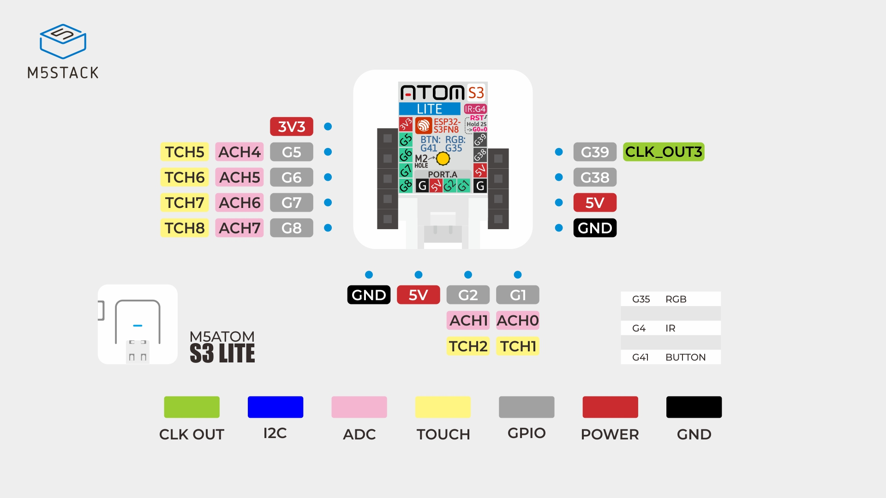

A minimal ESPHome hardware configuration for the M5Stack ATOM S3 Lite, a compact ESP32-S3 development board
with built-in RGB LEDs, button, and IR transmitter.

## 📑 Table of Contents

- [Overview](#-overview)
- [Hardware Specifications](#-hardware-specifications)
- [Features](#-features)
- [Quick Start](#-quick-start)
- [Configuration](#-configuration)
- [Use Cases & Examples](#-use-cases--examples)
- [GPIO Pinout](#-gpio-pinout)
- [Troubleshooting](#-troubleshooting)
- [Documentation](#-documentation)
- [Acknowledgments](#-acknowledgments)

## 📋 Overview

This project provides a minimal ESPHome hardware configuration for the M5Stack ATOM S3 Lite. The configuration
focuses on hardware definitions (RGB LEDs, button, IR transmitter) and basic WiFi connectivity, making it an ideal
starting point for custom projects.


## 🔧 Hardware Specifications

### M5Stack ATOM S3 Lite

- **Microcontroller**: ESP32-S3-FN8 (8MB Flash, 512KB SRAM)
- **Connectivity**: Wi-Fi 802.11 b/g/n, USB Type-C (USB-CDC)
- **Built-in Features**:
  - 4x WS2812 RGB LEDs (GPIO35) - Located beneath the button, fully RGB controllable
  - Programmable Button (GPIO41)
  - IR Transmitter LED (GPIO4)
  - Grove Port for external sensors (GPIO1, GPIO2)
- **Dimensions**: 24 x 24 x 14 mm
- **Documentation**: [M5Stack ATOM S3 Lite Official Docs](https://docs.m5stack.com/en/core/AtomS3%20Lite)

## ✨ Features

### Integrated Components

- ✅ **RGB LED Control** - 4 addressable WS2812 LEDs located beneath the button, fully RGB controllable with effects
  (pulse, strobe, random)
- ✅ **Button Input** - Built-in button with debouncing and IR trigger example
- ✅ **IR Transmitter** - Control IR devices (TVs, ACs, etc.)
- ✅ **Status Reporting** - Device online/offline status
- ✅ **WiFi Connectivity** - Basic WiFi connection for network integration

### Available Entities

- `LED` - RGB LED strip control (4x WS2812 addressable LEDs)
- `Button` - Button press sensor with IR transmitter example
- `Status` - Device availability sensor (online/offline)

## 🚀 Quick Start

You can copy the configuration code directly from the
[`m5stack-atoms3-lite-minimal.yaml`](m5stack-atoms3-lite-minimal.yaml) file and configure your secrets in ESPHome.

**Note**: This is a minimal hardware configuration. To add Home Assistant integration (API, OTA updates, web server),
you can extend the configuration with additional components. See the [ESPHome documentation](https://esphome.io/)
for details.

## 📝 Configuration

Here is the complete `m5stack-atoms3-lite-minimal.yaml` configuration file:

```yaml
# ============================================================================
# M5Stack ATOM S3 Lite - ESPHome Configuration
# ============================================================================
# This is a complete configuration for the M5Stack ATOM S3 Lite board.
# The ATOM S3 Lite is a tiny ESP32-S3 board with RGB LEDs, a button, and IR.

# Substitutions: Variables that can be reused throughout this configuration
# Think of these as "find and replace" - everywhere you see ${devicename},
# it will be replaced with the value defined here
substitutions:
  # The internal name used by ESPHome (use lowercase, no spaces, hyphens OK)
  devicename: "m5stack-atoms3-lite"

  # The friendly name shown in Home Assistant (can have spaces and capitals)
  friendly_name: "M5Stack ATOM S3 Lite"

  # Description of what this device does
  device_comment: "M5Stack ATOM S3 Lite - Multi-purpose ESPHome Device"

  # Tip: Change these to match your use case, for example:
  #   devicename: "living-room-sensor"
  #   friendly_name: "Living Room Sensor"
  #   device_comment: "Temperature and humidity sensor for living room"

# ============================================================================
# Core ESPHome Configuration
# ============================================================================
esphome:
  # Uses the devicename variable defined above (m5stack-atoms3-lite)
  name: ${devicename}

  # Uses the friendly_name variable defined above
  friendly_name: ${friendly_name}

  # Uses the device_comment variable defined above
  comment: ${device_comment}

  # Don't add MAC address to the device name (set to true if you have multiple identical devices)
  name_add_mac_suffix: false

# ============================================================================
# ESP32 Hardware Configuration
# ============================================================================
esp32:
  # Tells ESPHome which board you're using (ATOM S3 Lite uses ESP32-S3)
  board: esp32-s3-devkitc-1

  # Which framework to use for compiling (Arduino is easier for beginners)
  framework:
    type: arduino

# ============================================================================
# Logger - Serial Output for Debugging
# ============================================================================
# The logger lets you see what's happening on your device in real-time
logger:
  # baud_rate: 0 is REQUIRED for ESP32-S3 (it uses USB-CDC, not traditional UART)
  baud_rate: 0

  # How much detail to show in logs (DEBUG shows everything, INFO shows less)
  level: DEBUG

# ============================================================================
# WiFi Configuration
# ============================================================================
# Configure WiFi connection to your home network
wifi:
  # Your WiFi network name (SSID) - stored in secrets.yaml
  ssid: !secret wifi_ssid

  # Your WiFi password - stored in secrets.yaml
  password: !secret wifi_password

# ============================================================================
# RGB LED Strip - The 4 Colorful LEDs
# ============================================================================
# The ATOM S3 Lite has 4 RGB LEDs built-in on GPIO35
# Documentation: https://esphome.io/components/light/fastled/
light:
  # Use FastLED library for addressable LED control
  - platform: fastled_clockless

    # WS2812B is the type of LED chip used
    chipset: WS2812B

    # The LEDs are connected to GPIO35 on the board
    pin: GPIO35

    # There are 4 LEDs in the strip
    num_leds: 4

    # GRB is the color order for these specific LEDs (Green-Red-Blue)
    rgb_order: GRB

    # Internal ID to reference these LEDs in automations
    id: led

    # The name that appears in Home Assistant
    name: "${friendly_name} LED"

    # When device restarts, LEDs start OFF
    restore_mode: RESTORE_DEFAULT_OFF

    # Built-in light effects you can activate from Home Assistant
    effects:
      # Pulse effect: LEDs fade in and out smoothly
      - pulse:
          name: "Pulse"
          # How long each fade in/out takes (1 second)
          transition_length: 1s
          # How often to update the effect (1 second)
          update_interval: 1s

      # Strobe effect: LEDs flash on and off rapidly
      - strobe:
          name: "Strobe"

      # Random effect: LEDs change to random colors
      - random:
          name: "Random"
          # How long to transition between colors (5 seconds)
          transition_length: 5s
          # How often to pick a new random color (3 seconds)
          update_interval: 3s

# ============================================================================
# IR Remote Transmitter - Infrared LED for Remote Control
# ============================================================================
# The ATOM S3 Lite has a built-in IR LED on GPIO4 for controlling TVs, etc.
# Documentation: https://esphome.io/components/remote_transmitter/
remote_transmitter:
  # The IR LED is connected to GPIO4
  pin: GPIO4

  # Carrier duty cycle controls IR signal strength (50% is standard)
  carrier_duty_percent: 50%

  # Internal ID to reference the IR transmitter in automations
  id: ir_transmitter

  # Non-blocking allows other code to run while IR signal is being sent
  non_blocking: true

# ============================================================================
# Binary Sensors - On/Off Sensors
# ============================================================================
binary_sensor:
  # Status Sensor - Shows if device is online or offline in Home Assistant
  - platform: status
    # The name that appears in Home Assistant
    name: "${friendly_name} Status"

  # Physical Button - The built-in button on GPIO41
  - platform: gpio
    # The name that appears in Home Assistant
    name: "${friendly_name} Button"

    # Button configuration
    pin:
      # The button is connected to GPIO41
      number: GPIO41

      # Inverted means pressed=LOW, released=HIGH (common for buttons with pullup)
      inverted: true

      # Pin mode configuration
      mode:
        # Configure as input (reads signal)
        input: true

        # Enable internal pullup resistor (keeps pin HIGH when button not pressed)
        pullup: true

    # Filters clean up the button signal
    filters:
      # Debouncing: Ignore button bouncing for 10 milliseconds
      - delayed_off: 10ms

    # Action to perform when button is pressed
    on_press:
      then:
        # Send Samsung TV power signal via IR LED
        - remote_transmitter.transmit_samsung:
            # Samsung TV power code (change this for other devices)
            data: 0xE0E040BF

        # Write a message to the logs for debugging
        - logger.log: "Samsung TV Power Signal sent"
```

## 🎯 Use Cases & Examples

### Example 1: IR Remote Control

Use as a universal remote control for TVs, ACs, and other IR devices.

```yaml
# The button is already configured to send Samsung TV power command
# Customize the IR code in the configuration:
on_press:
  then:
    - remote_transmitter.transmit_samsung:
        data: 0xE0E040BF  # Change this to your device code
```

Common Samsung TV codes:

- Power: `0xE0E040BF` or `0xE0E09966`
- Volume Up: `0xE0E0E01F`
- Volume Down: `0xE0E0D02F`
- Mute: `0xE0E0F00F`

### Example 2: Status Indicator

Use the RGB LEDs to show system status, notifications, or alerts. You can control the LEDs directly from the
configuration using automations, or extend the configuration with Home Assistant API integration for remote control.

## 🔌 GPIO Pinout



### Used Pins in Default Configuration

| GPIO | Function | Description |
|------|----------|-------------|
| GPIO35 | RGB LED | 4x WS2812 addressable LEDs |
| GPIO41 | Button | Built-in button (active low) |
| GPIO4 | IR TX | Infrared transmitter LED |

### Available Pins for Expansion

| GPIO | Use Case | Notes |
|------|----------|-------|
| GPIO1, GPIO2 | Grove Port | I2C, UART, or GPIO |
| GPIO5, GPIO6, GPIO7, GPIO8 | Expansion | General purpose I/O |
| GPIO38, GPIO39 | Expansion | General purpose I/O |

## 🐛 Troubleshooting

### IR Transmitter Range Issues

**IR commands not reaching target:**

- Ensure direct line-of-sight (1-3 meters max)
- Test with phone camera (IR LED visible as purple light)
- Consider external IR LED for longer range
- Adjust carrier duty cycle: `carrier_duty_percent: 30%`

## 📖 Documentation

### Hardware Resources

- [M5Stack ATOM S3 Lite Docs](https://docs.m5stack.com/en/core/AtomS3%20Lite)
- [Pinout Diagram](resources/m5stack-atoms3-lite-pinout.jpg)

### ESPHome Resources

- [ESPHome Documentation](https://esphome.io/)
- [ESP32 Platform](https://esphome.io/components/esp32/)
- [FastLED Light Component](https://esphome.io/components/light/fastled/)
- [Remote Transmitter](https://esphome.io/components/remote_transmitter/)

## 🙏 Acknowledgments

- Based on [wildekek/ESPHome-M5Stack-Atom-S3-Lite](https://github.com/wildekek/ESPHome-M5Stack-Atom-S3-Lite)
- M5Stack for creating the ATOM S3 Lite hardware
- ESPHome community for the excellent framework

---

**Note**: This is a community project and not officially affiliated with M5Stack or ESPHome.
