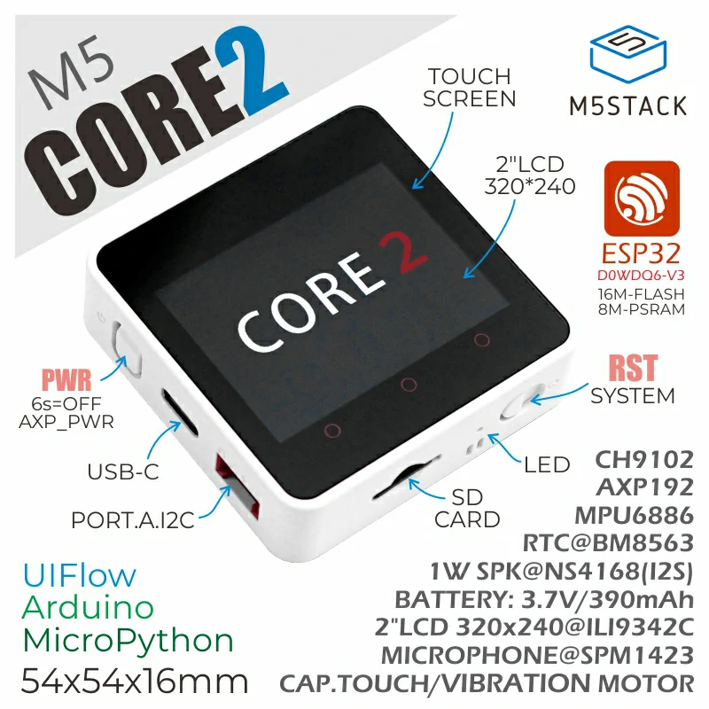

## Product Images



## GPIO Pinout

| Pin    | Function        |
| ------ | --------------- |
| GPIO21 | I2C SDA         |
| GPIO22 | I2C SCL         |
| GPIO18 | SPI CLK         |
| GPIO23 | SPI MOSI        |
| GPIO5  | Display CS      |
| GPIO15 | Display DC      |
| GPIO39 | Touchscreen IRQ |
| GPIO2  | I2S Audio DOUT  |
| GPIO0  | I2S LRCLK       |
| GPIO12 | I2S BCLK        |

## External Components

[ESPHome AXP192 Component by martydingo](https://github.com/martydingo/esphome-axp192)

This component is essential for powering the internal display and enabling power control for other peripherals on the M5Core2.

## Example Configuration

```yaml
substitutions:
  devicename: m5core2
  upper_devicename: M5Core2

esphome:
  name: $devicename
  platformio_options:
    upload_speed: 460800

esp32:
  board: m5stack-core2

psram:
  mode: quad
  speed: 80MHz

wifi:
  ssid: !secret wifi_ssid
  password: !secret wifi_password

  ap:
    ssid: $devicename Fallback Hotspot
    password: !secret wifi_password

captive_portal:

web_server:
  port: 80

logger:
  level: INFO

api:

ota:
  - platform: esphome
    password: ota

external_components:
  - source: github://martydingo/esphome-axp192
    components: [axp192]

sensor:
  - platform: axp192
    model: M5CORE2
    address: 0x34
    i2c_id: bus_a
    id: axp192_id
    update_interval: 30s
    battery_level:
      name: "${upper_devicename} Battery Level"
      id: "${devicename}_batterylevel"

  - platform: mpu6886
    address: 0x68
    update_interval: 1s
    accel_x:
      name: "MPU6886 Accel X"
    accel_y:
      name: "MPU6886 Accel Y"
    accel_z:
      name: "MPU6886 Accel Z"
    gyro_x:
      name: "MPU6886 Gyro X"
    gyro_y:
      name: "MPU6886 Gyro Y"
    gyro_z:
      name: "MPU6886 Gyro Z"
    temperature:
      name: "MPU6886 Temperature"

spi:
  clk_pin: GPIO18
  mosi_pin: GPIO23

i2c:
  - id: bus_a
    sda: GPIO21
    scl: GPIO22
    scan: true

display:
  - platform: ili9xxx
    model: ili9342
    cs_pin: GPIO5
    dc_pin: GPIO15
    invert_colors: true
    show_test_card: true
    dimensions:
      width: 320
      height: 240
    transform:
      mirror_x: false # must be explicitly included, otherwise it defaults to true with the ili9342

touchscreen:
  - platform: ft63x6
    interrupt_pin: GPIO39

binary_sensor:
  # the virtual buttons--coordinates taken from
  # https://github.com/m5stack/M5Core2/blob/0134dd3a38cfd335a1ec39da2c149f88baf54326/src/M5Core2.h#L54-L56
  # and
  # https://github.com/m5stack/M5Core2/blob/0134dd3a38cfd335a1ec39da2c149f88baf54326/src/utility/M5Button.h#L811-L815
  # for the parameter order `(x, y, width, height)`
  - platform: touchscreen
    name: Button A
    x_min: 10
    x_max: 120
    y_min: 240
    y_max: 280
    use_raw: true

  - platform: touchscreen
    name: Button B
    x_min: 130
    x_max: 200
    y_min: 240
    y_max: 280
    use_raw: true

  - platform: touchscreen
    name: Button C
    x_min: 230
    x_max: 310
    y_min: 240
    y_max: 280
    use_raw: true

# doesn't work:
# i2s_audio:
#   id: bus_i2s
#   i2s_lrclk_pin: GPIO0
#   i2s_bclk_pin: GPIO12
# speaker:
#   - platform: i2s_audio
#     dac_type: external
#     i2s_dout_pin: GPIO2
#     sample_rate: 44100
#     bits_per_sample: 16bit
# now use it:
# on_...:
#   then:
#     # turn on the power for gpio0-2
#     - lambda: |-
#         id(axp192_id).Write1Byte(0x94, id(axp192_id).Read8bit(0x94) | 0x07);
#     - speaker.volume_set: 50%
#     - speaker.play:
#         data: !lambda return startup_raw;
```

## Notes

- **Display**: works reliably with `ili9342`
- **Touchscreen**: works well with `ft63x6`, including virtual button regions (A/B/C)
- **MPU6886 IMU**: provides data for accelerometer, gyroscope, and temperature. Temperature readings are erratic and inaccurate
- **Speaker**: didn't work, but some config is provided
- **Microphone**: untested
- **BM8563 RTC**: not configured, no ESPHome component exists for it
