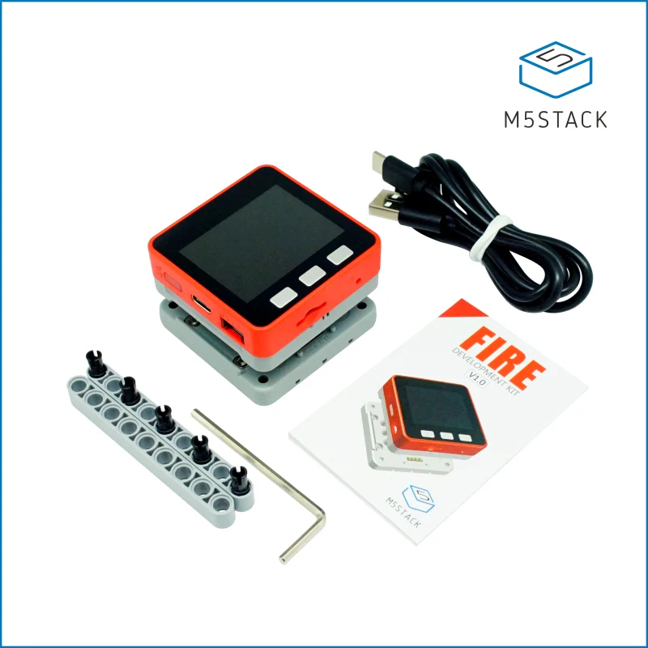
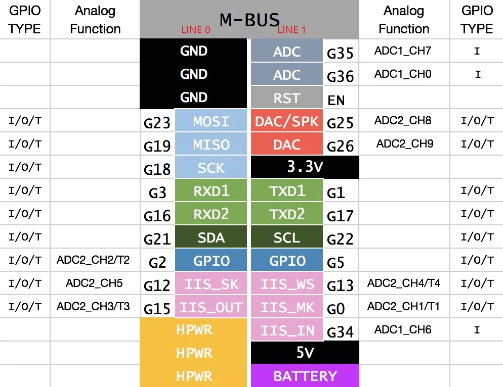
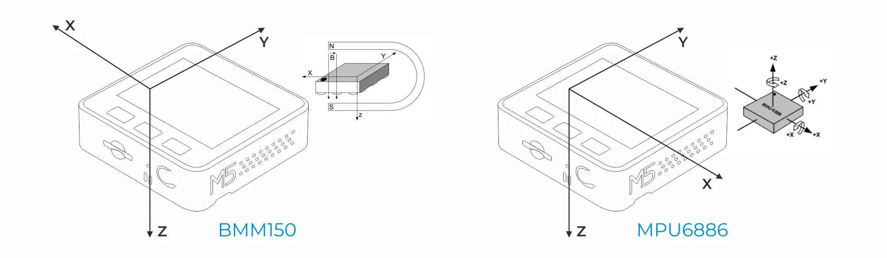

## Product Images



## Description

M5Stack FIRE Kit features an ESP32 Core, 16M Flash + 8M PSRAM, 9-Axis IMU sensor (6-Axis posture acceleration measurement + 3-Axis magnetic measurement), power management IC, speaker, microphone, and a 2 inch 320x240 LCD screen. The middle part is called M5GO base which provides a 500 mAh battery, M-BUS socket, LED bar and three more GROVE Ports. The bottom part is a charge table, which can be connected to the M5GO base via POGO pins.

## GPIO Pinout

|  Pin   | Function       |
| ------ | -------------- |
| GPIO39 | Button A       |
| GPIO38 | Button B       |
| GPIO37 | Button C       |
| GPIO34 | Microphone Pin |
| GPIO25 | Speaker Pin 1  |
| GPIO26 | Speaker Pin 2  |
| GPIO22 | GROVE A SCL    |
| GPIO21 | GROVE A SDA    |
| GPIO36 | GROVE B SCL    |
| GPIO26 | GROVE B SDA    |
| GPIO16 | GROVE C RXD    |
| GPIO17 | GROVE C TXD    |
| GPIO15 | SIG Pin        |

### MBus Pin Map



## MPU6886 and BMM150



| I2C Address | Function                             |
| ----------- | ------------------------------------ |
| 0x68        | MPU6886 6-Axis MotionTracking Sensor |
| 0x10        | BMM150 3-Axis Geomagnetic Sensor     |

## IP5306 Power Management

M5Stack Fire uses a customized version of the IP5306 Power Management circuit
[Customized IP5306 Datasheet]("https://github.com/m5stack/M5-Schematic/blob/master/Core/IIC_IP5306_REG_V1.4.pdf")

| I2C Address | Function                |
| ----------- | ----------------------- |
| 0x75        | IP5306 Power Management |

### IP5306 Example Configuration

```yml
external_components:
  - source:
      type: git
      url: https://github.com/ssieb/custom_components
    components: [ip5306]

ip5306:
  battery_level:
    name: Battery Level
  charger_connected:
    id: connected
  charge_full:
    id: full
```

Using the [IP5306 ESPHome Component]("https://github.com/ssieb/custom_components/tree/master/components/ip5306") by [@ssieb]("https://github.com/ssieb")

## Wifi Issues due to GPIO15

When the M5GO bottom is attached, GPIO15 (side lights pin) needs to be setup as an output pin, otherwise Wifi will fail to connect frequently. If you do not want to setup the side lights component (to save memory, for example), you can use the following alternative instead:

```yml
output:
  - platform: gpio
    id: wifi_fix_output
    pin: GPIO15
```

Source: [Official M5Stack repo](https://github.com/m5stack/M5Unified/blob/d26d2415f409b664631ff066ceeaffd6a753a4ff/src/M5Unified.cpp#L499).

## Example Configuration

```yml
substitutions:
  friendly_name: "M5StackFire"

esphome:
  name: m5stackfire

esp32:
  board: m5stack-fire

wifi:
  ssid: !secret wifi_ssid
  password: !secret wifi_password

  ap:
    ssid: ${friendly_name} Fallback Hotspot
    password: !secret wifi_password

captive_portal:

logger:

api:

ota:

# Power Management
external_components:
  - source:
      type: git
      url: https://github.com/ssieb/custom_components
    components: [ip5306]

i2c:
  sda: 21
  scl: 22
  scan: True

ip5306:
  battery_level:
    name: ${friendly_name} Battery Percent
    id: battery_percent
  charger_connected:
    name: ${friendly_name} Charger Connected
    id: connected
  charge_full:
    name: ${friendly_name} Charge Full
    id: full

# Buttons
binary_sensor:
  - platform: gpio
    id: M5_BtnA
    pin:
      number: 39
      inverted: true
  - platform: gpio
    id: M5_BtnB
    pin:
      number: 38
      inverted: true
  - platform: gpio
    id: M5_BtnC
    pin:
      number: 37
      inverted: true

# Internal LEDS
output:
  - platform: ledc # backlight output
    pin: 32
    id: gpio_32_backlight_pwm

light:
  - platform: monochromatic # backlight
    output: gpio_32_backlight_pwm
    name: ${friendly_name} Backlight
    id: backlight
    restore_mode: ALWAYS_ON
  - platform: esp32_rmt_led_strip
    rgb_order: GRB
    pin: GPIO15
    num_leds: 10
    rmt_channel: 1
    chipset: SK6812
    name: "${friendly_name} Side Light"
    restore_mode: ALWAYS_OFF
    id: side_light
    default_transition_length: 0s

# Deep Sleep
deep_sleep:
  id: deep_sleep_
  wakeup_pin: 39
  wakeup_pin_mode: INVERT_WAKEUP

# Microphone and Speaker
i2s_audio:
  i2s_lrclk_pin: GPIO13

microphone:
  - platform: i2s_audio
    adc_pin: GPIO34
    adc_type: internal
    id: adc_mic

media_player:
  - platform: i2s_audio
    name: "${friendly_name} Internal Media Player"
    id: media_player_out
    dac_type: internal
    mode: right

# Display
spi:
  clk_pin: 18
  mosi_pin: 23
  miso_pin: 19

font:
  - file: "gfonts://Roboto"
    id: roboto
    size: 20

display:
  - platform: ili9xxx
    model: M5STACK
    cs_pin: 14
    dc_pin: 27
    reset_pin: 33
    id: my_display
    lambda: |-
      it.print(80, 0, id(roboto), Color(255, 255, 255), TextAlign::TOP_CENTER, "M5Stack Fire Test");
```
