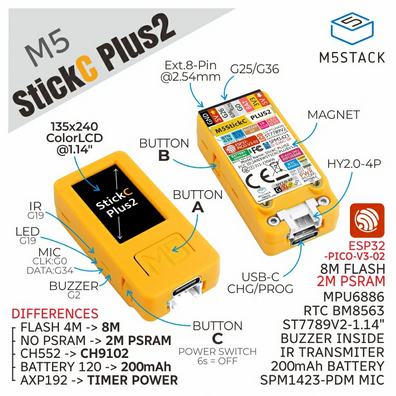

## Product Images



## GPIO Pinout

| Pin    | Function          |
| ------ | ----------------- |
| GPIO37 | Button A          |
| GPIO39 | Button B          |
| GPIO35 | Button C          |
| GPIO19 | Internal LED/IR   |
| GPIO13 | SPI CLK           |
| GPIO15 | SPI MOSI          |
| GPIO21 | I2C SDA           |
| GPIO22 | I2C SCL           |
| GPIO05 | Display CS        |
| GPIO14 | Display DC        |
| GPIO12 | Display Reset     |
| GPIO00 | I2S CLK           |
| GPIO26 | I2S LRCLK         |
| GPIO34 | Microphone Data   |
| GPIO38 | Battery Level     |
| GPIO02 | Buzzer            |

## External Component

Unlike the M5StickC Plus, the Plus2 has no power management chip. Therefore, AXP192 support is not required; TFT backlight  
and battery level are accessed through GPIO pins -- see below for details.

## Example Configuration

```yml
substitutions:
  devicename: m5stickc-plus2
  upper_devicename: M5StickC PLUS2

esphome:
  name: $devicename
  platformio_options:
    upload_speed: 115200

esp32:
  board: m5stick-c

wifi:
  ssid: !secret wifi_ssid
  password: !secret wifi_password
  
  ap:
    ssid: $devicename Fallback Hotspot
    password: !secret wifi_password

captive_portal:

logger:

api:

ota:

# Battery voltage measured through ADC1_CH2. PLUS2 has a voltage divider,
# so reading needs to be multiplied by 2
sensor:
  - platform: adc
    pin: GPIO38
    attenuation: 12db
    update_interval: 60s
    name: "Battery Voltage"
    filters:
      - multiply: 2.0

# Built-in 6-axis intertial measurement unit (IMU) that also includes a temperature sensor
  - platform: mpu6886
    i2c_id: bus_a
    address: 0x68
    update_interval: 10s
    accel_x:
      name: "MPU6886 Accel X"
    accel_y:
      name: "MPU6886 Accel Y"
    accel_z:
      name: "MPU6886 Accel z"
    gyro_x:
      name: "MPU6886 Gyro X"
    gyro_y:
      name: "MPU6886 Gyro Y"
    gyro_z:
      name: "MPU6886 Gyro z"
    temperature:
      name: "MPU6886 Temperature"

binary_sensor:
  # Turn on display backlight while Button A is pressed
  - platform: gpio
    pin:
      number: GPIO37
      inverted: false
    name: ${upper_devicename} Button A
    on_press:
      then:
        - light.turn_on: display_bl
    on_release:
      then:
        - light.turn_off: display_bl

  # Play 1000Hz tone through buzzer while Button B is pressed
  - platform: gpio
    pin:
      number: GPIO39
      inverted: true
    name: ${upper_devicename} Button B
    on_press:
      then:
        - output.turn_on: buzzer
        - output.ledc.set_frequency:
            id: buzzer
            frequency: "1000Hz"
        - output.set_level:
            id: buzzer
            level: "50%"

    on_release:
      then:
        - output.turn_off: buzzer

light:
  - platform: monochromatic
    output:  builtin_led
    name: ${upper_devicename} Led
    id: led1

  - platform: monochromatic
    output:  backlight
    name: ${upper_devicename} Backlight
    id: display_bl

output:
  - platform: ledc
    pin: 10
    inverted: true
    id: builtin_led

  - platform: ledc
    pin: 2
    inverted: true
    id: buzzer

  - platform: ledc
    pin: 27
    inverted: true
    id: backlight

spi:
  clk_pin: GPIO13
  mosi_pin: GPIO15

i2c:
   - id: bus_a
     sda: GPIO21
     scl: GPIO22
     scan: True

font:
  - file: "gfonts://Roboto"
    id: roboto
    size: 18

color:
  - id: my_white
    red: 100%
    green: 100%
    blue: 100%

# 1.14 inch, 135*240 Colorful TFT LCD, ST7789v2
display:
  - platform:  st7789v
    model: TTGO TDisplay 135x240
    cs_pin: GPIO5
    dc_pin: GPIO14
    reset_pin: GPIO12
    rotation: 270
    lambda: |-
     it.print(80, 0, id(roboto), id(my_white), TextAlign::TOP_CENTER, "M5Stick Test");

# note: Audio hasn't been tested
i2s_audio:
  id: bus_i2s
  i2s_lrclk_pin: G26
  i2s_bclk_pin: G0

microphone:
  - platform: i2s_audio
    i2s_din_pin: GPIO34
    i2s_audio_id: bus_i2s
    adc_type: external
    pdm: true
    id: mic
```
