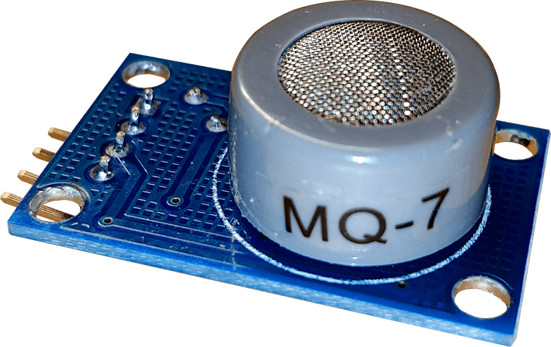
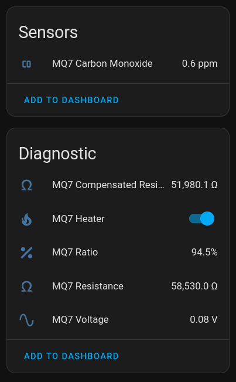

The MQ-7 sensor can be used for detecting carbon monoxide (CO) gas. This is done by cycling the sensor's internal heater between 5V for 60 seconds and 1.5V for 90 seconds. Most MQ-7 boards don't include a circuit to control the heater and need to be modified.

## Heater Mod

This will remove the digital output of the sensor and replace it with a digital input to control the heater of the MQ-7

### What you need

- MQ-7 sensor board
- Soldering iron / hot air station
- 75Ω Resistor (>160mW)
- 470Ω Resistor
- N-channel MOSFET (V_GS < 3.3V, Example: SL2310)
- Wires

### Steps

- De-solder the potentiometer and the dual op-amp
- De-solder the D0-LED (bottom)
- Cut the PCB traces in 2 locations (see picture below)
- Scratch off the solder mask in the marked location to provide a path to ground for the MOSFET
- Replace the 5Ω resistor on the left with a 75Ω resistor. This will provide 1.5V to the heater when the MOSFET is turned off
- Remove the 1kΩ resistor on the left and move it to its new position
- Remove the capacitor above the dual op-amp and move it to its new position
- Solder the MOSFET to the bottom center pin of the sensor and the ground pad you created
- Add the 470Ω resistor and the wires (see picture below)
- Optional: Add the D0-LED you removed earlier, but with reversed polarity. It will show the status of the heater
- Check the resistance between VCC and GND. It should be ~100Ω


## ESPHome Config

This config includes calibration and temperature / humidity compensation

The full heating cycle of the sensor takes 150 seconds. It can take a while until the first carbon monoxide reading appears after booting the ESP.

```yaml
substitutions:
  mq7_name: "MQ7"
  mq7_id: "mq7"
  # Both pins are 3.3V compatible and can be directly connected to the ESP if you followed the heater mod tutorial
  mq7_heater_pin: "25"
  mq7_analog_pin: "33"
  # Voltage divider values
  mq7_low_side_resistor: "1000"
  mq7_high_side_resistor: "470"
  mq7_supply_voltage: "5.0V"
  # Temperature / Humidity Compensation
  # replace "temperature" with the id of your temperature sensor (celsius) and "humidity" with the id of your humidity sensor
  temperature_sensor_id: "temperature"
  humidity_sensor_id: "humidity"
  # Calibration: place the sensor in clean air (outdoor) for a few hours and use the value of mq7_compensated_resistance
  mq7_clean_air_compensated_resistance: "55000"

esphome:
  name: esp32-mq7

esp32:
  board: esp32dev
  framework:
    type: arduino

wifi:
  ...

logger:
  baud_rate: 115200

api:
  ...

ota:
  ...

output:
  - platform: gpio
    pin: ${mq7_heater_pin}
    id: ${mq7_id}_heater_pin

switch:
  - platform: output
    name: "${mq7_name} Heater"
    icon: mdi:fire
    entity_category: diagnostic
    disabled_by_default: True
    id: ${mq7_id}_heater
    output: ${mq7_id}_heater_pin

interval:
  - interval: 150s
    then:
      - switch.turn_on: ${mq7_id}_heater
      - logger.log: "${mq7_name}: The sensor is heating!"
      - delay: 55s
      - switch.turn_off: ${mq7_id}_heater
      - logger.log: "${mq7_name}: The sensor is measuring!"
      - delay: 90s
      - if:
          condition:
            - switch.is_off: ${mq7_id}_heater
          then:
            - component.update: ${mq7_id}_raw
            - logger.log: "${mq7_name}: Done"
            - switch.turn_on: ${mq7_id}_heater
            - delay: 5s

sensor:
  # Replace with your own temperature / humidity sensor, located near the MQ-7
  - platform: homeassistant
    id: ${temperature_sensor_id}
    entity_id: sensor.temperature
  - platform: homeassistant
    id: ${humidity_sensor_id}
    entity_id: sensor.humidity
  - platform: adc
    id: ${mq7_id}_raw
    name: "${mq7_name} Voltage"
    entity_category: diagnostic
    disabled_by_default: True
    pin: ${mq7_analog_pin}
    attenuation: auto
    update_interval: never
  - platform: resistance
    id: ${mq7_id}_resistance
    name: "${mq7_name} Resistance"
    icon: mdi:omega
    entity_category: diagnostic
    disabled_by_default: True
    sensor: ${mq7_id}_raw
    configuration: UPSTREAM
    resistor: ${mq7_low_side_resistor}
    reference_voltage: ${mq7_supply_voltage}
    filters:
      - lambda: return (x - ${mq7_high_side_resistor});
    on_value:
      then:
        - component.update: ${mq7_id}_compensated_resistance
  - platform: template
    id: ${mq7_id}_compensated_resistance
    name: "${mq7_name} Compensated Resistance"
    icon: mdi:omega
    entity_category: diagnostic
    unit_of_measurement: Ω
    lambda: |-
      return (id(${mq7_id}_resistance).state / ( -0.01223333 * id(${temperature_sensor_id}).state -0.00609615 * id(${humidity_sensor_id}).state + 1.70860897));
    update_interval: never
    on_value:
      then:
        - component.update: ${mq7_id}_ratio
  - platform: template
    id: ${mq7_id}_ratio
    name: "${mq7_name} Ratio"
    icon: mdi:percent
    entity_category: diagnostic
    disabled_by_default: True
    unit_of_measurement: "%"
    lambda: |-
        return 100.0 * (id(${mq7_id}_compensated_resistance).state / ${mq7_clean_air_compensated_resistance});
    update_interval: never
    on_value:
      then:
        - component.update: ${mq7_id}_co
  - platform: template
    id: ${mq7_id}_co
    name: "${mq7_name} Carbon Monoxide"
    unit_of_measurement: "ppm"
    device_class: carbon_monoxide
    lambda: |-
      auto ratio_ln = log(id(${mq7_id}_ratio).state / 100.0);
      return exp(-0.685204 - 2.67936 * ratio_ln - 0.488075 * ratio_ln * ratio_ln - 0.07818 * ratio_ln * ratio_ln * ratio_ln);
    update_interval: never
```

## Calibration

After long-time storage the manufacturer recommends running the sensor for 48-168h to let the readings stabilize.

Then it can be calibrated by placing it in clean air (outdoors) to determine the highest possible resistance. This resistance value can be added to the ESPHome config




