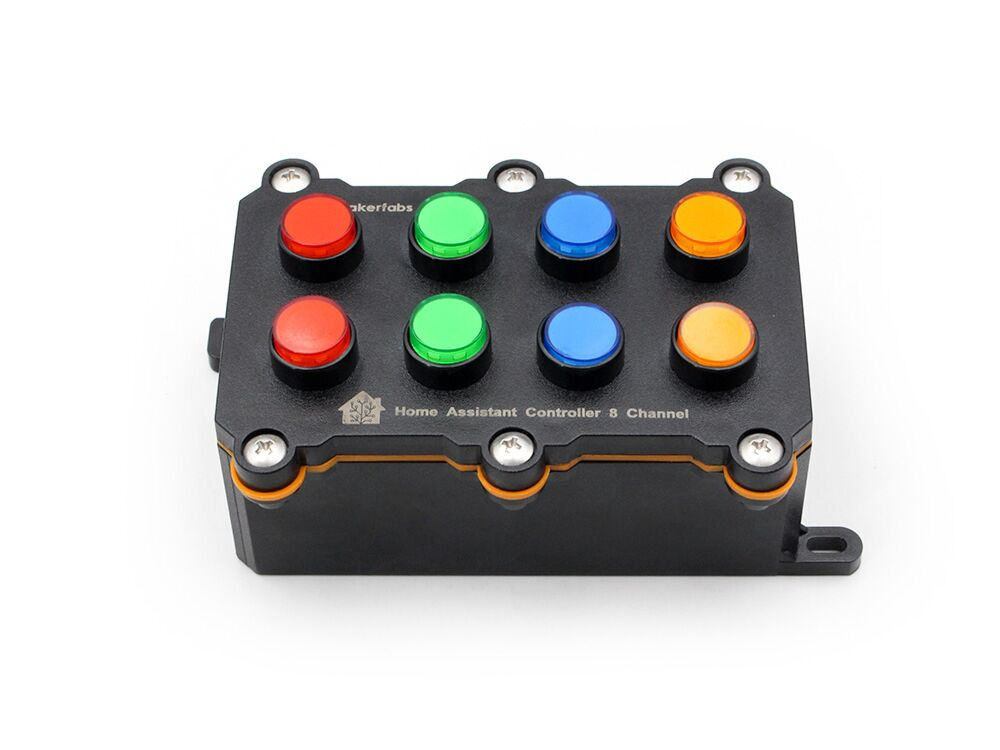

## Product description

This is an 8-button controller board with an ESP32, This button controller provides 8 inputs to Home Assistant
device, so it possible to create remote controlling without taking a phone/computer. You can use it in
combination with an [8-channel relay](https://www.makerfabs.com/8-channel-relay-for-home-assistant.html).

It can bought from: [https://www.makerfabs.com/8-channel-button-controller-for-home-assistant-html.html](https://www.makerfabs.com/8-channel-button-controller-for-home-assistant-html.html).

## Basic Config

```yaml
# based on https://github.com/Makerfabs/Home-Assistant-Controller-8-Channel/blob/main/button8.yaml

esphome:
  name: ha-controller-8-channel
  friendly_name:  HA-Controller-8-Channel

esp32:
  variant: esp32
  framework:
    type: esp-idf
    # version: 5.4.2

# Enable logging
logger:

# Enable Home Assistant API
api:

ota:
  - platform: esphome

wifi:
  ssid: !secret wifi_ssid
  password: !secret wifi_password

captive_portal:

web_server:
  port: 80

binary_sensor:
  - platform: gpio
    pin: 35
    name: "BUTTON1"
  
  - platform: gpio
    pin: 34
    name: "BUTTON2"

  - platform: gpio
    pin: 39
    name: "BUTTON3"

  - platform: gpio
    pin: 23
    name: "BUTTON4"

  - platform: gpio
    pin: 26
    name: "BUTTON5"

  - platform: gpio
    pin: 27
    name: "BUTTON6"

  - platform: gpio
    pin: 14
    name: "BUTTON7"

  - platform: gpio
    pin: 4
    name: "BUTTON8"

```
