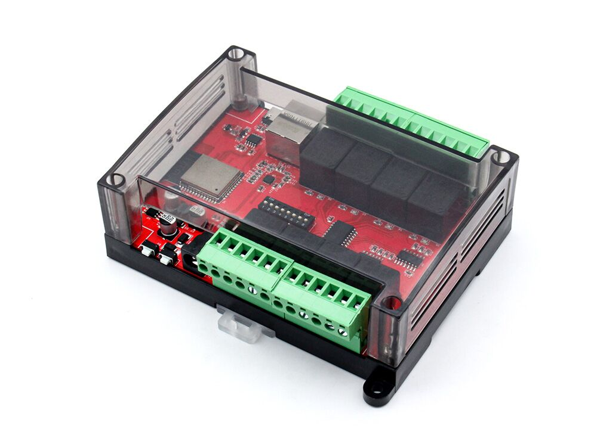

## Product description

This is an 8-relay board with an ESP32-S3 (N8):

- Supports 10A current with AC 220V
- Wifi/Ethernet support
- 2 kinds of connector for each wire connection
- 12V Power supply
- PLC Case for easy installation

It can bought from: [https://www.makerfabs.com/8-channel-relay-for-home-assistant.html](https://www.makerfabs.com/8-channel-relay-for-home-assistant.html)

## Basic Config

```yaml
# based on https://github.com/Makerfabs/Home-Assistant-Relay-8-Channel/blob/main/relay8.yaml

esphome:
  name: ha-realy-8-channel
  friendly_name: HA-Realy-8-Channel

esp32:
  variant: esp32
  framework:
    type: esp-idf
    # version: 5.4.2

# Enable logging
logger:

# Enable Home Assistant API
api:

ota:
  - platform: esphome

wifi:
  ssid: !secret wifi_ssid
  password: !secret wifi_password

captive_portal:

# ethernet:
#   type: LAN8720
#   mdc_pin: 23
#   mdio_pin: 18
#   clk_mode: GPIO17_OUT
#   phy_addr: 0
    
web_server:
  port: 80

switch:
  - platform: gpio
    pin: 32
    name: "Relay #1"
    inverted: true

  - platform: gpio
    pin: 33
    name: "Relay #2"
    inverted: true

  - platform: gpio
    pin: 14
    name: "Relay #3"
    inverted: true

  - platform: gpio
    pin: 13
    name: "Relay #4"
    inverted: true

  - platform: gpio
    pin: 15
    name: "Relay #5"
    inverted: true

  - platform: gpio
    pin: 4
    name: "Relay #6"
    inverted: true

  - platform: gpio
    pin: 16
    name: "Relay #7"
    inverted: true

  - platform: gpio
    pin: 5
    name: "Relay #8"
    inverted: true

```
