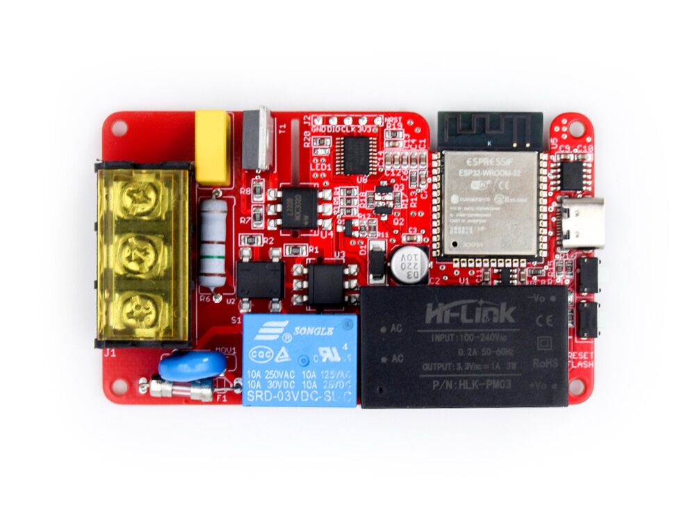

## Product description

The Makerfabs Home Assistant AC Dimmer uses a chopper circuit built around a BT139 TRIAC and a zero-cross
detection circuit. It detects each zero-crossing and then controls the TRIAC to chop the AC waveform for dimming.
In addition, because a TRIAC cannot fully disconnect the AC on its own, a relay is included to provide complete on/off
isolation.

- On board AC-DC, No external power supply needed;

- On Board Relay to totally shut down current leakage;

- ESP32 for Home assistant/ ESPhone;

- STM32G030F6P6 , for AC choppping;

- Suitable for AC 110V~230V, Any frequency;

- Max Load: 2KW;

It can be purchased from [Makerfabs](https://www.makerfabs.com/ac-dimmer-for-home-assistant.html).

## Basic Config

```yaml
# based on https://github.com/Makerfabs/Home-Assistant-AC-Dimmer/blob/main/firmware/dimmer.yaml

esphome:
  name: dimmeradruino
  friendly_name:  dimmer
  
external_components:
  - source:
      type: git
      url: https://github.com/Makerfabs/Home-Assistant-AC-Dimmer
      ref: main
      path: firmware/common_components
    components: [ arduino_dimmer ]

esp32:
  variant: ESP32
  framework:
    type: arduino

# Enable logging
logger:
  level: INFO

# Enable Home Assistant API
api:
  encryption:

ota:
  - platform: esphome

wifi:
  ssid: !secret wifi_ssid
  password: !secret wifi_password

captive_portal:

web_server:
  port: 80

output:
  - platform: arduino_dimmer
    id: arduino_dimmer_1

fan:
  - platform: speed
    name: "Kitchen Lights"
    output: arduino_dimmer_1
    icon: "mdi:lightbulb"
```
