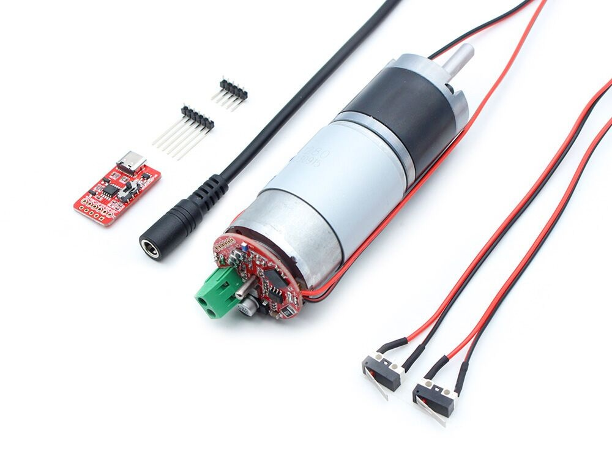

## Product description

An ESP32-based DC motor controller using the DRV8870 driver and a GA36Y-555 motor. It offers up to 11.6kg.cm torque.

It can be purchased from [Makerfabs](https://www.makerfabs.com/dc-motor-for-home-assistant-ga36y-555-html.html).

## Basic Config

```yaml
# based on https://github.com/Makerfabs/Home-Assistant-DC-Motor/blob/main/ha-motor.yaml

esphome:
  name: ha-dc-motor
  friendly_name: HA-DC-Motor
  

esp32:
  board: esp32dev
  framework:
    type: esp-idf

# Enable logging
logger:
  level: INFO

# Enable Home Assistant API
api:
  encryption:

ota:
  - platform: esphome

wifi:
  ssid: !secret wifi_ssid
  password: !secret wifi_password

captive_portal:

web_server:
  port: 80

output:
  - platform: ledc
    id: motor_reverse_pin
    pin: 25

  - platform: ledc
    id: motor_forward_pin
    pin: 26


fan:
  - platform: hbridge
    id: my_fan
    name: "DC Motor"
    pin_a: motor_forward_pin
    pin_b: motor_reverse_pin
    # enable_pin: motor_enable
    decay_mode: slow   # slow decay mode (braking) or fast decay (coasting)


binary_sensor:
  - platform: gpio
    pin: 
      number: 33
      mode:
        input: true
        pullup: true
    name: "Endstop 1"

  - platform: gpio
    pin:
      number: 32
      mode:
        input: true
        pullup: true
    name: "Endstop 2"

```
