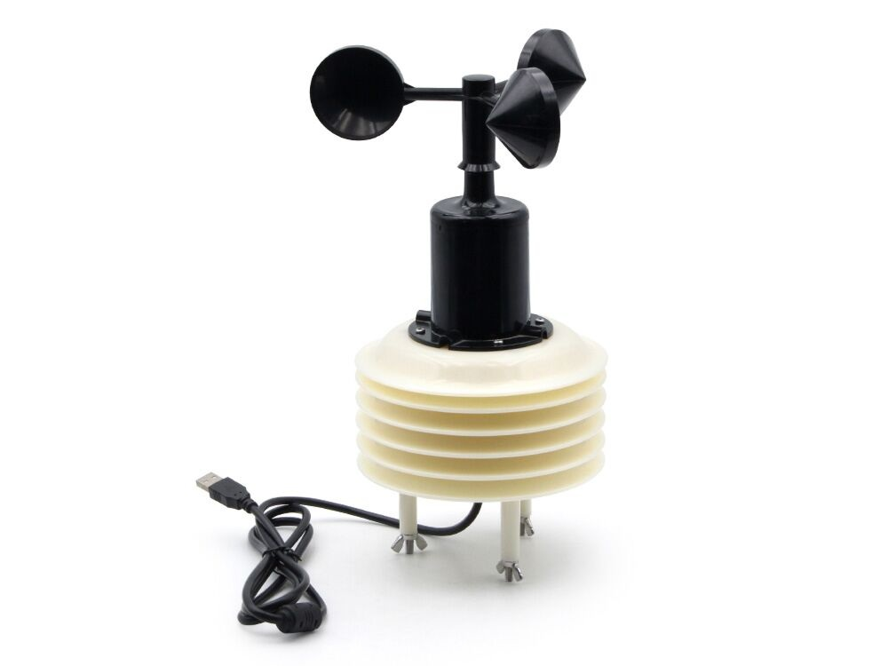

## Product description

A multi-functional weather station featuring an AHT10 sensor for high-precision temperature (±0.3°C) and humidity 
(±2%) monitoring, and a BMP280 for atmospheric pressure. It includes an SSAP10 industrial-grade laser sensor for 
precise PM1.0, PM2.5, and PM10 readings, and supports wind speed measurement.

It can be purchased from [Makerfabs](https://www.makerfabs.com/weather-station-for-home-assistant-esphome.html).

## Basic Config

```yaml
# based on https://github.com/Makerfabs/Home-Assistant-Weather-Station/blob/main/weather_station.yaml

esphome:
  name: ha-weather 
  friendly_name: "HA Weather Station"
  project:
    name: "makerfabs.weather_station"
    version: "1.0.0"
  
external_components:
  - source:
      type: git
      url: https://github.com/Makerfabs/Home-Assistan-Weather-Station
      ref: main
      path: common_components
    components: [ ssap10 ]

esp32:
  board: esp32dev
  framework:
    type: esp-idf
    version: recommended


# Enable logging
logger:
  level: INFO

# Enable Home Assistant API
api:
  encryption:

ota:
  - platform: esphome

wifi:
  ssid: !secret wifi_ssid
  password: !secret wifi_password

captive_portal:

web_server:
  port: 80
  
uart:
  - id: ssap10_uart
    rx_pin: GPIO21
    tx_pin: GPIO22
    baud_rate: 9600
    data_bits: 8
    stop_bits: 1
    parity: NONE

i2c:
  - id: i2c_bus
    sda: GPIO4
    scl: GPIO5
    scan: true
    frequency: 400kHz

sensor:
  - platform: ssap10
    name: "PM2.5 Concentration"
    id: pm25_sensor
    uart_id: ssap10_uart
    update_interval: 5s

  - platform: aht10
    i2c_id: i2c_bus
    temperature:
      name: "Temperature"
      id: temperature_sensor
      accuracy_decimals: 1
      unit_of_measurement: '°C'
      device_class: temperature
    humidity:
      name: "Humidity" 
      id: humidity_sensor
      accuracy_decimals: 1
    update_interval: 10s

  - platform: pulse_counter
    pin: 
      number: GPIO27
      mode:
        input: true
        pullup: true
    name: "Wind Speed"
    id: wind_speed_sensor
    unit_of_measurement: 'm/s'
    accuracy_decimals: 2
    update_interval: 5s
    filters:
      - multiply: 0.002
      - sliding_window_moving_average:
          window_size: 6
          send_every: 3

  - platform: bmp280_i2c
    i2c_id: i2c_bus
    address: 0x76
    pressure:
      name: "Atmospheric Pressure"
      id: pressure_sensor
      accuracy_decimals: 1
    temperature:
      name: "BMP280 Temperature"
      id: bmp_temperature_sensor
      accuracy_decimals: 1
      unit_of_measurement: '°C'
      device_class: temperature
    update_interval: 10s
    iir_filter: 16X

  - platform: internal_temperature
    name: "ESP32 Internal Temperature"
    id: esp_internal_temp

  - platform: wifi_signal
    name: "WiFi Signal Strength"
    id: wifi_signal_sensor
    update_interval: 60s

  - platform: uptime
    name: "Device Uptime"
    id: uptime_sensor
    update_interval: 60s

```
