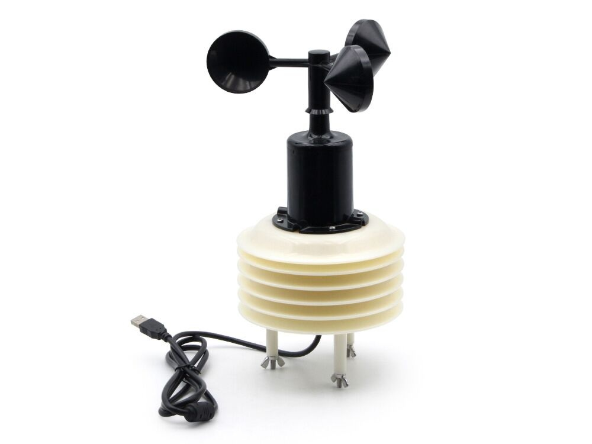

## Product description

A multi-functional weather station featuring an AHT10 sensor for high-precision temperature (±0.3°C) and humidity
(±2%) monitoring, and a BMP280 for atmospheric pressure. It includes an SSAP10 industrial-grade laser sensor for
precise PM1.0, PM2.5, and PM10 readings, and supports wind speed measurement.

It can be purchased from [Makerfabs](https://www.makerfabs.com/weather-station-for-home-assistant-esphome.html).

## Basic Config

```yaml file="weather_station.yaml"
```
