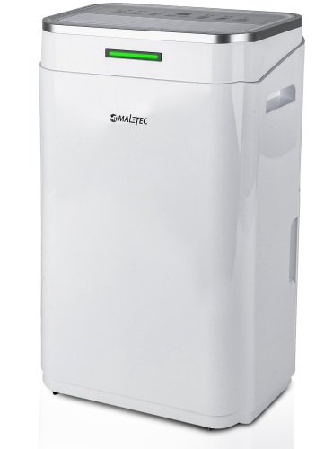
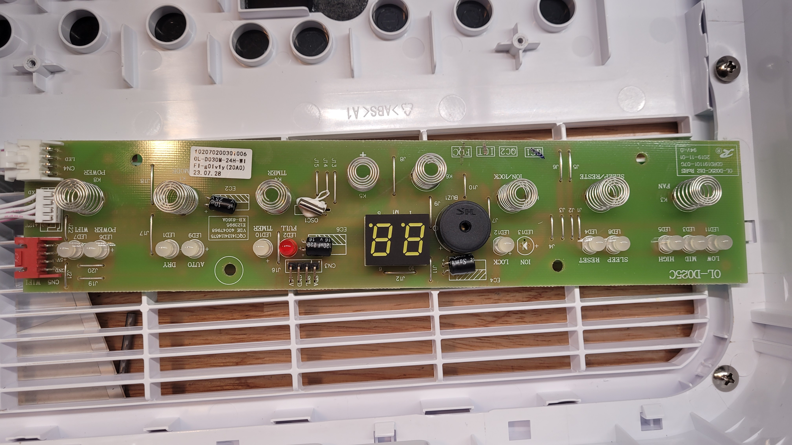
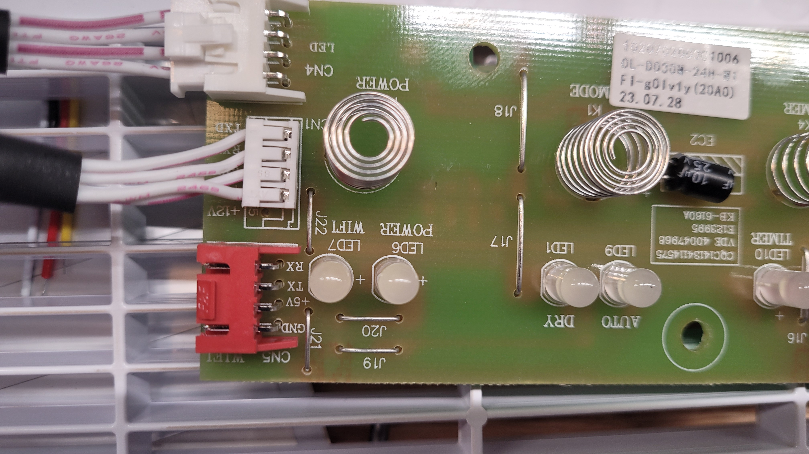
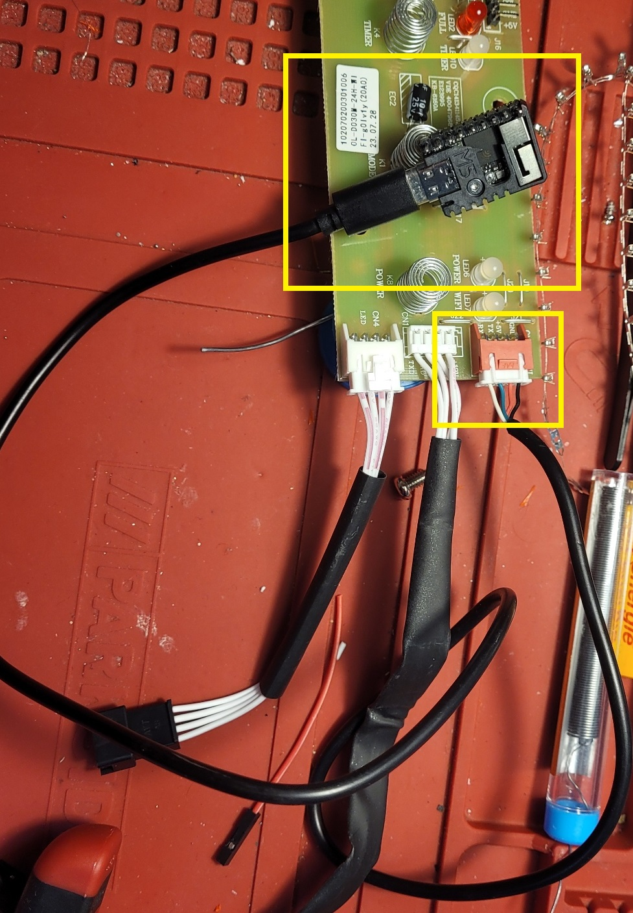

This dehumidifier is very likely sold by lot of different brand names.
"G21" brand ones looks 100% identical.

This guide is based on dehumidifer without wifi module, but if you encounter one with tuya based module, you can replace it or do [tuya-cloudcutter](https://github.com/tuya-cloudcutter/tuya-cloudcutter/).

This writeup is mostly to help others see how the device looks inside and so they do not need to figure out datapoints from scratch.

## Hardware

In my opinion easiest way to add connectivity to this device is use wifi connector present on board (in my case even for device sold with wifi capability). When using esp32-c3 or esp32-s3 on most boards we can take advantage of D+ and D- USB wires being connected to GPIO19 and GPIO20.




We can create cable using JST XH 2.54mm connector connected to the RX TX 5V GND on the connector to the basic 4 wire usb-C cable where we connect RX and TX pins to D+ and D- of the usb cable (green and white). GND will be black and 5V red of the usb cable.



## Board Configuration

Configuraiton is based on [Ningbo Fuda 5250B Dehumidifier](https://devices.esphome.io/devices/Ningbo-Fuda-5250B-Dehumidifier)

```yaml
substitutions:
  hostname: eh-maltec-dehumidifier
  device_id: maltec-dehumidifier
  device_name: Maltec Dehumidifier
  comment: Maltec Dehumidifier, M5Stamp ESP32S3, usb for rx tx

esphome:
  friendly_name: Maltec Dehumidifier EH
  area: Living room
  name: ${hostname}
  comment: ${comment}
  platformio_options:
    board_build.flash_mode: dio
    board_build.f_cpu: 80000000L
    build_flags:
      -"-D CONFIG_FREERTOS_UNICORE"
  
esp32:
  board: esp32-s3-devkitc-1
  variant: esp32s3
  framework:
    type: esp-idf
    sdkconfig_options:
      CONFIG_FREERTOS_UNICORE: y
      CONFIG_ESP32_DEFAULT_CPU_FREQ_80: y
      CONFIG_ESP32_DEFAULT_CPU_FREQ_MHZ: "80"

preferences:
  flash_write_interval: 2min

logger:
  level: VERBOSE
  logs:
    bluetooth_proxy: DEBUG
    esp32_ble: DEBUG
    tuya: DEBUG
    tuya.switch: DEBUG
    tuya.number: DEBUG
    tuya.sensor: DEBUG
    tuya.select: DEBUG
    mdns: DEBUG
    json: DEBUG
    sensor: DEBUG
    uart: WARN
    debug: NONE
    wifi: WARN
    internal_temperature: WARN
    api.connection: INFO
    text_sensor: DEBUG
    logger: DEBUG
    esp-idf: WARN
    number: DEBUG
    select: DEBUG
    main: DEBUG
  
# OTA flashing
ota:
  - platform: esphome

wifi: # Your Wifi network details
  
# Enable fallback hotspot in case wifi connection fails  
  ap:

# Enable Home Assistant API
api:

# Enable the captive portal
captive_portal:

##################################################################

uart:
  rx_pin: 20 # usb-c
  tx_pin: 19 # usb-c
  baud_rate: 9600

tuya:
  on_datapoint_update:
    - sensor_datapoint: 19
      datapoint_type: bitmask
      then:
        - lambda: |-
            ESP_LOGD("main", "on_datapoint_update %s", format_hex_pretty(x).c_str());
            id(water_tank_full).publish_state((x >> 0) & 1);

binary_sensor:
  - platform: template
    id: water_tank_full
    name: "Water tank full" #19
    device_class: problem
    icon: "mdi:water-alert"

switch:
  - platform: tuya
    name: "Power"
    switch_datapoint: 1
    icon: "mdi:power"
  - platform: tuya
    name: "Child lock"
    icon: "mdi:lock"
    switch_datapoint: 16
  - platform: tuya
    name: "Sleep"
    icon: "mdi:sleep"
    switch_datapoint: 14

number:
  - platform: tuya
    name: "Target humidity"
    number_datapoint: 2
    unit_of_measurement: "%"
    device_class: "humidity"
    min_value: 30
    max_value: 80
    step: 5
    icon: "mdi:water"
  - platform: tuya
    name: "Timer"
    number_datapoint: 17
    min_value: 0
    max_value: 20
    step: 5
    icon: "mdi:timer-cog"

sensor:
  - platform: tuya
    name: "Current Temperature"
    sensor_datapoint: 7
    unit_of_measurement: "°C"
    device_class: "temperature"
    accuracy_decimals: 0
  - platform: tuya
    name: "Humidity"
    sensor_datapoint: 6
    unit_of_measurement: "%"
    device_class: "humidity"
    accuracy_decimals: 0
    icon: "mdi:water-percent"

  - platform: uptime
    name: Uptime
  - platform: internal_temperature
    name: CPU Temperature

select:
  - platform: tuya
    name: "Mode"
    icon: "mdi:cog"
    enum_datapoint: 5
    options:
      1: Regular
      0: Clothes drying
  - platform: tuya
    name: "Fan speed"
    icon: "mdi:fan"
    enum_datapoint: 4
    options:
      0: Low
      1: High

##################################################################
text_sensor:
  - platform: debug
    device:
      name: "Device Info"
      internal: False
      disabled_by_default: True
    reset_reason:
      name: "Reset Reason"
  
button:
  - platform: restart
    name: "Restart"
    icon: "mdi:restart"
    internal: False
```
