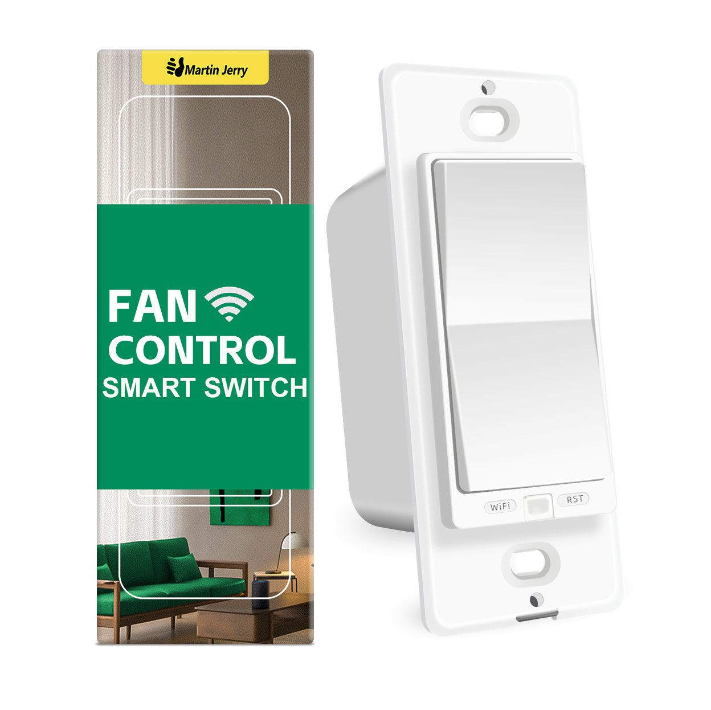
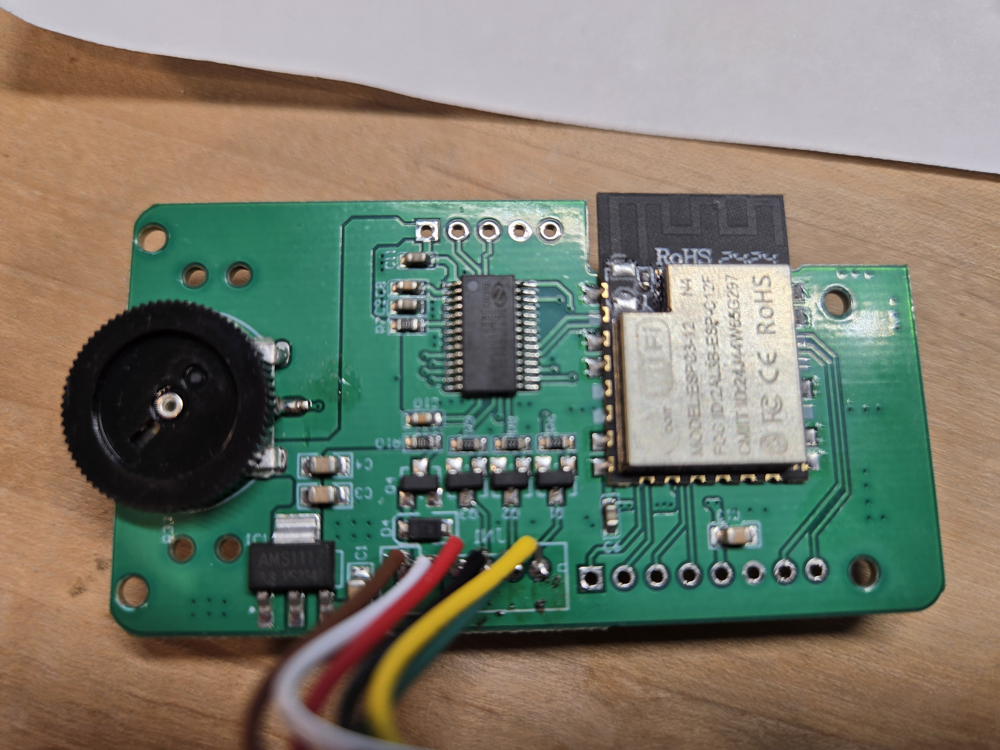
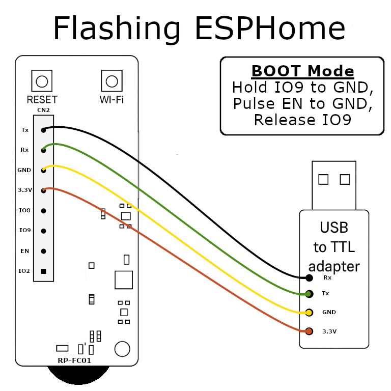

*Contributed by [Tim Irvin](https://github.com/irvintim)*

---

## Overview

The **MJ-RP-FC01** is a WiFi-enabled ceiling fan controller originally built for the Tuya ecosystem.  
It uses an **ESP32-C3** microcontroller and a **Tuya MCU** to manage fan speeds and modes.  
With ESPHome, the device can be locally controlled in Home Assistant without cloud dependencies.

This integration provides full speed and mode control via ESPHome while preserving the physical paddle switch functionality.

---

## Features

- 4 speed levels (25%, 50%, 75%, 100%)  
- Preset modes: Normal, Natural, Sleep  
- Tuya MCU-based UART control  
- ESPHome-native WiFi, OTA, and API support  
- Paddle input retains speed cycling control  
- Full Home Assistant integration

---

## CN2 Pinout (Confirmed)

| CN2 Pin | ESP32-C3 Pin | Function                                     |
|----------|---------------|----------------------------------------------|
| 1 | GPIO2 | Status LED / indicator (unused for flashing) |
| 2 | EN | Reset / Enable                               |
| 3 | GPIO9 | Boot select                                  |
| 4 | GPIO8 | Pin (unused for flashing)                    |
| 5 | 3.3V | Power                                        |
| 6 | GND | Ground                                       |
| 7 | GPIO21 | UART RX (to TX of USB-TTL)                   |
| 8 | GPIO22 | UART TX (to RX of USB-TTL)                   |

---

## Entering Bootloader Mode

When flashing the ESP32-C3 directly, use the following steps to enter boot mode:

1. Power the board at **3.3V** and **GND**.  
2. **Hold GPIO9** to **GND.**  
3. **Pulse EN** to **GND** briefly (while still holding GPIO9).  
4. **Release GPIO9.**  
5. Flash factory firmware at **115200 baud** via your USB-TTL adapter.
6. Subsequent OTA firmware flashing will work

> ⚠️ **Note:** Do *not* attempt to flash via the Tuya Tasmota web UI.  
> While it may initially accept an ESPHome binary, OTA updates will fail afterward,  
> requiring disassembly and a serial reflash using this method.

---

## Flashing Connections

| USB-TTL Adapter | CN2 Pin | Notes             |
|------------------|----------|-------------------|
| TX → | GPIO21 | RX on CN2 (UART0) |
| RX ← | GPIO22 | TX on CN2 (UART0) |
| GND | GND | Common ground     |
| 3.3V | 3.3V | Power supply      |

---

## ESPHome YAML Example

Below is the confirmed working configuration used in Home Assistant:

```yaml
substitutions:
  name: "rp-fc01"
  friendly_name: "Martin Jerry RP-FC01"

esphome:
  name: "${name}"
  friendly_name: "${friendly_name}"
  comment: MJ-RP-FC01 Ceiling Fan Controller (ESP32-C3)

esp32:
  board: esp32-c3-devkitm-1
  variant: esp32c3
  framework:
    type: esp-idf

logger:
  level: DEBUG

wifi:
  ssid: !secret wifi_ssid
  password: !secret wifi_password
  ap:
    ssid: "FanControlFallback"
    password: "fallback1234"

api:
ota:

uart:
  id: uart_bus
  tx_pin: GPIO22
  rx_pin: GPIO21
  baud_rate: 9600

tuya:
  uart_id: uart_bus

fan:
  - platform: tuya
    id: mcu_fan
    name: "Ceiling Fan"
    switch_datapoint: 1
    speed_datapoint: 3
    speed_count: 4

select:
  - platform: tuya
    id: fan_mode_select
    name: "Fan Mode"
    enum_datapoint: 11
    options:
      0: Normal
      1: Natural
      2: Sleep
````

---

## Behavior Notes

* **Speed cycling:**
  The physical paddle cycles through the four fan speeds (25–100%).
  Long-pressing the **down paddle** powers the fan off.

* **Preset mode:**
  The mode selector in Home Assistant (Normal/Natural/Sleep) persists internally but may reset visually when fan speed changes.
  This is purely a UI sync quirk; the MCU retains its selected mode.

* **Timer function:**
  The MCU includes a timer datapoint, but this integration omits it by default since it’s rarely used.

---

## Images





---

## Acknowledgments

Special thanks to the ESPHome community and all contributors who helped validate the UART mapping and Tuya datapoint decoding.
This guide was field-tested and verified by **Tim Irvin** in October 2025.

---

## Caveats

* Requires disassembly for the first flash.
* CN2 header pins are not marked, pin 1 has the square pad.
* Always verify voltage at CN2 before connecting USB-TTL (must be 3.3V).

---

## Revision History

* **2025-10-04:** Initial public release (confirmed working ESPHome build)

```
