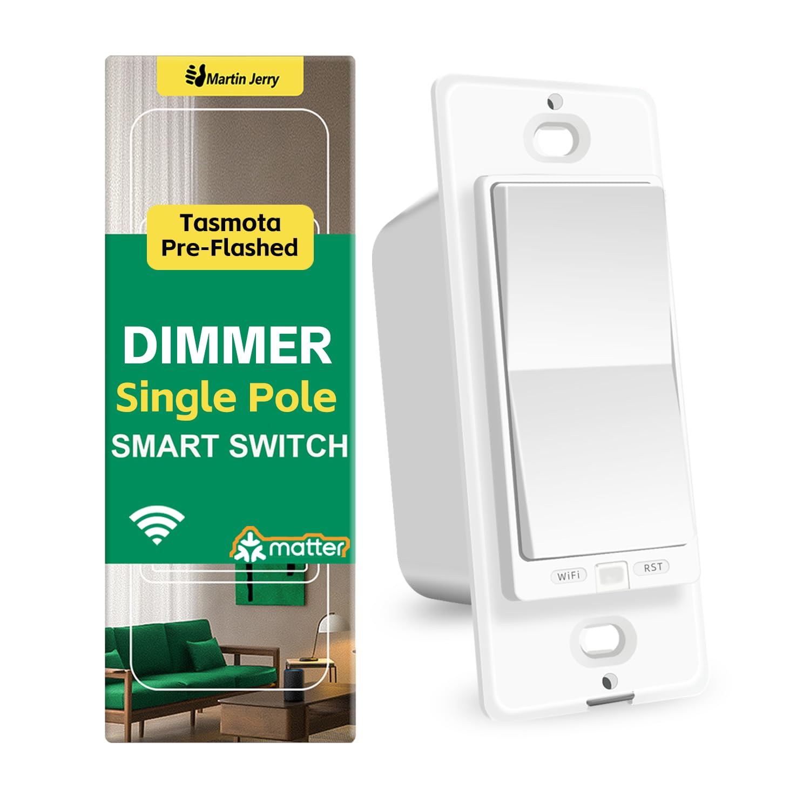
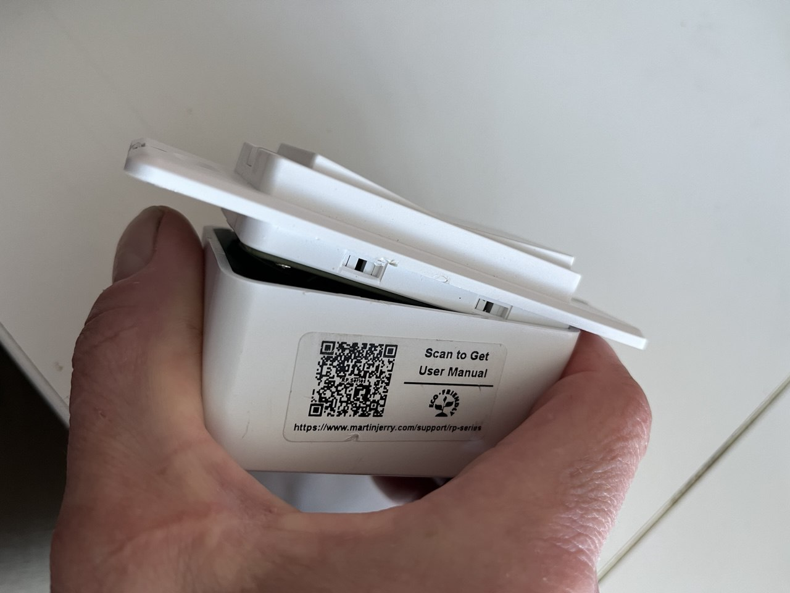
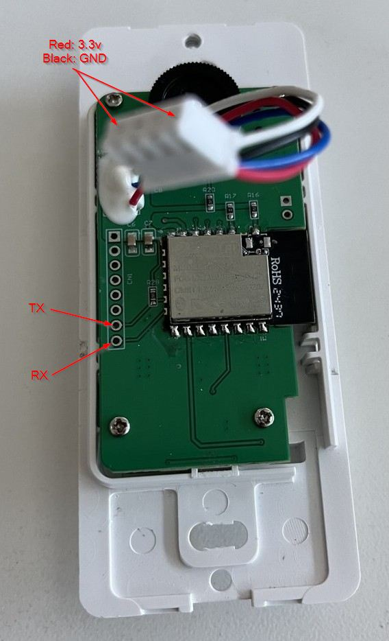

## Description

The **Martin Jerry RP-SD01** is a US-style wall dimmer switch based on the **ESP32-C3-12F** module. It ships with Tasmota preinstalled, but its default configuration can be unintuitive — the up/down rocker only controls dimming, while toggling the relay requires pressing a small Wi-Fi button on the front panel. After attempting to adjust this behavior using Tasmota rules, flashing ESPHome provided a much more intuitive and responsive experience.

[Amazon Link](https://a.co/d/3KxaLps)



This ESPHome configuration enables:

- Full control of the light dimming and relay via the rocker buttons.
- LED indicators to reflect the brightness level.
- Automatic restoration of the previous brightness setting after power loss.
- A default relay state of **OFF** on power-up.

## Flashing Instructions

To open the device:

1. Firmly squeeze the dimmer from the sides — the case will flex slightly.
2. Gently pry off the back cover, starting from the top. Be careful not to damage the dimmer wheel.



Once opened:

1. Disconnect the 4-pin cable — this is where you'll connect your serial adapter for flashing.
2. Use a 3.3V USB-to-TTL adapter and connect it to the header as shown below.



To enter flash mode:

1. Press and hold both the **Up** rocker and the **Wi-Fi** button (bottom left).
2. While holding them, press and release the **RST** button (bottom right).
3. Release the buttons — the device is now in flash mode.

You can now flash ESPHome using the ESPHome Dashboard or the CLI.

## GPIO Mapping

| Pin | Use                       |
| --- | ------------------------- |
| 9   | Up Button                 |
| 21  | Down Button               |
| 8   | WiFi Button               |
| 5   | PWM                       |
| 18  | Activity LED (inverted)   |
| 2   | Relay and Dim level 1 LED |
| 3   | Dim level 2 LED           |
| 4   | Dim level 3 LED           |
| 19  | Dim level 4 LED           |
| 20  | Dim level 5 LED           |

## Button Behavior (using advanced example below)

The up/down rocker provides intuitive control of both brightness and relay state:

| Button | Single Press | Hold       | Double Click      |
|--------|--------------|------------|-------------------|
| Up     | Turn On      | Dim Up     | Turn On (100%)    |
| Down   | Turn Off     | Dim Down   | Turn On (1%)      |

- The **Wi-Fi button** is still available but not used in the default configuration.
- The **LED indicators** show brightness level when the relay is ON.

## Example Configurations

### Basic Example

```yaml
substitutions:
  name: "rp-sd01"

esphome:
  name: "${name}"
  name_add_mac_suffix: true

esp32:
  board: esp32-c3-devkitm-1
  variant: esp32c3
  framework:
    type: esp-idf

logger:

api:
  reboot_timeout: 0s

ota:

wifi:
  ssid: !secret wifi_ssid
  password: !secret wifi_password
  ap: {}

captive_portal:

# Relay control
switch:
  - platform: gpio
    name: "Relay"
    id: relay
    pin:
      number: 2
      inverted: true
    restore_mode: ALWAYS_OFF

# PWM dimmer output
output:
  - platform: ledc
    id: pwm_output
    pin: GPIO5
    frequency: 1000 Hz
    min_power: 0.01
    max_power: 0.9

light:
  - platform: monochromatic
    name: "Dimmer"
    id: pwm_light
    output: pwm_output
    restore_mode: RESTORE_AND_OFF

# Button GPIOs (no logic attached yet)
binary_sensor:
  - platform: gpio
    id: button_wifi
    name: "Wi-Fi Button"
    pin: GPIO8

  - platform: gpio
    id: button_up
    name: "Up Button"
    pin:
      number: GPIO9
      mode: INPUT_PULLUP
      inverted: true

  - platform: gpio
    id: button_down
    name: "Down Button"
    pin:
      number: GPIO21
      mode: INPUT_PULLUP
      inverted: true

```

### Advanced Example which includes

- Dimmer control
- Relay switching
- Brightness feedback via LEDs
- Power-on behavior
- Optional fallback AP + captive portal

```yaml
substitutions:
  name: "rp-sd01"

esphome:
  name: "${name}"
  name_add_mac_suffix: true
  friendly_name: "${friendly_name}"
  name_add_mac_suffix: true
  platformio_options:
    board_build.flash_mode: dio
  on_boot:
    then:
      - script.execute: update_led_bar

esp32:
  board: esp32-c3-devkitm-1
  variant: esp32c3
  framework:
    type: esp-idf
    version: latest

logger:

api:
  reboot_timeout: 0s

ota:
  - platform: esphome

wifi:
  networks:
    - ssid: !secret wifi_ssid
      password: !secret wifi_password
  ap: {}

captive_portal:

script:
  - id: update_led_bar
    mode: restart
    then:
      - lambda: |-
          if (!id(relay1).state) {
            id(led2).turn_off();
            id(led3).turn_off();
            id(led4).turn_off();
            id(led5).turn_off();
            return;
          }
          float brightness = id(pwm_light).current_values.get_brightness();
          if (brightness > 0.20) id(led2).turn_on(); else id(led2).turn_off();
          if (brightness > 0.40) id(led3).turn_on(); else id(led3).turn_off();
          if (brightness > 0.60) id(led4).turn_on(); else id(led4).turn_off();
          if (brightness > 0.80) id(led5).turn_on(); else id(led5).turn_off();

light:
  - platform: binary
    name: "Activity LED"
    output: led_activity
  - platform: binary
    name: "Indicator LED 2"
    output: led2
  - platform: binary
    name: "Indicator LED 3"
    output: led3
  - platform: binary
    name: "Indicator LED 4"
    output: led4
  - platform: binary
    name: "Indicator LED 5"
    output: led5
  - platform: monochromatic
    name: "PWM Light"
    id: pwm_light
    output: pwm_output
    restore_mode: RESTORE_AND_OFF
    on_turn_on:
      then:
        - switch.turn_on: relay1
        - script.execute: update_led_bar
    on_turn_off:
      then:
        - switch.turn_off: relay1
        - script.execute: update_led_bar

switch:
  - platform: gpio
    name: "Relay"
    id: relay1
    pin:
      number: 2
      inverted: true
    restore_mode: ALWAYS_OFF
    on_turn_off:
      then:
        - lambda: |-
            id(led2).turn_off();
            id(led3).turn_off();
            id(led4).turn_off();
            id(led5).turn_off();

globals:
  - id: dimming
    type: bool
    restore_value: no
    initial_value: 'false'
  - id: saved_brightness
    type: float
    restore_value: yes
    initial_value: '0.5'

binary_sensor:
  - platform: gpio
    pin: GPIO8
    id: button_wifi
    name: "Wi-Fi Button"
  - platform: gpio
    pin:
      number: GPIO9
      mode: INPUT_PULLUP
      inverted: true
    id: button_up
    name: "Up Button"
    on_multi_click:
      - timing:
          - ON for at most 350ms
          - OFF for at most 250ms
          - ON for at most 350ms
        then:
          - switch.turn_on: relay1
          - light.turn_on:
              id: pwm_light
              brightness: 100%
              transition_length: 0ms
          - script.execute: update_led_bar
    on_click:
      min_length: 50ms
      max_length: 350ms
      then:
        - switch.turn_on: relay1
        - light.turn_on: pwm_light
    on_press:
      then:
        - lambda: 'id(dimming) = true;'
        - delay: 300ms
        - if:
            condition:
              lambda: 'return id(dimming);'
            then:
              - while:
                  condition:
                    lambda: 'return id(dimming);'
                  then:
                    - lambda: |-
                        auto call = id(pwm_light).make_call();
                        float current = id(pwm_light).current_values.get_brightness();
                        current += 0.05;
                        if (current > 1.0) current = 1.0;
                        call.set_transition_length(100);
                        call.set_brightness(current);
                        call.perform();
                        id(update_led_bar)->execute();
                    - delay: 200ms
    on_release:
      then:
        - lambda: 'id(dimming) = false;'

  - platform: gpio
    pin:
      number: GPIO21
      mode: INPUT_PULLUP
      inverted: true
    id: button_down
    name: "Down Button"
    on_multi_click:
      - timing:
          - ON for at most 350ms
          - OFF for at most 250ms
          - ON for at most 350ms
        then:
          - switch.turn_on: relay1
          - light.turn_on:
              id: pwm_light
              brightness: 1%
              transition_length: 0ms
          - script.execute: update_led_bar
    on_click:
      min_length: 50ms
      max_length: 350ms
      then:
        - switch.turn_off: relay1
        - light.turn_off: pwm_light
    on_press:
      then:
        - lambda: 'id(dimming) = true;'
        - delay: 300ms
        - if:
            condition:
              lambda: 'return id(dimming);'
            then:
              - while:
                  condition:
                    lambda: 'return id(dimming);'
                  then:
                    - lambda: |-
                        auto call = id(pwm_light).make_call();
                        float current = id(pwm_light).current_values.get_brightness();
                        current -= 0.05;
                        if (current < 0.01) current = 0.01;
                        call.set_transition_length(100);
                        call.set_brightness(current);
                        call.perform();
                        id(update_led_bar)->execute();
                    - delay: 200ms
    on_release:
      then:
        - lambda: 'id(dimming) = false;'

output:
  - platform: ledc
    id: pwm_output
    pin: GPIO5
    frequency: 1000 Hz
    min_power: 0.01
    max_power: 0.9
  - platform: gpio
    id: led_activity
    pin:
      number: GPIO18
      inverted: true
  - platform: gpio
    id: led2
    pin:
      number: GPIO3
      inverted: true
  - platform: gpio
    id: led3
    pin:
      number: GPIO4
      inverted: true
  - platform: gpio
    id: led4
    pin:
      number: GPIO19
      inverted: true
  - platform: gpio
    id: led5
    pin:
      number: GPIO20
      inverted: true
