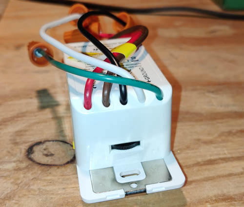
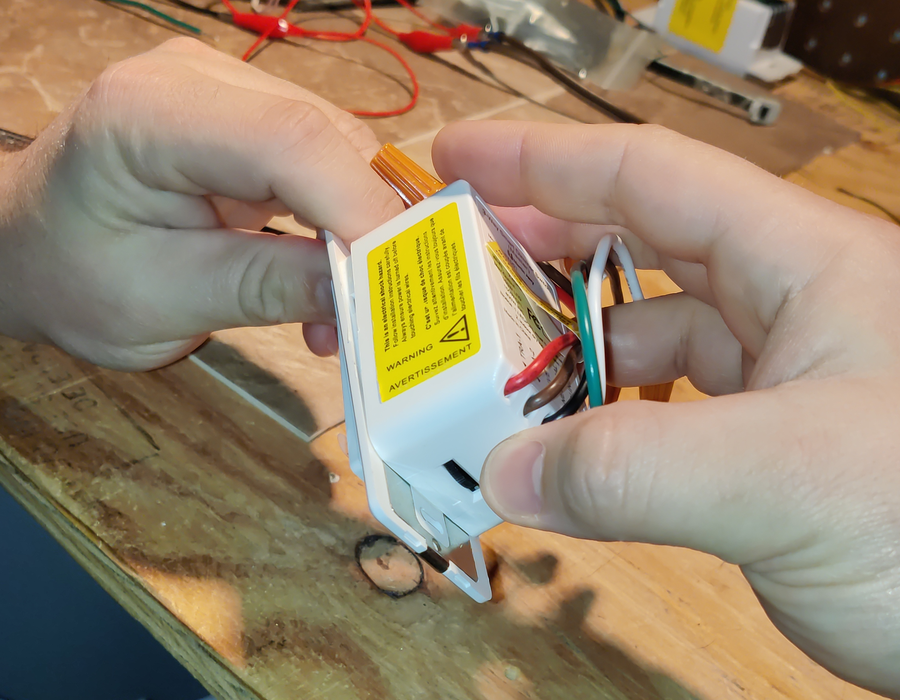
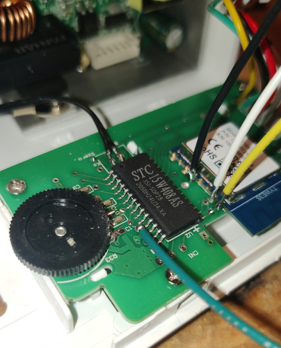

Martin Jerry STD01 3-Way Switch

[Amazon Link](https://amzn.to/3Mik8su)

## Notes

This TuyaMCU requires a baud rate of 115200.

You only need to disassemble the "master" device - the one with five wires.  The other unit doesn't have any smarts in it.  When you disassemble the device, mind the thumbwheel at the bottom of the switch.

You need to pull it apart from the top first or the thumbwheel will break off.


The black and red wires on the harness are ground and 3.3V respectively.
You will need to soldier wires onto GPIO0, TX, RX, and the Tuya MCU's reset pin.

The Tuya MCU's reset pin is number 11, and is active **HIGH** - you need to connect it to VCC.  Be careful not to lift the trace soldering, though it's not the end of the word if you do.
Note that the reset button on the switch itself kills the power supply.  In my picture, the Tuya MCU reset is green, GPIO0 is black, TX is yellow, and RX is white.

Finally, the device won't function properly if the harness isn't plugged in - the ESP and the Tuya MCU refuse to talk to each other.  I have not figured out why; I reconnected it, hooked it up to AC, and powered it up and insured it works.

## GPIO Pinout

| Pin   | Function |
| ----- | -------- |
| GPIO1 | Tuya Tx  |
| GPIO3 | Tuya Rx  |

## Basic Configuration

```yaml
substitutions:
  device_name: familyroom_light_1 #change
  friendly_name: Family Room Light #change
  icon: "mdi:light-switch"

esphome:
  name: ${device_name}
  platform: ESP8266
  board: esp01_1m

wifi:
  ssid: !secret wifi_ssid
  password: !secret wifi_password

logger:
  baud_rate: 0

api:

ota:

uart:
  rx_pin: GPIO3
  tx_pin: GPIO1
  baud_rate: 115200

tuya:

sensor:
  - platform: wifi_signal
    name: ${friendly_name} WiFi Signal
    update_interval: 60s

  - platform: uptime
    name: ${friendly_name} Uptime

binary_sensor:
  - platform: status
    name: ${friendly_name} Status

light:
  - platform: "tuya"
    name: ${friendly_name}
    dimmer_datapoint: 2
    switch_datapoint: 1
    min_value: 20
    max_value: 255
```
