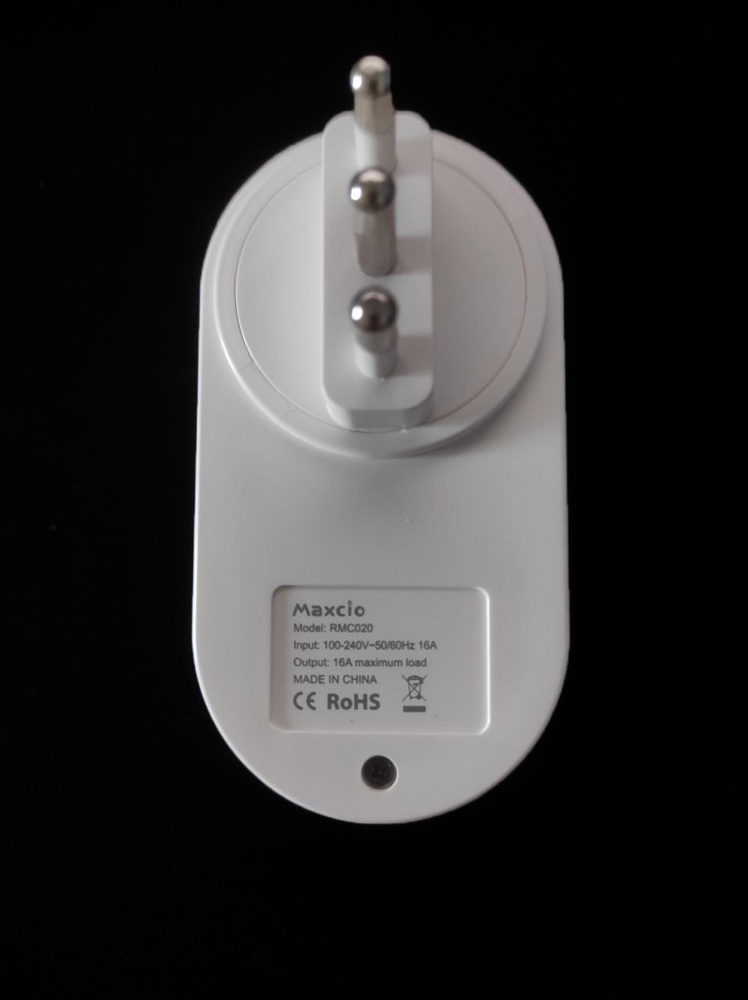

⚠️ **WARNING:** Requires the replacement of ESP chip with ESP-02S.




Maker: https://maxcio.com/collections/plug-and-strip/

## ESP-02S GPIO Pinout

| Pin    | Function       |
| ------ | -------------- |
| RX     | Button         |
| GPIO4  | HLW8012 CF Pin |
| GPIO5  | HLWBL CF1 Pin  |
| GPIO12 | HLWBL SEL Pin  |
| GPIO13 | Led            |
| GPIO14 | Relay          |

## Basic Config

### Base Hardware - Base Config

```yaml
substitutions:
  devicename: maxcio
  friendly_name: Smart Plug Maxcio
  device_description: Smart Plug Maxcio RMC020 Power Monitoring Plug with button, Red led.
  current_res: "0.002501592" # Random value. Requires power monitoring calibration
  voltage_div: "803.2" # Random value. Requires power monitoring calibration

esphome:
  name: ${devicename}
  comment: ${device_description}
  platform: ESP8266
  board: esp01_1m

wifi:
  ssid: !secret wifi_ssid
  password: !secret wifi_password

  # Enable fallback hotspot (captive portal) in case wifi connection fails
  ap:
    ssid: ${friendly_name}
    password: !secret ap_password

  manual_ip:
    static_ip: 192.168.1.131
    gateway: 192.168.1.1
    subnet: 255.255.255.0

captive_portal:

# Enable logging
logger:

# Web server can be removed after enabling HA API
web_server:
  port: 80

# Enable Home Assistant API
api:
#  password: !secret OTA_Password

ota:
#  password: !secret OTA_Password

# Enable time component for use by daily power sensor
time:
  - platform: homeassistant
    id: homeassistant_time

sensor:
  # Reports how long the device has been powered (in minutes)
  - platform: uptime
    name: ${friendly_name} Uptime
    filters:
      - lambda: return x / 60.0;
    unit_of_measurement: minutes

  # Reports the WiFi signal strength
  - platform: wifi_signal
    name: ${friendly_name} Wifi Signal
    update_interval: 60s

  # Reports the Current, Voltage, and Power used by the plugged-in device
  - platform: hlw8012
    sel_pin:
      number: GPIO12
      inverted: true
    cf_pin: GPIO04
    cf1_pin: GPIO05
    change_mode_every: 8
    update_interval: 10s
    current:
      name: ${friendly_name} Amperage
      icon: mdi:current-ac
      unit_of_measurement: A
    voltage:
      name: ${friendly_name} Voltage
      icon: mdi:flash-circle
      unit_of_measurement: V
    power:
      id: wattage
      name: ${friendly_name} Wattage
      icon: mdi:flash-outline
      unit_of_measurement: Watt
    current_resistor: ${current_res}
    voltage_divider: ${voltage_div}

  # Reports the total Power so-far each day, resets at midnight, see https://esphome.io/components/sensor/total_daily_energy.html
  # - platform: total_daily_energy
  #   name: ${friendly_name} Total Daily Energy
  #   icon: mdi:circle-slice-3
  #   power_id: wattage
  #   filters:
  #     # Multiplication factor from W to kW is 0.001
  #     - multiply: 0.001
  #   unit_of_measurement: kWh

binary_sensor:
  # Button on the front is pressed and then toggle relay
  - platform: gpio
    device_class: power
    pin:
      number: RX
      #mode: INPUT_PULLUP
      inverted: True
    name: ${friendly_name} Button # Name to make button visible in HA
    on_press:
      - switch.toggle: relay

switch:
  # Relay itself
  - platform: gpio
    name: ${friendly_name}
    pin: GPIO14
    id: relay
    restore_mode: ALWAYS_OFF
    #RESTORE_DEFAULT_OFF (Default) - Attempt to restore state and default to OFF if not possible to restore. Uses flash write cycles.
    #RESTORE_DEFAULT_ON - Attempt to restore state and default to ON. Uses flash write cycles.
    #ALWAYS_OFF - Always initialize the pin as OFF on bootup. Does not use flash write cycles.
    #ALWAYS_ON - Always initialize the pin as ON on bootup. Does not use flash write cycles.
    on_turn_on: # Action when relay is turned on
      - script.execute: led_power_on
    on_turn_off: # Action when relay is turned off
      - script.execute: led_relay_off

output:
  # Output GPIOs for red led
  - platform: esp8266_pwm # Red
    id: ${devicename}_red_output
    pin:
      number: GPIO13
      inverted: True

light:
  # RGB light
  - platform: monochromatic
    name: ${friendly_name} Light
    output: ${devicename}_red_output
    id: ${devicename}_red_led

# Blink the red light if we aren't connected to WiFi. Could use https://esphome.io/components/status_led.html instead but then we couldn't use the blue light for other things as well.
# Only if not connected after 30s
interval:
  - interval: 2000ms
    then:
      - if:
          condition:
            for:
              time: 30s
              condition:
                not:
                  wifi.connected:
          then:
            - light.turn_on:
                id: ${devicename}_red_led
                brightness: 100%

script:
  - id: led_relay_off # Normal operation when relay is off
    then:
      - light.turn_off:
          id: ${devicename}_red_led
          transition_length: 200ms
  - id: led_power_on # Normal operation when relay is on
    then:
      - light.turn_on:
          id: ${devicename}_red_led
          brightness: 80%
          transition_length: 200ms
```
