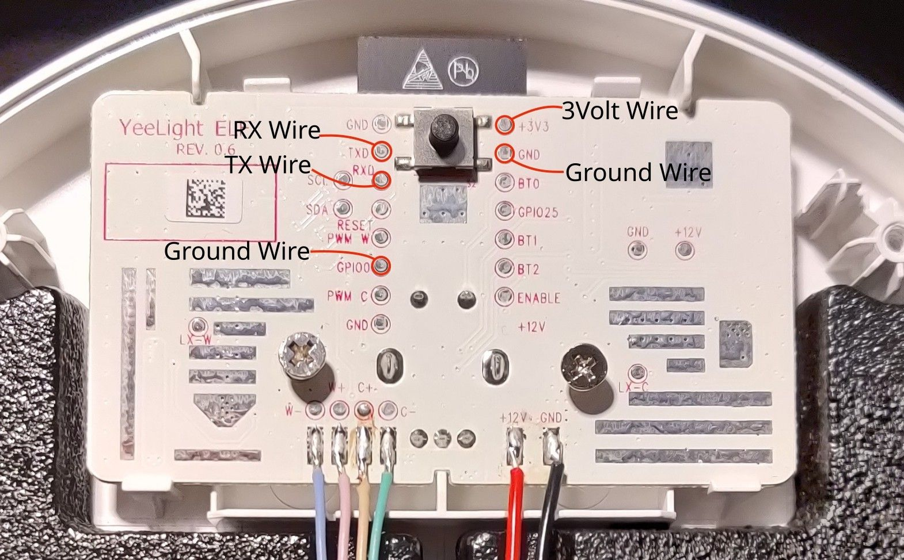

## Install ESPHome on Xiaomi Mi Smart LED Desk Lamp Pro

### Materials

To install ESPHome onto your Lamp you need

- Soldering iron
- Serial to USB stick
- 3 Volt Power from extern or the Serial-USB

### Open the Device

Unplug your Lamp and remove the screw under the rubber feet. Marked in the picture.


### Solder your debugger onto the Board

Plugin the 3Volts last.



### (Optional) backup old Firmware

If you want to backup the old firmware just use esptool.

Just replace COM or ttyUSB.

#### Linux

```batch
python3 -m esptool -b 115200 --port /dev/ttyUSB0 read_flash 0x00000 0x400000 your/folder/firmwaredump.bin
```

#### Windows

```batch
python.exe -m esptool -b 115200 --port COM3 read_flash 0x00000 0x400000 your/folder/firmwaredump.bin
```

## Recommended Config

```yaml
esphome:
  name: midesklamppro

esp32:
  board: esp32doit-devkit-v1
  framework:
    type: esp-idf
    version: 4.4.1
    sdkconfig_options:
      CONFIG_FREERTOS_UNICORE: y
    advanced:
      ignore_efuse_mac_crc: true

wifi:
  ssid: !secret wifi_ssid
  password: !secret wifi_password

# Enable logging
logger:

api:
  reboot_timeout: 0s
  password: !secret password

ota:
  password: !secret password

sensor:
  - platform: rotary_encoder
    id: rotation
    pin_a: GPIO26
    pin_b: GPIO27
    resolution: 2
    on_value:
      then:
        - if:
            condition:
              # Check if Button is pressed while rotating
              lambda: "return id(button).state;"
            then:
              # If Button is pressed, change CW/WW
              - lambda: |-
                  auto min_temp = id(light1).get_traits().get_min_mireds();
                  auto max_temp = id(light1).get_traits().get_max_mireds();
                  auto cur_temp = id(light1).current_values.get_color_temperature();
                  auto new_temp = max(min_temp, min(max_temp, cur_temp + (x*10)));
                  auto call = id(light1).turn_on();
                  call.set_color_temperature(new_temp);
                  call.perform();
            else:
              # If Button is not pressed, change brightness
              - light.dim_relative:
                  id: light1
                  relative_brightness: !lambda |-
                    return x / 25.0;
        # Reset Rotation to 0
        - sensor.rotary_encoder.set_value:
            id: rotation
            value: 0

binary_sensor:
  - platform: gpio
    id: button
    pin:
      number: GPIO33
      inverted: True
      mode: INPUT_PULLDOWN
    on_click:
      then:
        - light.toggle:
            id: light1
            transition_length: 0.5s
    filters:
      - delayed_off: 5ms

number:
  - id: freq1
    name: "Flicker Frequency"
    icon: "mdi:sine-wave"
    unit_of_measurement: "Hz"
    platform: template
    min_value: 0
    max_value: 100000
    initial_value: 100000
    mode: box
    step: 1
    set_action:
      - output.ledc.set_frequency:
          id: output_cw
          frequency: !lambda return x;
      - output.ledc.set_frequency:
          id: output_ww
          frequency: !lambda return x;

output:
  - platform: ledc
    pin: GPIO2
    id: output_cw
    power_supply: power
    frequency: 100000Hz
  - platform: ledc
    pin: GPIO4
    id: output_ww
    power_supply: power
    frequency: 100000Hz

power_supply:
  - id: power
    pin: GPIO12
    enable_time: 0s
    keep_on_time: 0s

light:
  - platform: cwww
    id: light1
    name: "Mi Desk Lamp Pro"
    default_transition_length: 0s
    constant_brightness: true
    cold_white: output_cw
    warm_white: output_ww
    cold_white_color_temperature: 4800 K
    warm_white_color_temperature: 2500 K #2500k is the original value of the lamp. To correct binning for 2700k to look more like 2700k use 2650k instead
    restore_mode: RESTORE_DEFAULT_OFF
    gamma_correct: 1
```
