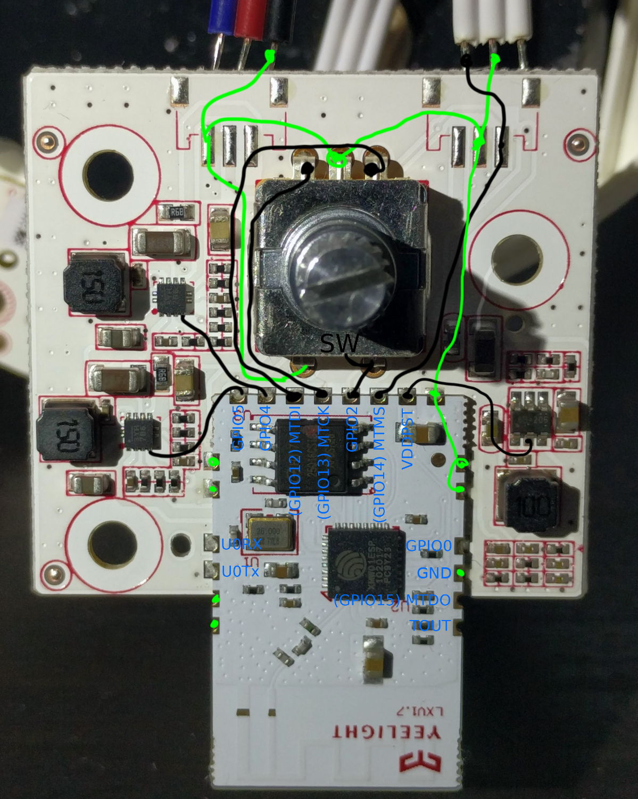

```yaml
substitutions:
  friendly_name: Mi Desk Lamp
  device_name: mi-desklamp

esphome:
  name: ${device_name}
  comment: ${friendly_name}
  platform: ESP8266
  board: esp8285

# Enable logging
logger:

# Enable Home Assistant API
api:

ota:

wifi:
  ssid: !secret wifi_ssid
  password: !secret wifi_password

  # Enable fallback hotspot (captive portal) in case wifi connection fails
  ap:
    ssid: "Mi-Desk-Lamp-1S Fallback Hotspot"
    password: "4Kv4XJ2e9Bmt"

captive_portal:

# Enable Web server
web_server:
  port: 80

# Sync time with Home Assistant
time:
  - platform: homeassistant
    id: homeassistant_time

# Text sensors with general information
text_sensor:
  - platform: version
    name: ${friendly_name} Version
  - platform: wifi_info
    ip_address:
      name: ${friendly_name} IP Address

sensor:
  # Uptime sensor
  - platform: uptime
    name: ${friendly_name} Uptime
  # WiFi Signal sensor
  - platform: wifi_signal
    name: ${friendly_name} Wifi Signal
    update_interval: 60s
  # Rotary
  - platform: rotary_encoder
    id: rotation
    pin_a: GPIO13
    pin_b: GPIO12
    resolution: 2
    on_value:
      then:
        - if:
            condition:
              # Check if Button is pressed while rotating
              lambda: 'return id(button).state;'
            then:
              # If Button is pressed, change CW/WW
              - lambda: |-
                  auto min_temp = id(light1).get_traits().get_min_mireds();
                  auto max_temp = id(light1).get_traits().get_max_mireds();
                  auto cur_temp = id(light1).current_values.get_color_temperature();
                  auto new_temp = max(min_temp, min(max_temp, cur_temp + (x * 10)));
                  auto call = id(light1).turn_on();
                  call.set_color_temperature(new_temp);
                  call.perform();
            else:
              # If Button is not pressed, change brightness
              - light.dim_relative:
                  id: light1
                  relative_brightness: !lambda |-
                    return x / 25.0;
        # Reset Rotation to 0
        - sensor.rotary_encoder.set_value:
            id: rotation
            value: 0

binary_sensor:
  - platform: gpio
    id: button
    pin:
      number: GPIO2
      inverted: true
    on_click:
      then:
        - light.toggle: light1

output:
  - platform: esp8266_pwm
    pin: GPIO4
    id: output_cold
  - platform: esp8266_pwm
    pin: GPIO5
    id: output_warm

light:
  - platform: cwww
    id: light1
    default_transition_length: 0s
    constant_brightness: true
    name: ${friendly_name} Light
    cold_white: output_cold
    warm_white: output_warm
    cold_white_color_temperature: 6500K
    warm_white_color_temperature: 2650K
    gamma_correct: 0
```



For serial flashing you need two power wires (GND, VDDPST- AKA VCC 3.3v), two serial wires (U0RX, U0TX) and the boot mode pin (GPIO0).
On your Serial Adaptor connect U0RX to TX and U0TX to RX.
ESP also needs to be put into programming mode before the firmware can be uploaded by connecting GPIO0 pin to GND prior to applying power.
