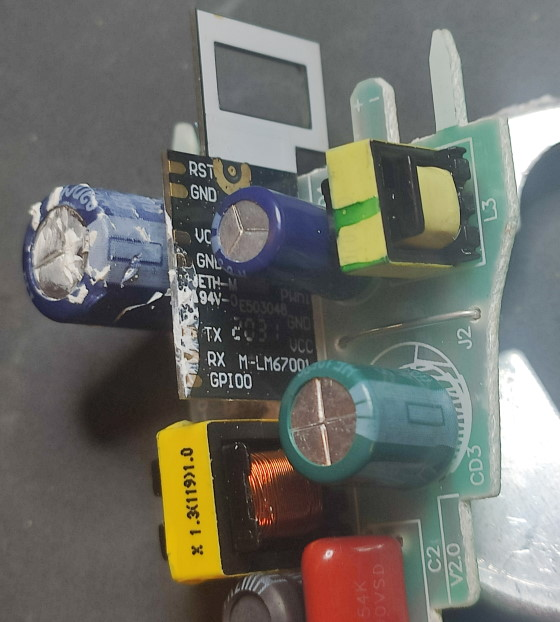

Basic white LED bulb without light temperature control.
Uses an ESP8266 carrier board with 4 outputs (see pictures at the bottom), so RGBW or CCT bulbs using the same configurations are possible (that's why the config below defines 4 output PWMs but only 1 is used).

Model numbers:

- Warm white, E27 model: XMBGDP01YLK
- Cool white, B22 model: XMBGDP02YLK
- Cool white, E27 model: XMBGDP03YLK

## Basic Configuration

```yaml
substitutions:
  friendly_name: Mi Bulb 01
  device_name: mibulb-01

# Basic Config
esphome:
  name: ${device_name}
  comment: ${friendly_name}

esp8266:
  board: modwifi

# OTA flashing
ota:
  - platform: esphome

wifi: # Your Wifi network details
  
# Enable fallback hotspot in case wifi connection fails  
  ap:

# Enabling the logging component
logger:

# Enable Home Assistant API
api:

# Enable the captive portal
captive_portal:

# Enable the Web Server component 
webserver:

# Sync time with Home Assistant
time:
  - platform: homeassistant
    id: homeassistant_time

# Text sensors with general information
text_sensor:
  - platform: version
    name: ${friendly_name} ESPHome Version
  - platform: wifi_info
    ip_address:
      name: ${friendly_name} IP Address

sensor:
  # Uptime sensor
  - platform: uptime
    name: ${friendly_name} Uptime
  # WiFi Signal sensor
  - platform: wifi_signal
    name: ${friendly_name} WiFi Signal
    update_interval: 60s

output:
  - platform: esp8266_pwm
    pin: GPIO5
    id: pwm1
    # frequency: 1000Hz
  - platform: esp8266_pwm
    pin: GPIO13
    id: pwm2
    # frequency: 1000Hz
  - platform: esp8266_pwm
    pin: GPIO12
    id: pwm3
    # frequency: 1000Hz
  - platform: esp8266_pwm
    pin: GPIO14
    id: pwm4
    # frequency: 1000Hz

light:
  - platform: monochromatic
    name: ${friendly_name} Light
    output: pwm1
    id: light01
    # Ensure the light turns on by default if the physical switch is actuated.
    restore_mode: ALWAYS_ON
    default_transition_length: 0.2s
```

## Disassembly


The bulb is glued together using some sort of hard silicone.
The top cover is a slightly soft, pliable plastic while the base is metal with plastic casted right onto it.

1. Don't disassemble the bulb right after turning it off! Not only it can be hot, there are capacitors inside that can hold 300V!
2. Gently run a sharp knife around the bulb in the slot between the top cover and the base
3. Use a spudger or a flathead screwdriver to pry open the bulb - run it around and don't force it as the plastic of the bulb's base is quite brittle
4. After removing the top cover, unscrew the 2 screws and lift the PCB with LEDs
5. Put the screws back in halfway and use them to pull the metal cover
6. Pull the main PCB until it unhooks from rails on the inside of the base (see picture below), then twist it to side and unhook the neutral contact spring and pull the PCB out




Notes:

- The controller carrier board has the pins required for flashing easily accessible and labeled, so no further disassembly is required
- For flashing use the GND pad closer to the antenna - it has weaker thermal connection and therefore is easier to solder to
- Watch out for the miniscule components near the base of the antenna, it's easy to knock them off! See the pinout picture - the orange rectangle marks one such ripped off component that caused the WiFi signal to be super weak thus effectively killing the bulb

## Pinout


