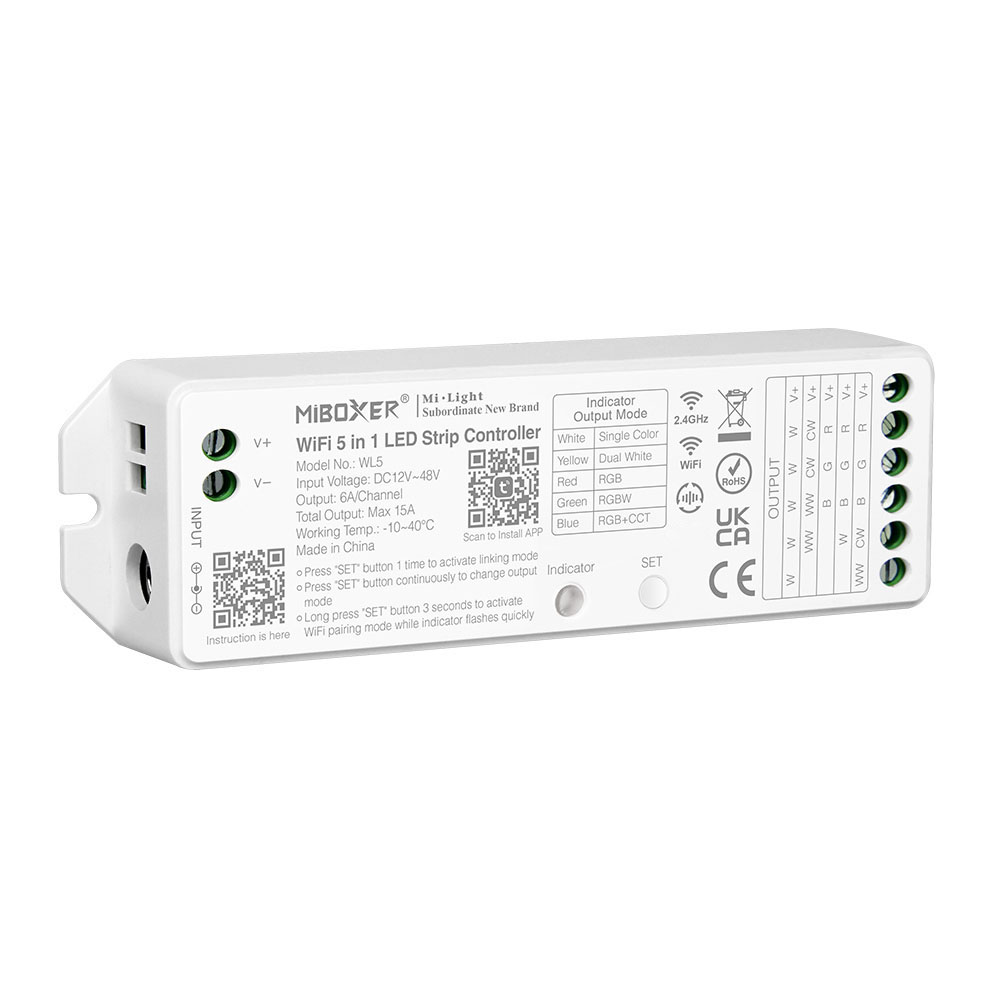
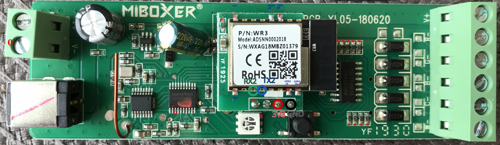

The MiBoxer WL5 is an LED controller with support for single color, CCT, RGB, RGBW, and RGBWW LED strips. It also has support for 2.4 GHz RF remote controls.

Functionally, it closely resembles the [Tuya WB5 LED controller](/devices/Tuya-WB5-WiFi-5in1-LED-Controller), with the main difference being the microcontroller. The WL5 uses a Tuya WR3 module, which is based on the RTL8710BN microcontroller.

## Pinout



| Pin | Function                                   |
| --- | ------------------------------------------ |
| GND | Ground connection                          |
| 3V3 | 3.3V input for powering the controller     |
| TX0 | Transmit pin connected to the Tuya MCU     |
| RX0 | Receive pin connected to the Tuya MCU      |
| TX2 | Transmit pin used for flashing/programming |
| RX2 | Receive pin used for flashing/programming  |

## Prerequisites

- Connect your **serial programming adapter** to the **WR3 module** as follows:
  - **GND** → GND
  - **3V3** → 3V3
  - **RX** → TX2
  - **TX** → RX2  
  Refer to the image above for the pinout layout.

- If you haven’t already, download [**ltchiptool**](https://github.com/libretiny-eu/ltchiptool), a command-line utility for flashing and dumping firmware.  
  **Note**: The standard ESP flasher is not compatible with this device.

## Flashing

Before flashing or dumping firmware, the device must be placed in **download mode**:

1. **Short TX2 to GND.**
2. **Power on the device** by connecting either:
   - the **3.3V and GND lines** to an adjustable power supply, or  
   - the device’s **12–24V DC power supply** via the `INPUT` plug connection.
3. Connect the programming adapter to your PC.  
   > *ltchiptool will prompt you later to disconnect TX2 from GND.*

**Note:** As an alternative to disconnecting and reconnecting power, you can also **power cycle** the device by shorting the **EN** pin to **GND**

## Backing up the original firmware

Before flashing ESPHome, it’s highly recommended to back up the original firmware in case you want to restore the stock functionality later. Run:

```shell
ltchiptool flash read realtek-ambz2 wl5_backup.uf2
```

After issuing the command, disconnect TX2 from GND to begin the backup process.

### Flashing ESPHome

1. In the ESPHome device builder, after configuring your firmware, select:
**Install > Manual download**, then click **UF2 package** to download the compiled binary.
2. Put the device back into download mode (short TX2 to GND, then power on).
3. Flash the new firmware using:

```shell
ltchiptool flash write realtek-ambz2 firmware.uf2
```

## Basic configuration

```yaml
esphome:
  name: miboxer-wl5
  friendly_name: MiBoxer WL5
  comment: MiBoxer WiFi 5 in 1 LED Strip Controller
  project:
    name: MiBoxer.WL5
    version: "2025.8.0"

rtl87xx:
  board: wr3
  framework:
    version: latest

# Enable logging
logger:

# Enable Home Assistant API
api:

ota:
  - platform: esphome

wifi:
  ssid: !secret wifi_ssid
  password: !secret wifi_password

  # Enable fallback hotspot (captive portal) in case wifi connection fails
  ap:
    ssid: "MiBoxer WL5 Fallback Hotspot"

# Note: At the time of writing, enabling `web_server` or `captive_portal` causes the firmware compilation to fail.
captive_portal:

uart:
  rx_pin: RX0
  tx_pin: TX0
  baud_rate: 9600

tuya:

number:
  - platform: tuya
    name: Auto-off timer
    number_datapoint: 26
    min_value: 0
    max_value: 86400
    step: 1
    multiply: 60
    unit_of_measurement: min.
    entity_category: config
    icon: mdi:timer


select:
  - platform: tuya
    name: Mode
    enum_datapoint: 21
    optimistic: true
    options:
      0: White
      1: Color
      2: Scene
    icon: mdi:menu-open
    entity_category: config
```

## Configuring output modes

### Single color mode

```yaml
light:
  - platform: tuya
    name: Light
    switch_datapoint: 20
    color_interlock: true
    gamma_correct: 1
    default_transition_length: 0s

    dimmer_datapoint: 22
    min_value: 0
    max_value: 1000
```

### CCT mode

```yaml
light:
  - platform: tuya
    name: Light
    switch_datapoint: 20
    color_interlock: true

    dimmer_datapoint: 22
    min_value: 0
    max_value: 1000

    color_temperature_datapoint: 23
    color_temperature_invert: true
    color_temperature_max_value: 1000
    cold_white_color_temperature: 6000 K
    warm_white_color_temperature: 2700 K
```

### RGB mode

```yaml
light:
  - platform: tuya
    name: Light
    switch_datapoint: 20
    color_interlock: true

    color_datapoint: 24
    color_type: hsv
```

### RGBW mode

```yaml
light:
  - platform: tuya
    name: Light
    switch_datapoint: 20
    color_interlock: true

    dimmer_datapoint: 22
    min_value: 0
    max_value: 1000

    color_datapoint: 24
    color_type: hsv
```

### RGBWW mode

```yaml
light:
  - platform: tuya
    name: Light
    switch_datapoint: 20
    color_interlock: true

    dimmer_datapoint: 22
    min_value: 0
    max_value: 1000

    color_temperature_datapoint: 23
    color_temperature_invert: true
    color_temperature_max_value: 1000
    cold_white_color_temperature: 6000 K
    warm_white_color_temperature: 2700 K

    color_datapoint: 24
    color_type: hsv
```
