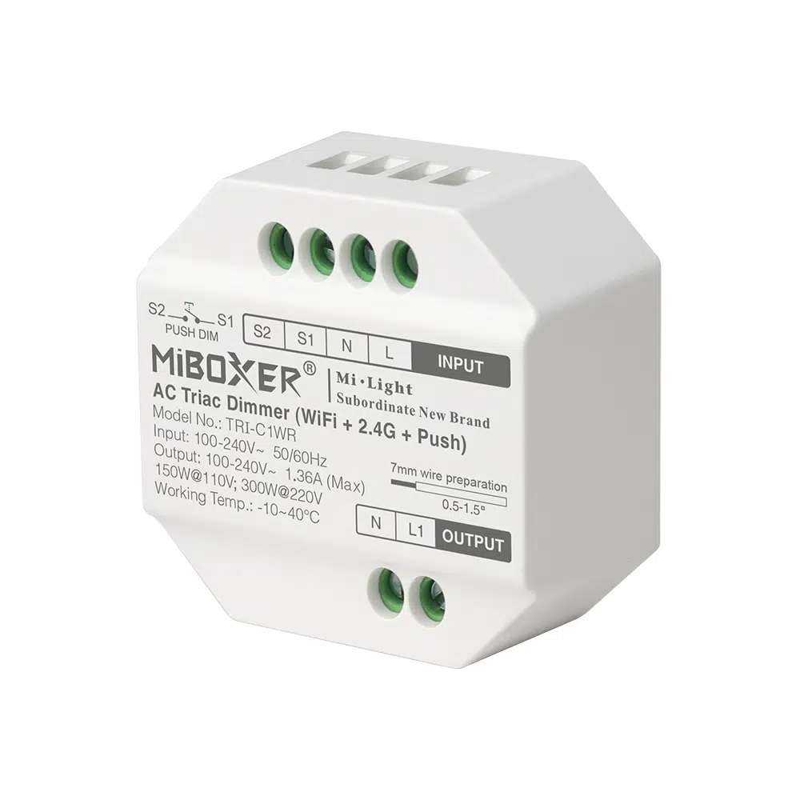
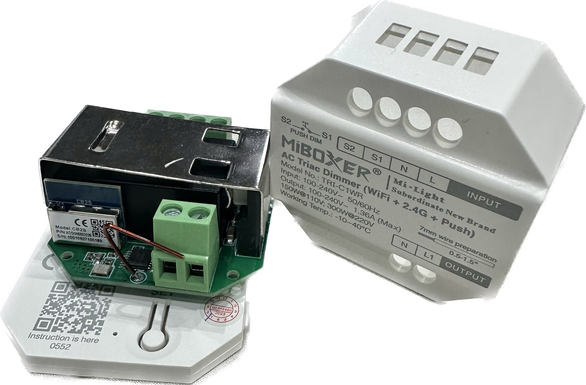
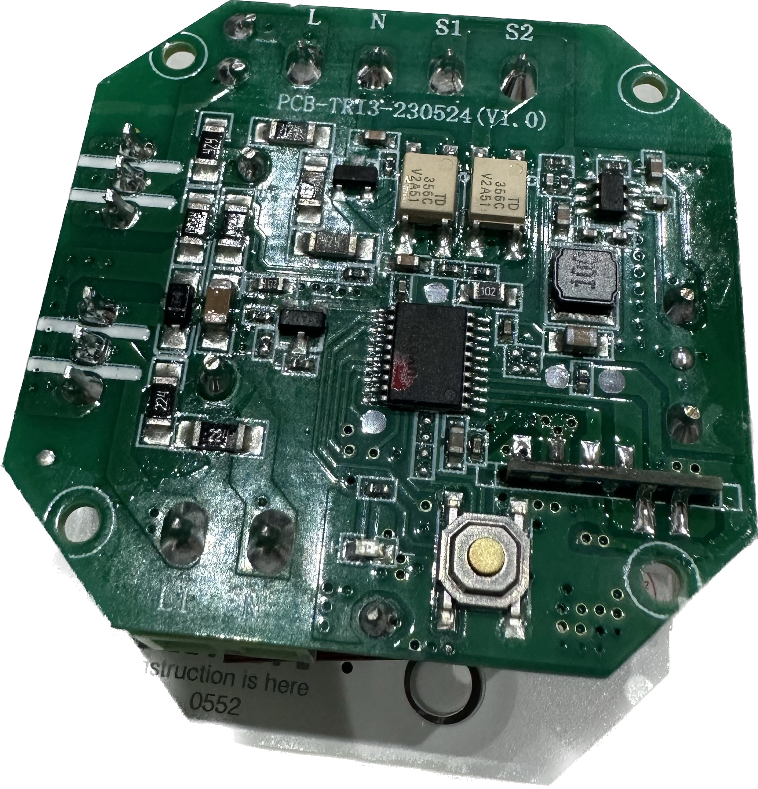
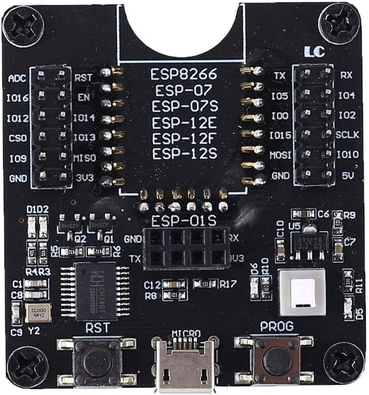

## General Notes

The Miboxer TRI-C1WR Dimmer Module uses the UART to communicate with Tuya MCU. This Sensor comes with a CB2S chip and requires replacement in order to be used with ESPHome.
It is still possible to convert these switches to ESPHome by replacing the WBR3 chip with an Espressif ESP8685-WROOM-03-H2/H4 or Wireless Tag WT32C3-01N or an esp8266 ESP-02 chip and this process will require heat gun, soldering tools and moderate soldering skill, for all chip replacements can be made easier with low melt solder as well, these were replaced with official espressif ESP8685-WROOM-03-H4 modules

## Flashing

Flash using ESP Web install and select ESP32-C3 option.

To put ESP32-C3 in flash mode EN needs to be pulled high and GPIO9 need to be pulled low. May take a 2-3 attempts, but just disconnect and reconnect 3V3 while keeping GPIO9 pulled low and click the retry button again until it works.

The [datasheet](https://docs.ai-thinker.com/_media/esp32/docs/esp-c3-12f_specification.pdf) references GPIO8 which needs to be pulled low during flashing, use the following board to achieve this you can purchase ([AliExpress](https://www.aliexpress.com/item/1005002668365356.html), [Amazon](https://amzn.to/3o8owSb), [Banggood](https://www.banggood.com/ESP8266-Test-Board-Burner-Development-Board-WIFI-Module-For-ESP-01-ESP-01S-ESP-12E-ESP-12F-ESP-12S-ESP-18T-p-1684992.html)) a test board for effortless flashing. Just drop the module in, plug in the USB cable, hold the boot button while powering up and flash!



| ESP32 Pin | USB Serial Pin | Comments |
| --- | --- | --- |
| 3V3 | 3V3 | Connect to dedicated 3V3 1A power supply if encountering brown out |
| G | GND | |
| IO9 | Ground | Round contact pad on back of board, pull low BEFORE attaching 3V3 |
| IO8 | 3V3 | Could not find this pin, but it didn't seem to be required |
| TX | RX | |
| RX | TX | |
| EN | 3V3 | Pull high to enable ESP32 (do not leave floating) |

## Running

For normal operation connect EN to VCC (pull high) to enable the C3 chip. GPIO9 has an internal pullup and it needs to be high on power up for the module to boot so try and avoid that pin similar to GPIO0 on ESP8266.

ESP32's are power hungry on boot and the USB to serial adapter might not be able to provide enough power for that. Use a stable 3.3v power supply that can supply more than 1A.

## GPIO Pinout for ESP32-C3

| Pin    | Function       |
| ------ | -------------- |
| GPIO20 | RX             |
| GPIO21 | TX             |

## Getting it up and running

The sensor is a Tuya device, however as the main WBR3 chip needs to be replaced with a ESP12 Variant or ESP32-C3-12F, which is easily flashed before soldering. After that, you can use ESPHome's OTA functionality to make any further changes.

## Configuration for ESP-IDF

```yaml
substitutions:
  device_ssid: "Tuya Dimmer"
  device_name: tuyadimmer
  device_description: "Miboxer TRI-C1WR Dimmer Module ESP32-C3 ESP-IDF"
  friendly_name: "Miboxer TRI-C1WR Dimmer Module"
  main_device_id: "tuyadimmer" # Put the name that you want to see in Home Assistant.
  light_icon: "mdi:lightbulb-spot"
  project_name: "miboxer.tri-c1wr-esp-idf"
  project_version: "1.0"

esphome:
  name: ${device_name}
  comment: ${device_description}
  platformio_options:
    board_build.flash_mode: dio
  project:
    name: "${project_name}"
    version: "${project_version}"

esp32:
  board: esp32-c3-devkitm-1
  framework:
    type: esp-idf

# Enable Home Assistant API
api:
  password: !secret api_password
  encryption:
    key: !secret api_encryption_key

# Enable logging
logger:

ota:
  safe_mode: true
  password: !secret ota_password

wifi:
  ssid: !secret wifi_ssid
  password: !secret wifi_password
  power_save_mode: none
  # Enable fallback hotspot (captive portal) in case wifi connection fails
  ap:
    ssid: ${device_ssid} Fallback Hotspot
    password: !secret ap_password

uart:
  rx_pin: GPIO20
  tx_pin: GPIO21
  baud_rate: 9600

# Register the Tuya MCU connection
tuya:

sensor:
  # WiFi Signal sensor.
  - platform: wifi_signal
    name: ${friendly_name} Signal strength
    update_interval: 60s
    internal: true
  # Uptime Sensor
  - platform: uptime
    name: "${friendly_name} Uptime"
    id: uptime_sensor
    update_interval: 360s
    on_raw_value:
      then:
        - text_sensor.template.publish:
            id: uptime_human
            state: !lambda |-
              int seconds = round(id(uptime_sensor).raw_state);
              int days = seconds / (24 * 3600);
              seconds = seconds % (24 * 3600);
              int hours = seconds / 3600;
              seconds = seconds % 3600;
              int minutes = seconds /  60;
              seconds = seconds % 60;
              return (
                (days ? to_string(days) + "d " : "") +
                (hours ? to_string(hours) + "h " : "") +
                (minutes ? to_string(minutes) + "m " : "") +
                (to_string(seconds) + "s")
              ).c_str();

text_sensor:
  # Expose WiFi information as sensors.
  - platform: wifi_info
    ip_address:
      name: ${friendly_name} IP
    ssid:
      name: ${friendly_name} SSID
    bssid:
      name: ${friendly_name} BSSID
  # Expose Uptime
  - platform: template
    name: ${friendly_name} Uptime Human Readable
    id: uptime_human
    icon: mdi:clock-start

# Restart Buttons
button:
  - platform: restart
    id: "restart_device"
    name: "${friendly_name} Restart"
    entity_category: "diagnostic"
  - platform: safe_mode
    id: "restart_device_safe_mode"
    name: "${friendly_name} Restart (Safe Mode)"
    entity_category: "diagnostic"

# Dimmer Function
light:
  - platform: "tuya"
    name: "${friendly_name}"
    id: ${main_device_id}
    dimmer_datapoint: 22
    switch_datapoint: 20
    min_value: 10
    max_value: 1000
    icon: "${light_icon}"

# Disable Dimming Function
switch: 
  - platform: "tuya"
    id: "${main_device_id}_mode"
    name: "${friendly_name} Switch Only Mode"
    switch_datapoint: 102

# Minimum Brightness
number:
  - platform: "tuya"
    name: "${friendly_name} Minimum Brightness"
    number_datapoint: 103
    min_value: 0
    max_value: 255
    step: 1
```

## Configuration for Arduino (not recommended, but has been working fine for ages)

```yaml
substitutions:
  device_ssid: "Tuya Dimmer"
  device_name: tuyadimmer
  device_description: "Miboxer TRI-C1WR Dimmer Module ESP32-C3 ESP-IDF"
  friendly_name: "Miboxer TRI-C1WR Dimmer Module"
  main_device_id: "tuyadimmer" # Put the name that you want to see in Home Assistant.
  light_icon: "mdi:lightbulb-spot"
  project_name: "miboxer.tri-c1wr-arduino"
  project_version: "1.0"

esphome:
  name: ${device_name}
  comment: ${device_description}
  project:
    name: "${project_name}"
    version: "${project_version}"
  platformio_options:
    board_build.flash_mode: dio

esp32:
  board: esp32-c3-devkitm-1
  framework:
    type: arduino
    version: 2.0.5
    platform_version: 5.2.0

# Enable Home Assistant API
api:
  password: !secret api_password
  encryption:
    key: !secret api_encryption_key

# Enable logging
logger:

ota:
  safe_mode: true
  password: !secret ota_password

wifi:
  ssid: !secret wifi_ssid
  password: !secret wifi_password
  power_save_mode: none
  # Enable fallback hotspot (captive portal) in case wifi connection fails
  ap:
    ssid: ${device_ssid} Fallback Hotspot
    password: !secret ap_password

captive_portal:

web_server:
  port: 80

uart:
  rx_pin: GPIO20
  tx_pin: GPIO21
  baud_rate: 9600

# Register the Tuya MCU connection
tuya:

sensor:
  # WiFi Signal sensor.
  - platform: wifi_signal
    name: ${friendly_name} Signal strength
    update_interval: 60s
    internal: true
  # Uptime Sensor
  - platform: uptime
    name: "${friendly_name} Uptime"
    id: uptime_sensor
    update_interval: 360s
    on_raw_value:
      then:
        - text_sensor.template.publish:
            id: uptime_human
            state: !lambda |-
              int seconds = round(id(uptime_sensor).raw_state);
              int days = seconds / (24 * 3600);
              seconds = seconds % (24 * 3600);
              int hours = seconds / 3600;
              seconds = seconds % 3600;
              int minutes = seconds /  60;
              seconds = seconds % 60;
              return (
                (days ? to_string(days) + "d " : "") +
                (hours ? to_string(hours) + "h " : "") +
                (minutes ? to_string(minutes) + "m " : "") +
                (to_string(seconds) + "s")
              ).c_str();
    # ESP32 Temperature
  - platform: template
    name: ${friendly_name} ESP32 Internal Temperature
    id: temp
    lambda: return temperatureRead();
    unit_of_measurement: °C
    accuracy_decimals: 2

text_sensor:
  # Expose WiFi information as sensors.
  - platform: wifi_info
    ip_address:
      name: ${friendly_name} IP
    ssid:
      name: ${friendly_name} SSID
    bssid:
      name: ${friendly_name} BSSID
  # Expose Uptime
  - platform: template
    name: ${friendly_name} Uptime Human Readable
    id: uptime_human
    icon: mdi:clock-start

# Restart Buttons
button:
  - platform: restart
    id: "restart_device"
    name: "${friendly_name} Restart"
    entity_category: "diagnostic"
  - platform: safe_mode
    id: "restart_device_safe_mode"
    name: "${friendly_name} Restart (Safe Mode)"
    entity_category: "diagnostic"

# Dimmer Function
light:
  - platform: "tuya"
    name: "${friendly_name}"
    id: ${main_device_id}
    dimmer_datapoint: 22
    switch_datapoint: 20
    min_value: 10
    max_value: 1000
    icon: "${light_icon}"

# Disable Dimming Function
switch: 
  - platform: "tuya"
    id: "${main_device_id}_mode"
    name: "${friendly_name} Switch Only Mode"
    switch_datapoint: 102

# Minimum Brightness
number:
  - platform: "tuya"
    name: "${friendly_name} Minimum Brightness"
    number_datapoint: 103
    min_value: 0
    max_value: 255
    step: 1
```
