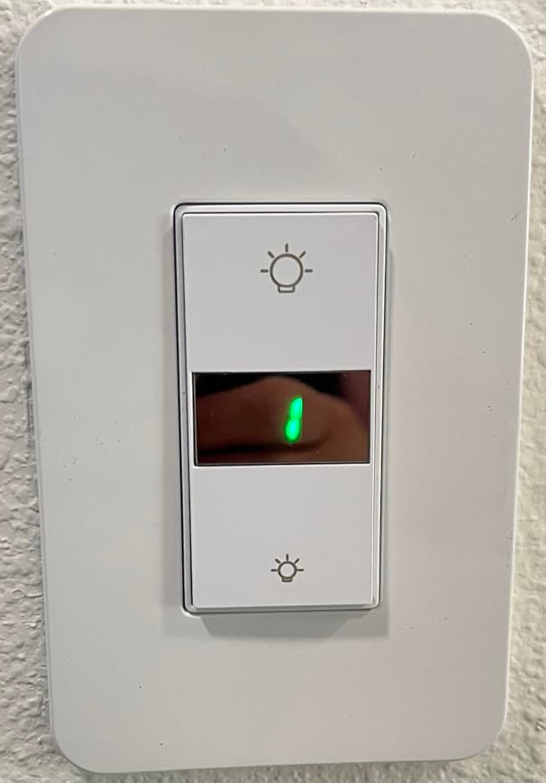
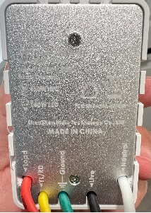

## Overall description

Milfra dimmers are another type of in-wall, brightness-only light dimming devices with Tuya-Smart application support,
and support 3+ way installations.

## Technical details

The device is using Tuya-compatible application structure with two main components:

- application-specific MCU, responsible for controlling light output, and
- a Tuya CBU module that contains application level logic.
  - external switch input GPIO is connected to secondary MCU,
  - communication to dimming MCU is bidirectional, currently haven't determined what data the MCU is requesting from Tuya that causes an
    unknown command 0x34 error

## Programming

First programming was done over USB-serial. The module needs disassembled (pretty easy) and moderate soldering
skills are required to attach USB-RS232 converter cables. Did not test if CloudCutter or other methods would work.

Need to solder cables Rx, Tx, Gnd, Vcc (3V3) and CEN pin.
Preferred flashing software is [ltchiptool](https://github.com/libretiny-eu/ltchiptool) from LibreTiny project. Start programming like:

```bash
ltchiptool flash write <firmware.uf2>
```

then short CEN pin to ground for a moment to initiate progrmming mode on the module.

## GPIO Pinout

| Pin    | Function |
| ------ | -------- |
| GPIO10 | UART RX  |
| GPIO11 | UART TX  |

## Basic configuration

```yaml
substitutions:
  device_name: dimmer1
  icon: "mdi:light-switch"
  update_interval_wifi: "60s"

esphome:
  name: ${device_name}
  friendly_name: dimmer1

bk72xx:
  board: cbu
  
# OTA flashing
ota:
  - platform: esphome

wifi: # Your Wifi network details
  
# Enable fallback hotspot in case wifi connection fails  
  ap:

# Enabling the logging component
logger:

# Enable Home Assistant API
api:

# Enable the captive portal
captive_portal:

sensor:
  - platform: uptime
    name: Uptime

uart:
  rx_pin: GPIO10
  tx_pin: GPIO11
  baud_rate: 115200

tuya:

light:
  - platform: tuya
    name: dimmer
    dimmer_datapoint: 2
    min_value_datapoint: 3
    switch_datapoint: 1
    min_value: 200
    max_value: 1000

select:
  - platform: tuya
    enum_datapoint: 13
    name: Work Mode
    optimistic: true
    options:
      0: Light_White
  - platform: tuya
    enum_datapoint: 14
    name: Relay Status
    optimistic: true
    options:
      0: "Off"
      1: "On"
      2: Memory

```
