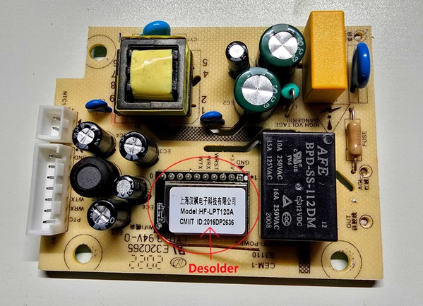
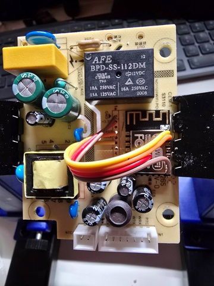

## General Notes

Mill panel heaters are available in various versions. This component is specifically designed for **Generation 2 panel heaters** (not compatible with portable heater models). Have a look here to check which generation you have https://millheat.zendesk.com/hc/en-us/articles/360000252071-Which-generation-do-I-have.
If you have a Generation 3 panel heater (which comes with a built-in ESP32), check out this component: https://github.com/ssieb/esphome_components/tree/mill/components/mill_heater

To use this component with a Generation 2 panel heater, you’ll need to replace the HF-LPT120A module with an ESP8266.


HF-LPT120A desoldered


Solder the ESP8266 in place.
Refer to the **GPIO Pinout section** for detailed instructions



## GPIO Pinout

| PIN (mill board) | ESP8266    | Description              |
|------------------|------------|--------------------------|
| +3.3V            | VCC        | Power input (3.3V)       |
| GND              | GND        | Ground                   |
| WTX              | TX (GPIO1) | UART transmitter         |
| WRX              | RX (GPIO3) | UART receiver            |

## Configuration

```yaml
substitutions:
  devicename: "millzero_heater"  #Lower case name
  friendly_name: "Mill Zero heater"

esphome:
  name: "${devicename}"

external_components:
  source:
    type: git
    url: https://github.com/owangen/esphome
  components: [ mill_panelheater_gen2 ]

esp8266:
  board: d1_mini

wifi:
  ssid: !secret wifi_ssid
  password: !secret wifi_password
  ap:

captive_portal:

# Enable logging
logger:
  baud_rate: 0 # Deactived to prevent conflict with UART, sending UART to mill controller does not work if enabled

# Enable Home Assistant API
api:

ota:

uart:
  id: uart_bus
  tx_pin: GPIO01
  rx_pin: GPIO03
  baud_rate: 9600

climate:
  - platform: mill_panelheater_gen2
    name: Mill heater
```

## Credits

This component is based on the work by https://github.com/JDolven/Replacing-HF_LPT120A-in-a-millheat-heater and https://github.com/trondsundt/MillHeat-ESPHome-NodeMCU
