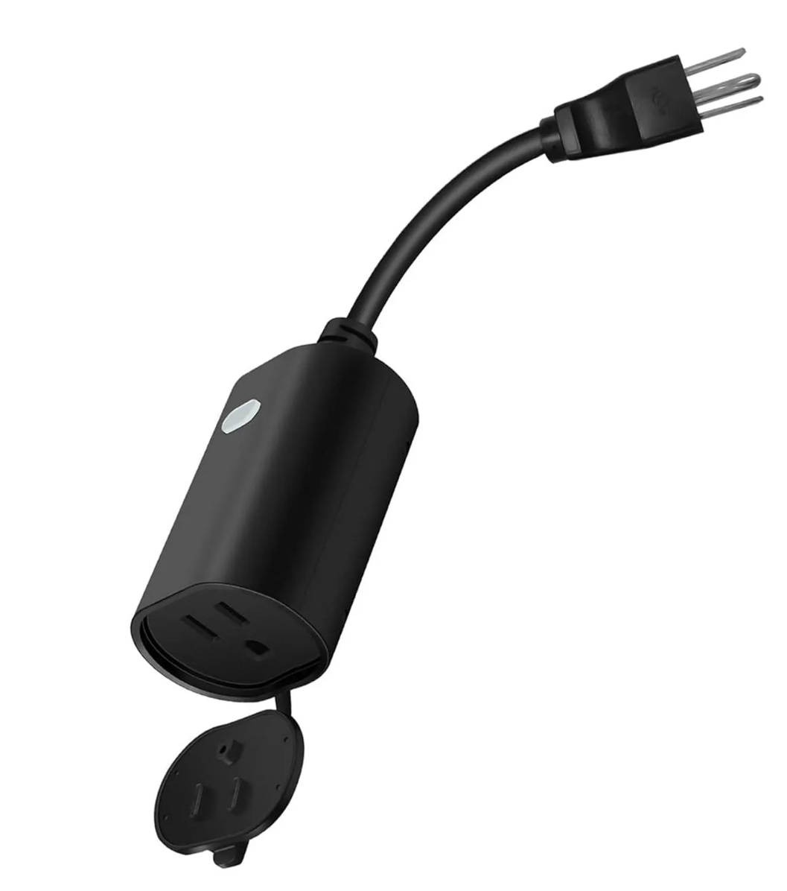

## Notes

This device has at least three different versions, one with ESP8266, one with WB2s, and one with CB2S. This is specific to the CB2s version. If you have the WB2S chip (Version 2.0) pinout information can be found [here.](https://www.elektroda.com/rtvforum/topic3973047.html)

## Basic Configuration

```yaml
substitutions:
  name: minoston_mp22w
  friendly_name: "MP22W"

esphome:
  name: ${name}
  name_add_mac_suffix: false
  friendly_name: ${friendly_name}

bk72xx:
  board: cb2s

wifi:
  ssid: !secret wifi_ssid
  password: !secret wifi_password
  domain: !secret domain
  power_save_mode: none
  ap:
    ssid: "ESPHome"
    password: !secret wifi_fallback_password

api:
  encryption:
    key: !secret api_key

web_server:
  port: 80
    
ota:

logger:

captive_portal:

binary_sensor:
  - platform: gpio
    pin:
      number: P8
      inverted: true
    id: button1
    filters:
      - delayed_on: 10ms
      - delayed_off: 10ms
    on_release:
      - switch.toggle: outlet

switch:
  - platform: gpio
    name: Outlet
    id: outlet
    pin: P24
    icon: mdi:power-socket-us
    on_turn_on:
      - switch.turn_off: led
    on_turn_off:
      - switch.turn_on: led

  - platform: gpio
    name: "led"
    internal: true
    id: led
    pin:
      number: P7
      inverted: true

text_sensor:
  - platform: wifi_info
    ip_address:
      name: ESP IP Address
    ssid:
      name: ESP Connected SSID
    mac_address:
      name: ESP Mac Wifi Address

sensor:
  - platform: uptime
    name: Uptime
    unit_of_measurement: minutes
    filters:
      - lambda: return x / 60.0;

  - platform: wifi_signal
    name: Signal
    update_interval: 60s