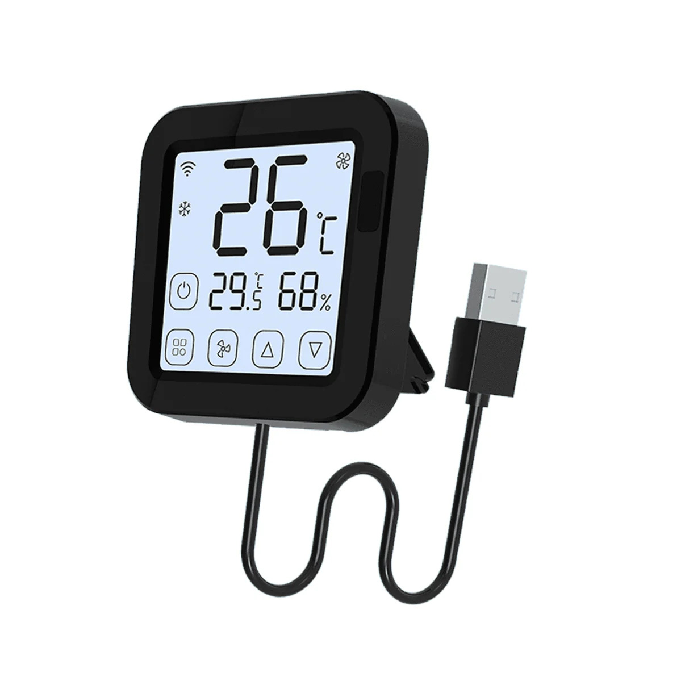

## Product Description

This is a Thermostat that works as a Universal IR Controller but specific for AC Units. Once configured with the correct IR library it can control most of AC Units from different brands, using the touch panel on the device. It can also listen to IR commands from the original remote and sync the display accordingly.

## Flashing

No need to open the device, you can use [cloud cutter](https://github.com/tuya-cloudcutter/tuya-cloudcutter/).

Important: To make sure that the touchscreen is enabled you need to activate the device first using the Tuya app, and configure any AC unit there. After that you can use cloud cutter to install the custom firmware.

## Configuration example

```yml
esphome:
  name: ir-thermostat
  friendly_name: IR Thermost
  on_boot:
    priority: -100  # Run after all components are initialized
    then:
      - delay: 3s  # Wait for Tuya to finish initialization
      - lambda: |-
          id(initialization_complete) = true;
          ESP_LOGD("boot", "Initialization complete, enabling climate sync");

bk72xx:
  board: generic-bk7231n-qfn32-tuya
  
# Enable logging
logger:
  level: INFO

# Enable Home Assistant API
api:
  encryption:
    key: !secret ha-key

ota:
  - platform: esphome
    password: !secret ota_pass

wifi:
  ssid: !secret wifi_ssid
  password: !secret wifi_password

  # Enable fallback hotspot (captive portal) in case wifi connection fails
  ap:
    ssid: "IR Thermostat Hotspot"
    password: !secret hotspot_pass

captive_portal:

globals:
  - id: global_target_temperature
    type: float  # Changed to float to match climate component
    restore_value: yes
    initial_value: '23'

  - id: global_mode
    type: int  # Store as int for easier comparison
    restore_value: yes
    initial_value: '-1'  # -1 means "not initialized"

  - id: global_fan_mode
    type: int  # Store as int
    restore_value: yes
    initial_value: '-1'  # -1 means "not initialized"

  # Add a flag to prevent updates during initialization
  - id: initialization_complete
    type: bool
    initial_value: 'false'

  # Add a flag to track sync direction
  - id: sync_in_progress
    type: bool
    initial_value: 'false'

  # Track the source of the last change
  - id: last_change_source
    type: int
    initial_value: '0'  # 0 = unknown, 1 = primary, 2 = secondary/IR


########################
### IR BLASTER SETUP ###
########################
remote_transmitter:
  id: ir_t
  pin: P7
  carrier_duty_percent: 50%

remote_receiver:
  id: ir_r
  pin:
    number: P8
    inverted: true
  # dump:
  #   - lg
  tolerance: 55%


######################
### TUYA MCU SETUP ###
######################
uart:
  rx_pin: RX1
  tx_pin: TX1
  baud_rate: 9600

tuya:


###############
### SENSORS ###
###############
sensor:

  # WiFi signal
  - platform: wifi_signal
    name: "WiFi Signal"
    update_interval: 120s

  - platform: uptime
    name: Uptime

  - platform: tuya
    name: "Umidade"
    sensor_datapoint: 12
    unit_of_measurement: "%"

  - platform: tuya
    name: "Temperatura"
    sensor_datapoint: 2
    unit_of_measurement: "°C"
    accuracy_decimals: 1
    filters:
      - multiply: 0.1

text_sensor:
  # ESPHome version
  - platform: version
    hide_timestamp: true
    name: "ESPHome Version"
  # IP address and connected SSID
  - platform: wifi_info
    ip_address:
      name: "IP Address"
      icon: mdi:wifi
    ssid:
      name: "Connected SSID"
      icon: mdi:wifi-strength-2

binary_sensor:
  - platform: status
    name: Status


#######################
### CLIMATE DEVICES ###
#######################
climate:
# THIS IS THE TUYA CLIMATE ENTITY
# IT RELAYS STATE CHANGES TO THE SECONDARY CLIMATE ENTITY WHICH PROCESSES THEM AS IR COMMANDS
  - platform: tuya
    name: "AC"
    id: climate_primary
    visual:
      min_temperature: 17
      max_temperature: 30
      temperature_step: 1
    switch_datapoint: 1
    target_temperature_datapoint: 3
    target_temperature_multiplier: 1
    current_temperature_datapoint: 2
    current_temperature_multiplier: 0.1
    supports_heat: true
    supports_cool: true
    active_state:
      datapoint: 4
      cooling_value: 0
      heating_value: 1
      fanonly_value: 3
      drying_value: 4
    fan_mode:
      datapoint: 5
      auto_value: 0
      low_value: 1
      medium_value: 2
      high_value: 3

    # AUTOMATION THAT WHENEVER THE DATAPOINTS UPDATE THOSE STATUSES SHOULD ALSO BE UPDATED ON THE MAIN CLIMATE ENTITY
    on_state:
      - lambda: |-
          // Skip if this change was triggered by secondary sync
          if (id(sync_in_progress)) {
            ESP_LOGD("climate_sync", "Sync in progress, skipping primary->secondary sync");
            return;
          }

          // Skip updates during initialization
          if (!id(initialization_complete)) {
            ESP_LOGD("climate_sync", "Skipping update - initialization not complete");
            return;
          }

          auto primary = id(climate_primary);
          auto secondary = id(climate_secondary);

          // Skip if target temperature is NaN
          if (std::isnan(primary->target_temperature)) {
            ESP_LOGD("climate_sync", "Skipping update - target temperature is NaN");
            return;
          }

          // Mark that we're syncing from primary
          id(last_change_source) = 1;

          ESP_LOGD("climate_sync", "=== Primary -> Secondary Sync ===");

          bool needs_update = false;
          auto call = secondary->make_call();

          // Check temperature change
          if (!std::isnan(primary->target_temperature) &&
              (std::isnan(id(global_target_temperature)) ||
               std::abs(primary->target_temperature - id(global_target_temperature)) > 0.1)) {
            ESP_LOGD("climate_sync", "Temperature changed: %.1f -> %.1f", id(global_target_temperature), primary->target_temperature);
            id(global_target_temperature) = primary->target_temperature;
            call.set_target_temperature(primary->target_temperature);
            needs_update = true;
          }

          // Check mode change
          int current_mode = (int)primary->mode;
          if (current_mode != id(global_mode)) {
            ESP_LOGD("climate_sync", "Mode changed: %d -> %d", id(global_mode), current_mode);
            id(global_mode) = current_mode;
            call.set_mode(primary->mode);
            needs_update = true;
          }

          // Check fan mode change
          if (primary->fan_mode.has_value()) {
            int current_fan_mode = (int)primary->fan_mode.value();
            if (current_fan_mode != id(global_fan_mode)) {
              ESP_LOGD("climate_sync", "Fan mode changed: %d -> %d", id(global_fan_mode), current_fan_mode);
              id(global_fan_mode) = current_fan_mode;
              call.set_fan_mode(primary->fan_mode.value());
              needs_update = true;
            }
          }

          // Only perform call if something actually changed
          if (needs_update) {
            ESP_LOGI("climate_sync", "Sending update to secondary climate");
            id(sync_in_progress) = true;
            call.perform();
            id(sync_in_progress) = false;
          }

  # THIS THE THE SECONDARY HIDDEN CLIMATE DEVICE THAT PROCESSES THE COMMANDS FROM THE PRIMARY ENTITY AS IR COMMANDS

  - platform: climate_ir_lg
  # Exampels of other platforms tested with this config
  # - platform: midea_ir
  # - platform: heatpumpir
    name: "IR"
    id: climate_secondary

    # If using platform: heatpumpir, uncomment this and select the correct procotol accordingly
    # protocol: electroluxyal
    # horizontal_default: auto
    # vertical_default: auto
    # min_temperature: 16
    # max_temperature: 30

    receiver_id: ir_r

    # AC Units from LG in Brazil use these timings. May not be required for your case.
    header_high: 3265us
    header_low: 9856us

    internal: true
    visual:
      min_temperature: 17
      max_temperature: 30
      temperature_step: 1

    on_state:
      - lambda: |-
          // Skip if this was triggered by primary sync
          if (id(sync_in_progress)) {
            ESP_LOGD("climate_sync", "Sync in progress, skipping secondary->primary sync");
            return;
          }

          // Skip during initialization
          if (!id(initialization_complete)) {
            ESP_LOGD("climate_sync", "Initialization not complete, skipping IR sync");
            return;
          }

          auto secondary = id(climate_secondary);
          auto primary = id(climate_primary);

          // This is likely an IR remote command if we got here
          ESP_LOGD("climate_sync", "=== IR Remote Command Detected ===");
          ESP_LOGD("climate_sync", "Mode: %s", climate_mode_to_string(secondary->mode));
          ESP_LOGD("climate_sync", "Target Temp: %.1f", secondary->target_temperature);
          if (secondary->fan_mode.has_value()) {
            ESP_LOGD("climate_sync", "Fan Mode: %s", climate_fan_mode_to_string(secondary->fan_mode.value()));
          }

          // Mark that we're syncing from secondary
          id(last_change_source) = 2;

          // Check what changed and update primary
          bool needs_update = false;
          auto call = primary->make_call();

          // Temperature
          if (std::abs(secondary->target_temperature - id(global_target_temperature)) > 0.1) {
            ESP_LOGD("climate_sync", "IR changed temperature: %.1f -> %.1f",
                     id(global_target_temperature), secondary->target_temperature);
            id(global_target_temperature) = secondary->target_temperature;
            call.set_target_temperature(secondary->target_temperature);
            needs_update = true;
          }

          // Mode
          int secondary_mode = (int)secondary->mode;
          if (secondary_mode != id(global_mode)) {
            ESP_LOGD("climate_sync", "IR changed mode: %d -> %d",
                     id(global_mode), secondary_mode);
            id(global_mode) = secondary_mode;
            call.set_mode(secondary->mode);
            needs_update = true;
          }

          // Fan mode
          if (secondary->fan_mode.has_value()) {
            int secondary_fan_mode = (int)secondary->fan_mode.value();
            if (secondary_fan_mode != id(global_fan_mode)) {
              ESP_LOGD("climate_sync", "IR changed fan mode: %d -> %d",
                       id(global_fan_mode), secondary_fan_mode);
              id(global_fan_mode) = secondary_fan_mode;
              call.set_fan_mode(secondary->fan_mode.value());
              needs_update = true;
            }
          }

          if (needs_update) {
            ESP_LOGI("climate_sync", "Syncing IR changes to Tuya");
            id(sync_in_progress) = true;
            call.perform();
            id(sync_in_progress) = false;
          }
```
