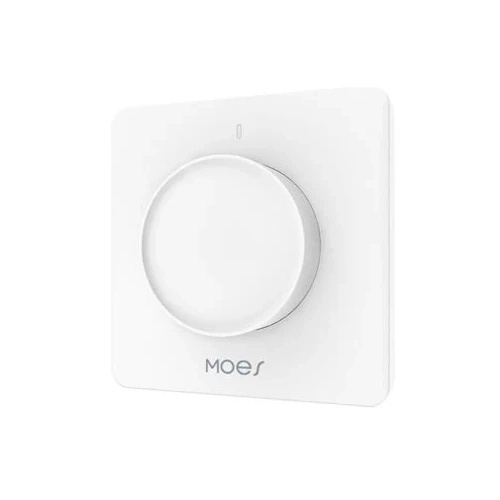

## Product Description

This is a wall mounted light dimmer for EU standard wall boxes. The rotary dimmer is available in different versions (WiFi / ZigBee). The WiFi version with WB3S module is suitable for ESPHome and can be flashed directly.

## Flashing

The device contains a WB3S module (BK72xx, WiFi), which can be directly flashed using ltchiptool. 
Alternatively, it should also be possible to replace the module with e.g. a WT0132C6-S5 (ESP32C6) module.

## Configuration example

```yml
esphome:
  name: wall-dimmer-knob
  friendly_name: Wall Dimmer Knob

bk72xx:
  board: wb3s

# Enable logging
logger:

# Enable Home Assistant API
api:

ota:
  - platform: esphome

wifi:
  ssid: !secret wifi_ssid
  password: !secret wifi_password

  # Enable fallback hotspot (captive portal) in case wifi connection fails
  ap:
    ssid: "Wall-Dimmer-Knob"

captive_portal:

uart:
  rx_pin: RX1
  tx_pin: TX1
  baud_rate: 115200

# Register the Tuya MCU connection
tuya:

# Main light entity
light:
  - platform: "tuya"
    name: "Wall Dimmer"
    dimmer_datapoint: 2        # Brightness
    switch_datapoint: 1        # On/Off
    min_value: 10              # adjust if min brightness is too high/low
    max_value: 1000            # DP2 scale (check by dimming in app/original fw)


# Minimum brightness (user adjustable)
number:
  - platform: "tuya"
    name: "Min Brightness"
    number_datapoint: 3
    min_value: 0
    max_value: 1000
    step: 10
    entity_category: config

select:
  - platform: "tuya"
    name: "Load Type"
    enum_datapoint: 4
    options:
      0: "LED"
      1: "Incandescent"
      2: "Halogen"
    entity_category: config

  - platform: "tuya"
    name: "Indicator LED"
    enum_datapoint: 21
    options:
      0: "On"
      1: "Follow Load"
      2: "Off"
    entity_category: config

```
