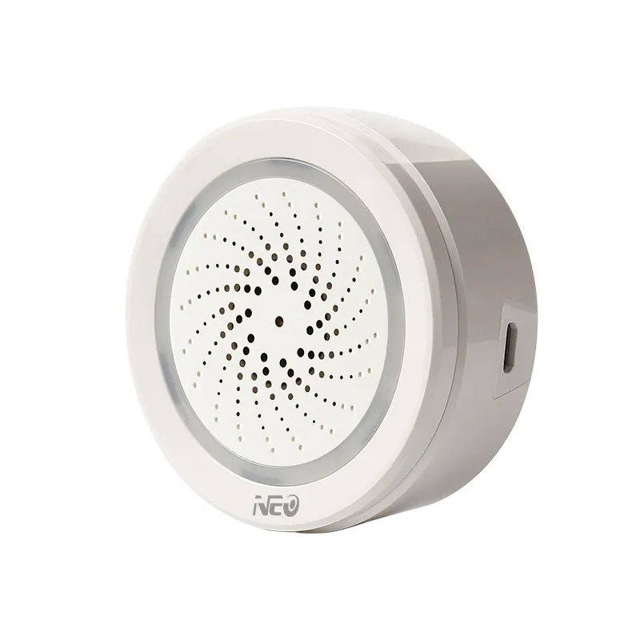

This is a Tuya siren with temperature and humidity sensor. Runs on USB and two CR123A batteries as backup (not supplied with the device).
Hardware Versions

There are, so far, three known hardware versions. The console will show one of these MCU Product ID’s: {"p":"ymf4oruxqx0xlogp","v":"1.0.0","m":0}, {"p":"ymf4oruxqx0xlogp","v":"1.0.1","m":0} , {"p":"ymf4oruxqx0xlogp","v":"1.0.2","m":0}, {“p”:”ymf4oruxqx0xlogp”,”v”:”1.0.3”,”m”:0} or {"p":"9fngbrgje6ljqhee","v":"1.0.2","m":0}

The ymf versions work with tuya-convert but the 9fn version requires flashing the device with serial.

The 1.0.1 version supports the TuyaSend0 command to query the MCU for the latest values but the 1.0.2 version does not appear to support that command at this time (2021-03-05).

In an order on 2021-01-31 for three devices, one of each hardware versions was received. In an order from 2020-12, the 1.0.1 version was received, which is rock solid.



## Basic Configuration

``` yaml
substitutions:
  name: coolcam_alarm_sensor
  friendly_name: Coolcam Alarm Sensor

esphome:
  name: ${name}
  friendly_name: ${friendly_name}

esp8266:
  board: esp01_1m

# Enable logging
logger:
  baud_rate: 0

# Enable Home Assistant API
api:

ota:
  - platform: esphome

web_server:

wifi:
  ssid: !secret wifi_ssid
  password: !secret wifi_password

  # Enable fallback hotspot (captive portal) in case wifi connection fails
  ap:
    ssid: ${friendly_name} Fallback
    password: !secret wifi_password

captive_portal:

# Dia / Hora
time:
  - platform: sntp
    id: sntp_time
    timezone: Europe/Madrid
    servers:
     - 0.pool.ntp.org
     - 1.pool.ntp.org
     - 2.pool.ntp.org

uart:
  rx_pin: RX
  tx_pin: TX
  baud_rate: 9600

tuya:
  time_id: sntp_time

switch:
  - platform: "tuya"
    name: "Alarm"
    switch_datapoint: 104
    icon: "mdi:alarm-bell"
  - platform: "tuya"
    name: "Temperature Alarm"
    switch_datapoint: 113
    icon: "mdi:thermometer-alert"
  - platform: "tuya"
    name: "Humidity Alarm"
    switch_datapoint: 114
    icon: "mdi:water-percent-alert"
  - platform: "tuya"
    name: "Unit ºF (OFF) / ºC (ON)"
    switch_datapoint: 112
    icon: "mdi:temperature-celsius"

sensor:
  - platform: "tuya"
    name: "Temperature"
    sensor_datapoint: 105
    unit_of_measurement: "°C"
    icon: "mdi:thermometer"
    device_class: "temperature"
    state_class: "measurement"
    accuracy_decimals: 1
    filters:
      - multiply: 0.1
  - platform: "tuya"
    name: "Humidity"
    sensor_datapoint: 106
    unit_of_measurement: "%"
    icon: "mdi:water-percent"
    device_class: "humidity"
    state_class: "measurement"
    accuracy_decimals: 0

text_sensor:
  - platform: tuya
    name: "Power Type"
    sensor_datapoint: 101
    icon: "mdi:power-plug-battery"
    filters:
      - substitute:
        - "1 -> Battery High"
        - "2 -> Battery Medium"
        - "3 -> Battery Low"
        - "4 -> USB Port"

select:
  - platform: tuya
    name: "Alarm Sound"
    enum_datapoint: 102
    icon: "mdi:music-note"
    optimistic: true
    options:
      0: Doorbell
      1: Fur Elise
      2: Big Ben
      3: Ring Ring
      4: Lone Ranger
      5: Turkish March
      6: High Pitched
      7: Red Alert
      8: Crickets
      9: Beep
      10: Dog Bark
      11: Police Siren
      12: Grandfather Clock
      13: Phone Ring
      14: Fire Truck
      15: Clock Chime
      16: Alarm Clock
      17: School Bell
  - platform: tuya
    name: "Volume"
    enum_datapoint: 116  
    icon: "mdi:volume-high"
    optimistic: true
    options:
      0: High
      1: Medium
      2: Low

number:
  - platform: tuya
    name: "Alarm Duration (in s)"
    number_datapoint: 103
    icon: "mdi:timer"
    min_value: 0
    max_value: 300
    step: 5
  - platform: tuya
    name: "Min. Temp. Alarm"
    number_datapoint: 107
    icon: "mdi:thermometer-chevron-down"
    min_value: 0
    max_value: 100
    step: 1
  - platform: tuya
    name: "Max. Temp. Alarm"
    number_datapoint: 108
    icon: "mdi:thermometer-chevron-up"
    min_value: 0
    max_value: 100
    step: 1
  - platform: tuya
    name: "Min. Hum. Alarm"
    number_datapoint: 109
    icon: "mdi:water-minus"
    min_value: 0
    max_value: 100
    step: 1
  - platform: tuya
    name: "Max. Hum. Alarm"
    number_datapoint: 110
    icon: "mdi:water-plus"
    min_value: 0
    max_value: 100
    step: 1

```
