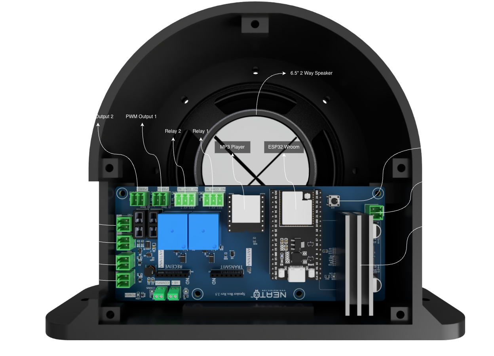

## Overview

The Neato Audio 50 is a WiFi-enabled audio and automation controller for themed attractions,
escape rooms, haunted houses, and interactive installations. It combines a 50 W amplified MP3
player, two relay outputs, two dimmable spotlight outputs, and optional 4-channel RF wireless
inputs in a single pre-flashed networked unit.

Ships with a Kenwood KFC-1666S 6.5" 2-way speaker and includes battery backup with automatic
switchover on power loss.

**Applications:** haunted house scares, shooting gallery hit audio, escape room narrative
progression, scavenger hunt clues, museum exhibit narration, themed restaurant moments.

**Key features:**

- TPA3116D2 50 W amplifier with included Kenwood KFC-1666S 6.5" speaker (4–8 Ω)
- DFPlayer Mini MP3 playback from MicroSD (FAT32, up to 32 GB, 4-digit filename prefix)
- Playback modes: single file, random from folder, sequential playlist, background loop with event interruption
- 2 wired trigger inputs (digital, debounced, 3.3 V logic)
- Optional 4-channel 433 MHz RF receiver (A/B/C/D wireless buttons)
- Per-input configurable: specific track or random selection
- 2 × SPDT relay outputs — 15 A @ 12 VDC / 250 VAC; trigger at audio start, end, or after delay
- 2 × FET dimmable spotlight outputs — 4.2 A each, 12 V, PWM 0–100%, sync to audio events
- Software volume control (0–30, persistent across reboots)
- Battery backup with automatic switchover
- Home Assistant native (ESPHome API), FPP, and MQTT compatible
- Standalone AP mode; hotspot `audio-XX`, web UI at `192.168.4.1`
- OTA firmware updates

## Hardware

| Component | Specification |
|-----------|--------------|
| MCU | ESP32 (Wemos D1 Mini32 form factor) |
| Input voltage | 12 V DC |
| Amplifier | TPA3116D2, 50 W |
| Speaker (included) | Kenwood KFC-1666S 6.5" 2-way, 4–8 Ω |
| Audio storage | MicroSD, FAT32, up to 32 GB |
| Audio format | MP3 (128 kbps minimum recommended), 4-digit filename prefix |
| Max files | Up to 255 in standard operation (3,000 on card) |
| Relay outputs | 2 × SPDT, 15 A @ 12 VDC / 250 VAC |
| Spotlight outputs | 2 × FET, 4.2 A each, 12 V, PWM dimmable |
| Wired inputs | 2 × digital, debounced, 3.3 V logic |
| RF inputs | 4-channel 433 MHz (optional add-on, A/B/C/D) |
| WiFi | 802.11 b/g/n 2.4 GHz |
| Battery backup | Yes — automatic switchover on power loss |

### PCB revisions

- **Rev 2.3** — original design
- **Rev 2.4 / 2.5 / 2.6** — same pinouts; RFTX connector configurable as 4 RF inputs or trigger outputs; Rev 2.6 is the latest

## Hardware Pinout



## GPIO Pinout

| GPIO | Function |
|------|----------|
| GPIO17 | DFPlayer Mini UART TX (→ DFPlayer RX) |
| GPIO16 | DFPlayer Mini UART RX (← DFPlayer TX) |
| GPIO26 | Relay 1 output |
| GPIO27 | Relay 2 output |
| GPIO33 | FET 1 — SpotLight 1 (LEDC PWM) |
| GPIO25 | FET 2 — SpotLight 2 (LEDC PWM) |
| GPIO0 | Amplifier wake (active-high) |
| GPIO5 | Amplifier unmute (active-low) |
| GPIO22 | Heartbeat LED output |
| GPIO23 | Status LED (active-low) |
| GPIO4 | RF TX power enable |
| GPIO34 | Wired input 1 (active-low) |
| GPIO39 | Wired input 2 (active-low) |
| GPIO32 | Push button (INPUT_PULLUP) |
| GPIO36 | RF remote button A |
| GPIO2 | RF remote button B |
| GPIO15 | RF remote button C |
| GPIO35 | RF remote button D |

## Quick Start

1. Power on — device broadcasts WiFi hotspot `audio-XX` (unit-specific)
2. Connect phone or laptop to the hotspot — captive portal opens at `192.168.4.1`
3. Select your venue WiFi network and enter credentials
4. Device reboots and joins the network
5. Home Assistant discovers the device within 60 seconds
6. Access web UI via local hostname (e.g., `audio-1.local`) to configure tracks, volume, and outputs

For standalone operation (no hub), skip steps 3–5 and use the web UI at `192.168.4.1`.

## Configuration

```yaml url=https://github.com/CodeMakesItGo/NeatoFx_Public/blob/main/Audio/NeatoAudio50/main.yaml
```

### Variants

| File | Board | RFTX connector mode |
|------|-------|---------------------|
| `main.yaml` | Rev 2.4 / 2.5 / 2.6 | Trigger outputs (default) |
| `main_rftx.yaml` | Rev 2.4 / 2.5 / 2.6 | 4 RF trigger inputs |
| `main_rev2_3.yaml` | Rev 2.3 | Trigger outputs |
| `main_rev2_3_rftx.yaml` | Rev 2.3 | 4 RF trigger inputs |

### Operating modes

- **Standalone** — creates its own WiFi AP. Use `configs/standalone.yaml`.
- **Networked** — joins home WiFi and exposes the Home Assistant ESPHome API. Use `configs/networked.yaml`.

## Links

- [Product page](https://neatofx.com/products/neato-fx-audio-50)
- [Support & documentation](https://neatofx.com/pages/support-audio)
- [GitHub repository](https://github.com/CodeMakesItGo/NeatoFx_Public/tree/main/Audio/NeatoAudio50)
