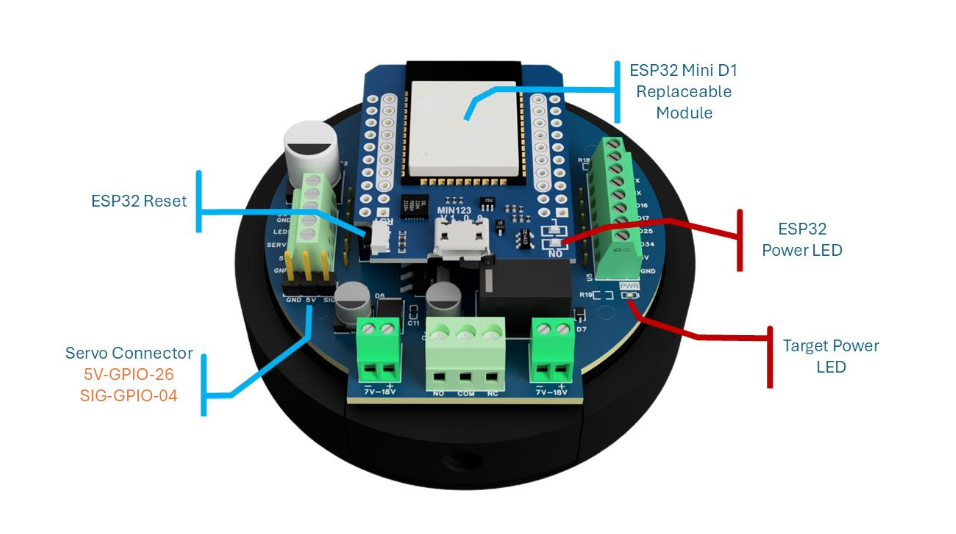
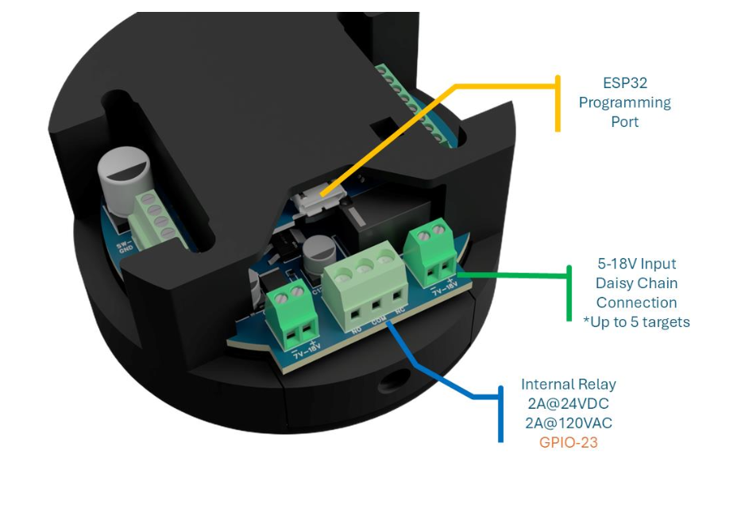
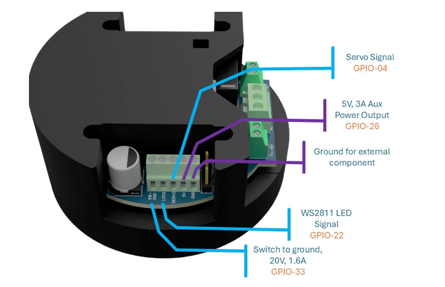
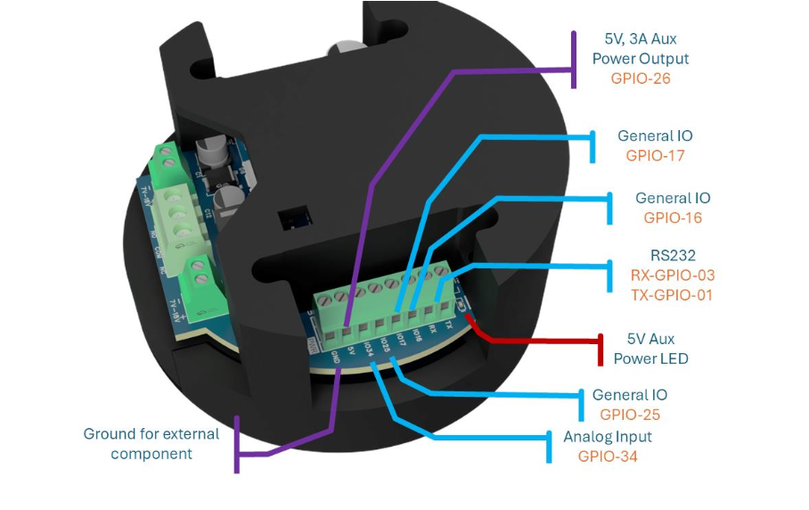

## Overview

The Neato Target IR is a self-contained WiFi-enabled infrared hit detector and prop controller.
Wire it up, configure it from any browser, and it runs your prop — relay, servo, LEDs, and
scoring — with no custom coding or external controller required.

Common applications include shooting galleries, haunted house props, escape room sequences,
museum interactive exhibits, themed restaurant interactions, and scavenger hunt activations.

Each target ships pre-flashed and tested. Settings persist in flash across power cycles.
Targets daisy-chain (up to 5 units per power supply) and support OTA updates individually
or in batch via Home Assistant.

**Key features:**

- 38 kHz IR receiver — ambient-light tolerant, up to 20 ft range; laser tag, NEC, and raw protocols
- WS2811/WS2812 RGB LEDs — 6 face LEDs onboard + independent strip output (up to 100 LEDs)
- SPDT relay — 2 A @ 120 VAC or 24 VDC (motors, solenoids, bells, air cannons, AC lighting)
- GND switch — switch to ground, 20 V, 1.6 A
- Servo output — PWM 50 Hz, 0–180°, 5 V @ 3 A auxiliary power
- 3 debounced digital inputs + 1 analog input (0–3.3 V) for buttons, PIR, pressure pads
- Browser-based configuration: point value, LED colors/animations, relay hold time, servo angles, IR sensitivity
- Home Assistant native (ESPHome API) — discovered automatically within 60 seconds of joining WiFi
- Standalone AP mode — no hub required; hotspot `NEATO-target-1` / `neato123`, web UI at `192.168.4.1`
- OTA firmware updates
- ¼" camera thread mount with CCTV swivel mount included

## Hardware

| Component | Specification |
|-----------|--------------|
| MCU | ESP32 Mini D1 (replaceable) |
| Input voltage | 5–18 V DC, reverse-polarity protected |
| WiFi | 802.11 b/g/n 2.4 GHz, static IP supported |
| IR receiver | 38 kHz, up to 20 ft range |
| Relay | SPDT, 2 A @ 120 VAC or 24 VDC (GPIO-23) |
| GND switch | Switch to ground, 20 V, 1.6 A (GPIO-33) |
| LED strips | WS2811/WS2812 — 6 face LEDs + up to 100 on strip output |
| Servo | PWM 50 Hz, 0–180°, 5 V @ 3 A aux |
| Digital inputs | 3 × debounced, 3.3 V logic |
| Analog input | 1 × 0–3.3 V |
| 5 V auxiliary | 2 × 5 V @ 3 A |
| Mounting | ¼" camera thread + CCTV swivel mount |
| Daisy-chain | Up to 5 units per power supply |

### Hardware revisions

- **Rev 1.x** — original design, single LED strip
- **Rev 3.x** — current production; dual LED strips, servo, auxiliary power rail, expanded GPIO

## GPIO Pinout (Rev 3.x)

| GPIO | Function |
|------|----------|
| GPIO5 | Face LED strip — WS2812 (6 onboard LEDs) |
| GPIO22 | External WS2811/WS2812 LED strip signal (up to 100 LEDs) |
| GPIO19 | IR receiver (38 kHz) |
| GPIO23 | Internal relay — SPDT, 2 A @ 24 VDC / 120 VAC |
| GPIO33 | Switch to ground — 20 V, 1.6 A |
| GPIO4 | Servo signal — PWM 50 Hz |
| GPIO26 | 5 V, 3 A auxiliary power output (servo connector power) |
| GPIO18 | External trigger input (TRIGGER net) |
| GPIO25 | General IO |
| GPIO16 | General IO |
| GPIO17 | General IO |
| GPIO34 | Analog input (0–3.3 V) |
| GPIO1 | RS232 TX |
| GPIO3 | RS232 RX |









## Quick Start

1. Power on — target broadcasts WiFi hotspot `NEATO-target-1` (password: `neato123`)
2. Connect phone or laptop to the hotspot — captive portal opens automatically
3. Select your venue WiFi network and enter credentials
4. Home Assistant discovers the device within 60 seconds
5. Open the web UI at the device IP to adjust point value, LED colors, relay timing, and more

For standalone operation (no hub), skip steps 3–4. Access the web UI at `192.168.4.1` while
connected to the hotspot.

## Configuration

```yaml file=target-hardware.yaml
```

For a fully networked install with Home Assistant, IR protocol selection, servo, and FPP support,
import the complete configuration:

```yaml url=https://github.com/CodeMakesItGo/NeatoFx_Public/blob/main/Targets/NeatoTargetIR/main.yaml
```

### Firmware builds

| Build | IR protocol | Networking |
|-------|-------------|-----------|
| Standard (`main.yaml`, networked mode) | NEC + laser tag | Joins WiFi, Home Assistant API |
| Standalone (`configs/standalone.yaml`) | NEC + laser tag | AP hotspot only, no hub required |

### IR protocols (selectable)

| Protocol | File | Use case |
|----------|------|----------|
| Laser Tag | `protocols/ir_laser_tag.yaml` | Multi-player laser tag guns (recommended) |
| NEC | `protocols/ir_nec.yaml` | Standard TV remotes (testing) |
| Raw | `protocols/ir_raw.yaml` | Protocol analysis / development |

## Links

- [Product page](https://neatofx.com/products/neato-fx-target-ir)
- [Support & documentation](https://neatofx.com/pages/support-target)
- [GitHub repository](https://github.com/CodeMakesItGo/NeatoFx_Public/tree/main/Targets/NeatoTargetIR)
- [Device manuals (PDF)](https://github.com/CodeMakesItGo/NeatoFx_Public/tree/main/Targets/NeatoTargetIR/docs)
