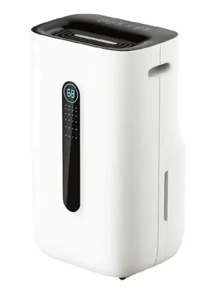

Ningbo Fuda Intelligent Technology is a company manufacturing a number of
devices such as dehumidifiers and air conditioning units. These are typically
white-labeled, and come under a number of brand names such as Rohnson, Nedis,
Kayami, Cling etc.

Some of these dehumidifiers are WiFi-enabled, by employing a Tuya module,
allowing them to be fully controlled over WiFi, typically using the vendor's
smartphone app, or the Tuya Smart/Smart Life applications.

Unfortunately, as of October 2023, ESPHome does not include a
Humidifier/Hygrostat component to map to Home Assistant's Humidifier
integration (see
[esphome/feature-requests#1859](https://github.com/esphome/feature-requests/issues/1859)).
Until such support is added, the dehumidifier can be exposed as a series of
switches, sensors and selects, for each of the functions of the device's
control panel.

## Flashing

### Over-the-air

It is often possible to use [tuya-convert](/guides/tuya-convert/) to flash the
module over-the-air. Note that this applies to ESP8266-based modules; if your
model shipped with a BK72xx-based module, other methods such as
[tuya-cloudcutter](https://github.com/tuya-cloudcutter/tuya-cloudcutter/) can
be used.

Both of these tools rely on exploiting vulnerabilities in the stock Tuya
firmware, which may be patched in newer versions, so this may or may not work
with your device. It is generally advisable to not install firmware updates
through the vendor's smartphone application as this may patch any
vulnerabilities that exist in the shipped software.

### Over serial

If OTA fails, it is possible to flash the module through the serial port pins,
using [esptool](https://github.com/espressif/esptool/), or, in case your model
shipped with a BK72xx, using
[ltchiptool](https://github.com/libretiny-eu/ltchiptool).

The dehumidifier can be easily disassembled using a Philips screwdriver.  The
Tuya module can be found on a separate daughterboard, connected using a JST
connector to the mainboard, which provides the board with `+5V`, `GND`, as well
as `RX`/`TX` pins for the UART connecting to the main MCU. The daughterboard
includes a voltage regulator and level shifters to convert between `+5V` and
`+3.3V`, that the Tuya module expects. Unfortunately, this is a different UART
than the one required for flashing the firmware. However, the daughterboard
helpfully contains debug pins next to the module:

| Pin       | Connect to                |
| --------- | ------------------------- |
| UART 0 RX | Serial adapter TXD        |
| IO1       | Serial adapter RXD        |
| IO0       | Short to GND for flashing |
| GND       | Serial adapter/Vcc GND    |

`Vcc` needs to be provided separately, either `+5V` through the connector, or
`+3.3V` directly to the ESP8266.

## Board Configuration

The configuration below is for a Rohnson R-9820, model name FDD20-5250BWR5:

```yaml
esp8266:
  board: esp_wroom_02

uart:
  rx_pin: GPIO13 # U1RX
  tx_pin: GPIO15 # U1TX
  baud_rate: 9600

tuya:
  on_datapoint_update:
    - sensor_datapoint: 11
      datapoint_type: bitmask
      then:
        - lambda: |-
            ESP_LOGD("main", "on_datapoint_update %s", format_hex_pretty(x).c_str());
            // only seen in the wild is decimal value 8, for Water Tank Full
            id(water_tank_full).publish_state((x >> 3) & 1);

binary_sensor:
  - platform: template
    id: water_tank_full
    name: "Water tank"
    device_class: problem
    icon: "mdi:water-alert"
  - platform: tuya
    name: "Unknown 101"
    sensor_datapoint: 101
    internal: true
  - platform: tuya
    name: "Unknown 105"
    sensor_datapoint: 105
    internal: true

switch:
  - platform: tuya
    name: "Power"
    switch_datapoint: 1
  - platform: tuya
    name: "Air clean"
    icon: "mdi:leaf"
    switch_datapoint: 5
  - platform: tuya
    name: "Child lock"
    icon: "mdi:lock"
    switch_datapoint: 7
  - platform: tuya
    name: "Sleep"
    icon: "mdi:sleep"
    switch_datapoint: 102

number:
  - platform: tuya
    name: "Target humidity"
    number_datapoint: 4
    unit_of_measurement: "%"
    device_class: "humidity"
    min_value: 30
    max_value: 80
    step: 5

sensor:
  - platform: tuya
    name: "Temperature"
    sensor_datapoint: 103
    unit_of_measurement: "°C"
    device_class: "temperature"
    accuracy_decimals: 0
  - platform: tuya
    name: "Humidity"
    sensor_datapoint: 104
    unit_of_measurement: "%"
    device_class: "humidity"
    accuracy_decimals: 0

select:
  - platform: tuya
    name: "Mode"
    icon: "mdi:cog"
    enum_datapoint: 2
    options:
      0: Regular
      1: Automatic
      2: Strong
      3: Clothes drying
  - platform: tuya
    name: "Fan speed"
    icon: "mdi:fan"
    enum_datapoint: 6
    options:
      0: Low
      1: High
#  - platform: tuya
#    name: "Unknown"
#    enum_datapoint: 12
```
