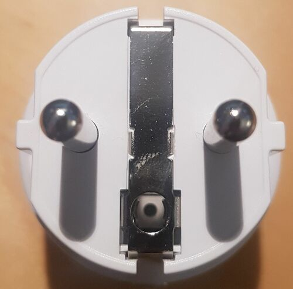
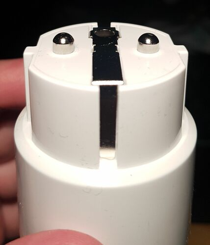
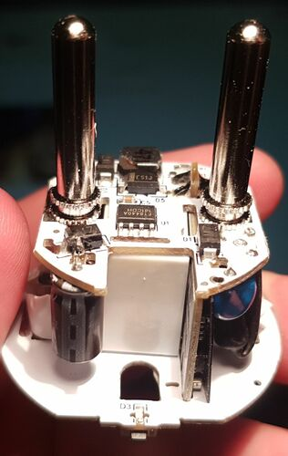

## Warning

Looks like device chip was replaced to non-flashable custom tasmota chip.

## Overview

Previously this device was identical to the [Gosund SP111](/devices/gosund-sp111/).

## Images

Below images were taken in May 2022, device was bought in May 2022.

Notice the images are in random order.

Inside there is a colored sticker - used halogen lamp to heat it up, and thus
glue is less hard and the sticker can be removed more easily.

