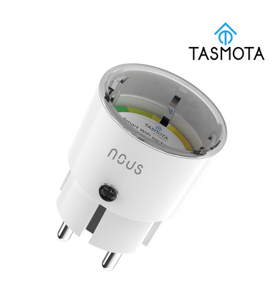

## GPIO Pinout

[see pinout](https://nous.technology/product/a1t.html?show=manual)

| Pin    | Function   |
| ------ | ---------- |
| GPIO00 | Button1    |
| GPIO01 | None       |
| GPIO02 | None       |
| GPIO03 | None       |
| GPIO04 | BL0937 CF  |
| GPIO05 | HLWBL CF1  |
| GPIO09 | None       |
| GPIO10 | None       |
| GPIO12 | HLWBL SELi |
| GPIO13 | Led1i      |
| GPIO14 | Relay1     |
| GPIO15 | None       |
| GPIO16 | None       |
|  FLAG  | None       |

## Basic Configuration

```yaml

substitutions:
  devicename: "smartplug"
  # Higher value gives lower watt readout
  current_res: "0.00280"
  # Lower value gives lower voltage readout
  voltage_div: "775"


esphome:
  name: $devicename
  comment: "Nous Smart Wifi Socket A1T (Tasmota)"
  name_add_mac_suffix: true
  project:
    name: "NOUS.Smart-Wifi-Socket"
    version: "A1T"

esp8266:
  board: esp8285
  restore_from_flash: true
  early_pin_init: False

# Enable logging
logger:

# Enable Home Assistant API
api:

ota:

wifi:
  ssid: !secret wifi_ssid
  password: !secret wifi_password
  fast_connect: on

  # Enable fallback hotspot (captive portal) in case wifi connection fails
  ap:
    ssid: "${devicename}-AP"

captive_portal:

# see: https://esphome.io/components/time.html
time:
  - platform: homeassistant
    id: homeassistant_time

# Enable Web server
web_server:
  port: 80

light:
  - platform: status_led
    id: led
    restore_mode: RESTORE_DEFAULT_ON
    pin:
      number: GPIO13
      inverted: true

binary_sensor:
  - platform: status
    name: "${devicename} - Status"

  # toggle relay on/off
  - platform: gpio
    pin:
      number: GPIO00
      mode: INPUT_PULLUP
    id: "button_state"
    on_press:
      - switch.toggle: "button_switch"

switch:
  - platform: template
    name: "${devicename} - Switch"
    icon: mdi:power
    optimistic: true
    restore_mode: RESTORE_DEFAULT_ON
    id: "button_switch"
    lambda: |-
      if (id(relay).state) {
        return true;
      } else {
        return false;
      }
    turn_on_action:
      - switch.turn_on: relay
      - light.turn_on: led
    turn_off_action:
      - switch.turn_off: relay
      - light.turn_off: led
  - platform: gpio
    restore_mode: RESTORE_DEFAULT_ON
    pin: GPIO14
    id: relay

sensor:
  - platform: wifi_signal
    name: "${devicename} - Wifi Signal"
    update_interval: 60s
    icon: mdi:wifi

  - platform: uptime
    name: "${devicename} - Uptime"
    update_interval: 60s
    icon: mdi:clock-outline

  - platform: total_daily_energy
    name: "${devicename} - Electric Consumption [kWh]"
    power_id: "nous_a1t_watt"
    filters:
      # Multiplication factor from W to kW is 0.001
      - multiply: 0.001
    unit_of_measurement: kWh
    icon: mdi:calendar-clock

  - platform: adc
    pin: VCC
    name: "${devicename} - VCC Volt"
    icon: mdi:flash-outline

  - platform: hlw8012
    sel_pin:
      number: GPIO12
      inverted: True
    cf_pin: GPIO04
    cf1_pin: GPIO05
    change_mode_every: 4
    current_resistor: ${current_res}
    voltage_divider: ${voltage_div}
    update_interval: 3s

    current:
      name: "${devicename} - Ampere"
      unit_of_measurement: A
      accuracy_decimals: 3
      icon: mdi:current-ac

    voltage:
      name: "${devicename} - Voltage"
      unit_of_measurement: V
      accuracy_decimals: 1
      icon: mdi:flash-outline

    power:
      name: "${devicename} - Power"
      id: "nous_a1t_watt"
      unit_of_measurement: W
      icon: mdi:gauge

text_sensor:
  - platform: wifi_info
    ip_address:
      name: "${devicename} - IP Address"
    ssid:
      name: "${devicename} - Wi-Fi SSID"
    bssid:
      name: "${devicename} - Wi-Fi BSSID"
  - platform: version
    name: "${devicename} - ESPHome Version"
    hide_timestamp: true

```
