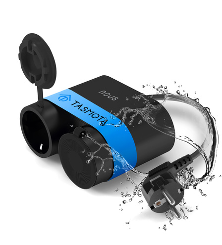

## GPIO Pinout

[see pinout](https://nous.technology/product/a4t.html?show=manual)

| Pin    | Function   |
| ------ | ---------- |
| GPIO00 | None       |
| GPIO01 | HLWBL SELi |
| GPIO02 | None       |
| GPIO03 | LedLink_i  |
| GPIO04 | HLWBL CF1  |
| GPIO05 | BL0937 CF  |
| GPIO09 | None       |
| GPIO10 | None       |
| GPIO12 | Relay 1    |
| GPIO13 | Relay 2    |
| GPIO14 | Button 1   |
| GPIO15 | None       |
| GPIO16 | None       |
|  FLAG  | None       |

## Basic Configuration

```yaml

substitutions:
  devicename: nousa4tplug
  # Higher value gives lower watt readout
  current_res: "0.00280"
  # Lower value gives lower voltage readout
  voltage_div: "775"

api:

ota:
  platform: esphome

wifi:
  ssid: !secret wifi_ssid
  password: !secret wifi_password

  # Enable fallback hotspot (captive portal) in case wifi connection fails
  ap:
    ssid: "${devicename}-AP"

captive_portal:

esphome:
  name: ${devicename}

esp8266:
  board: esp8285
  restore_from_flash: true
  early_pin_init: false


time:
  - platform: homeassistant
    id: ha_time

binary_sensor:
  - platform: gpio
    pin:
      number: GPIO14
      inverted: True
    name: input
    on_multi_click:
      - timing:
        - ON for at most 1s
        - OFF for at least 0.5s
        then:
          - switch.toggle: relay_1
      - timing:
        - ON for at most 1s
        - OFF for at most 0.5s
        - ON for at most 1s
        - OFF for at least 0.1s
        then:
          - switch.toggle: relay_2

light:
 - platform: status_led
   id: connection_status_led
   name: status_led
   internal: true
   pin:
     number: GPIO03
     inverted: true

switch:
  - platform: gpio
    pin: GPIO12
    restore_mode: RESTORE_DEFAULT_OFF
    id: relay_1
    name: switch_1
  - platform: gpio
    pin: GPIO13
    restore_mode: RESTORE_DEFAULT_OFF
    id: relay_2
    name: switch_2


sensor:
  - platform: hlw8012
    model: BL0937
    sel_pin:
      number: GPIO01
      inverted: True
    cf_pin: GPIO05
    cf1_pin: GPIO04
    change_mode_every: 4
    current_resistor: ${current_res}
    voltage_divider: ${voltage_div}
    update_interval: 3s

    current:
      name: current
      id: current
      #unit_of_measurement: "A"
      accuracy_decimals: 3
      device_class: current
      state_class: measurement
    voltage:
      name: voltage
      id: voltage
      #unit_of_measurement: "V"
      accuracy_decimals: 1
      device_class: voltage
      state_class: measurement
    power:
      name: power
      id: power
      #unit_of_measurement: "W"
      accuracy_decimals: 1
      device_class: power
      state_class: measurement

  - platform: total_daily_energy
    name: daily_energy
    power_id: power
    restore: false
    unit_of_measurement: Wh
    accuracy_decimals: 0
    device_class: energy
    state_class: total_increasing

```
