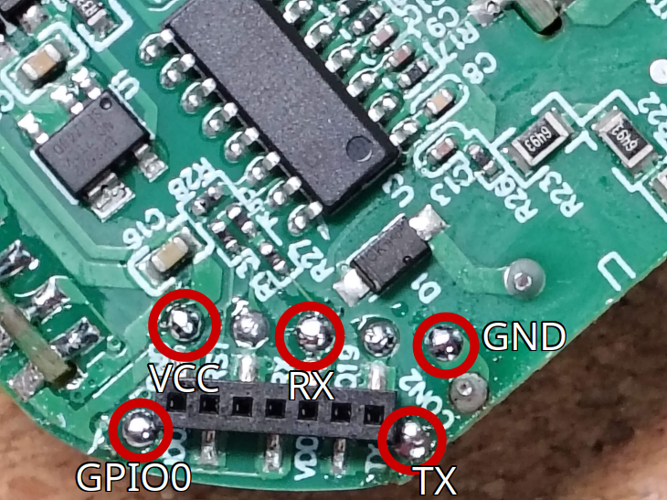

 / Curtain module(1 channel) (ESP32)")

This device comes pre-installed with Tasmota. To flash it with ESPHome, refer to the [**Migrating from Tasmota**](https://esphome.io/guides/migrate_sonoff_tasmota.html)guide. Alternatively, you can disassemble the device and solder wires to the test pads (see pinout) for manual flashing.

## GPIO Pinout

| Pin    | Function   |
| ------ | ---------- |
| GPIO00 | LED        |
| GPIO01 | TX         |
| GPIO03 | BL0939 RX  |
| GPIO04 | Button     |
| GPIO05 | Switch     |
| GPIO12 | Relay      |
| GPIO13 | Relay      |
| GPIO18 | Switch     |

## Example configuration

This example configures the relay as a 2-gang light switch relay with an optional decoupled mode. The NOUS B3T can also be used to control blinds. Refer to the [**Cover Component**](https://esphome.io/components/cover/) and [**Current Based Cover**](https://esphome.io/components/cover/current_based) documentation for further instructions.

```yaml
esphome:
  name: nous-b3t
  friendly_name: NOUS B3T
  comment: "NOUS B3T WiFi Switch/Curtain (2 channel with power monitoring)"
  project:
    name: "Nous.B3T"
    version: "2025.6.0"

esp32:
  board: esp32dev
  framework:
    type: esp-idf

# Enable logging
logger:

# Enable Home Assistant API
api:

ota:
  - platform: esphome

wifi:
  ssid: !secret wifi_ssid
  password: !secret wifi_password

  # Enable fallback hotspot (captive portal) in case wifi connection fails
  ap:
    ssid: "NOUS B3T Fallback Hotspot"

captive_portal:

esp32_ble_tracker:

bluetooth_proxy:
  active: true

network:
  enable_ipv6: true

time:
  - platform: homeassistant
    id: homeassistant_time

uart:
  tx_pin: GPIO01
  rx_pin: GPIO03
  baud_rate: 4800
  parity: NONE
  stop_bits: 2

sensor:
  - platform: uptime
    type: timestamp
    name: "Uptime"
    id: uptime_sensor
    entity_category: diagnostic
  - platform: wifi_signal
    name: "RSSI"
    id: rssi
    update_interval: 60s
    disabled_by_default: true
  - platform: internal_temperature
    name: "Device Temperature"
    id: device_temperature

  - platform: bl0939
    voltage:
      name: "RMS Voltage"
    current_1:
      name: "Current 1"
    current_2:
      name: "Current 2"
    active_power_1:
      name: "Active Power 1"
    active_power_2:
      name: "Active Power 2"
    energy_1:
      name: "Energy 1"
    energy_2:
      name: "Energy 2"
    energy_total:
      name: "Energy Total"

light:
  - platform: status_led
    name: "Status LED"
    id: default_status_led
    pin:
      number: GPIO0
      inverted: true
      ignore_strapping_warning: true
    entity_category: config

switch:
  - platform: gpio
    name: "Switch 1"
    pin:
      number: GPIO12
      ignore_strapping_warning: true
    id: relay_1
    device_class: switch
    restore_mode: restore_default_on

  - platform: gpio
    name: "Switch 2"
    pin: GPIO13
    id: relay_2
    device_class: switch
    restore_mode: restore_default_on

  - platform: template
    name: "Decoupled Mode"
    id: decoupled_mode
    restore_mode: RESTORE_DEFAULT_ON
    optimistic: true
    entity_category: config
    icon: "mdi:connection"

binary_sensor:
  - platform: status
    name: "Status"
   
  - platform: gpio
    pin:
      number: GPIO4
      mode:
        input: true
        pullup: true
      inverted: true
    id: button
    internal: true
    filters:
      - invert:
      - delayed_off: 50ms
    on_press:
      - switch.toggle: relay_1
      - switch.toggle: relay_2
      - event.trigger:
          id: switch_event
          event_type: builtin_button

  - platform: gpio
    name: "Switch 1 (external)"
    pin:
      number: GPIO05
      mode: INPUT_PULLUP
      inverted: true
      ignore_strapping_warning: true
    id: switch_1
    icon: "mdi:light-switch"
    entity_category: diagnostic
    filters:
      - delayed_on_off: 50ms

    on_multi_click:
      - timing:
          - OFF for at least 50ms
        then:
          - if:
              condition:
                - not:
                    - api.connected
                    - switch.is_on: decoupled_mode
              then:
                - switch.toggle: relay_1
              else:
                - if:
                    condition:
                      - switch.is_off: relay_1
                    then:
                      - switch.turn_on: relay_1
                    else:
                      - event.trigger:
                          id: switch_event
                          event_type: switch_1
    

      - timing:
          - ON for at least 50ms
        then:
          - if:
              condition:
                - not:
                    - api.connected
                    - switch.is_on: decoupled_mode
              then:
                - switch.toggle: relay_1
              else:
                - if:
                    condition:
                      - switch.is_off: relay_1
                    then:
                      - switch.turn_on: relay_1
                    else:
                      - event.trigger:
                          id: switch_event
                          event_type: switch_1

      # failsafe sequence to turn on/off decoupled mode when HA automation is not working
      # rocker on/off/on of off/on/off
      - timing:
          - ON for 50ms to 350ms
          - OFF for 50ms to 350ms
          - ON for at least 200ms
        then:
          - switch.toggle: decoupled_mode
          - event.trigger:
              id: switch_event
              event_type: failsafe

      - timing:
          - OFF for 50ms to 350ms
          - ON for 50ms to 350ms
          - OFF for at least 200ms
        then:
          - switch.toggle: decoupled_mode
          - event.trigger:
              id: switch_event
              event_type: failsafe

  - platform: gpio
    name: "Switch 2 (external)"
    pin:
      number: GPIO18
      mode: INPUT_PULLUP
      inverted: true
    id: switch_2
    icon: "mdi:light-switch"
    entity_category: diagnostic
    filters:
      - delayed_on_off: 50ms

    on_multi_click:
      - timing:
          - OFF for at least 50ms
        then:
          - if:
              condition:
                - not:
                    - api.connected
                    - switch.is_on: decoupled_mode
              then:
                - switch.toggle: relay_2
              else:
                - if:
                    condition:
                      - switch.is_off: relay_2
                    then:
                      - switch.turn_on: relay_2
                    else:
                      - event.trigger:
                          id: switch_event
                          event_type: switch_2


      - timing:
          - ON for at least 50ms
        then:
          - if:
              condition:
                - not:
                    - api.connected
                    - switch.is_on: decoupled_mode
              then:
                - switch.toggle: relay_2
              else:
                - if:
                    condition:
                      - switch.is_off: relay_2
                    then:
                      - switch.turn_on: relay_2
                    else:
                      - event.trigger:
                          id: switch_event
                          event_type: switch_2


      - timing:
          - ON for 50ms to 350ms
          - OFF for 50ms to 350ms
          - ON for at least 200ms
        then:
          - switch.toggle: decoupled_mode
          - event.trigger:
              id: switch_event
              event_type: failsafe

      - timing:
          - OFF for 50ms to 350ms
          - ON for 50ms to 350ms
          - OFF for at least 200ms
        then:
          - switch.toggle: decoupled_mode
          - event.trigger:
              id: switch_event
              event_type: failsafe


event:
  - platform: template
    device_class: button
    name: None
    icon: "mdi:light-switch"
    id: switch_event
    event_types:
      - switch_1
      - switch_2
      - failsafe
      - builtin_button

```

## Pinout

Because the built-in button is connected to GPIO4, unlike on other devices, you also need to solder a wire to GPIO0 and pull it to GND to enter flash mode.

