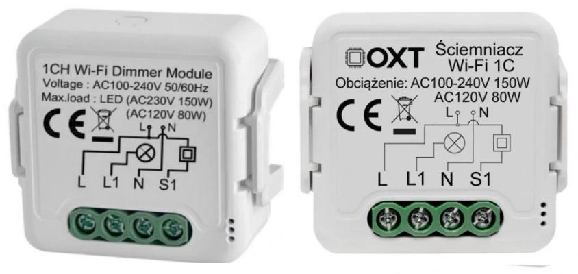
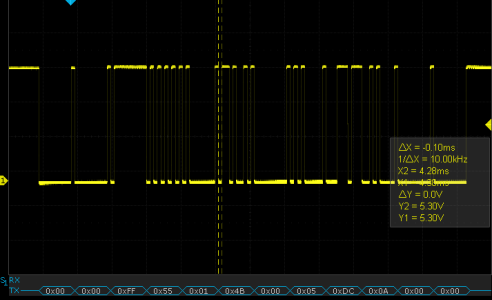
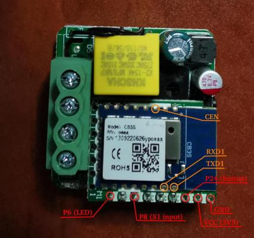
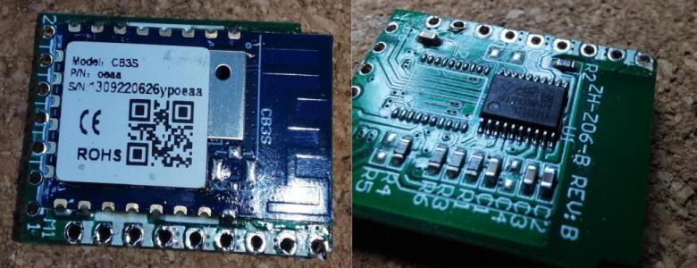

## Overall description

OXT dimmers are another type of in-wall, brightness-only light dimming devices with Tuya-Smart application support,
yet using different method to control light than the already-supported Tuya dimmers.

Advantage of the OXT implementations is that the firmware has full control over dimming functionality and physical switch input,
so can control timings, transitions, effects, etc.

The devices seem to be manufactured in China and are sold under different marketing names such as OXT (Polish brand) and Smart Best, possibly also
Himojo, HaveDeer, GIRIER, RSH are compatible as well but have not been tested...
All of them look identical and have same dimensions 39.2x39.2x18mm, so very likely they are all using same hardware design and protocol.

## Technical details

The device is using Tuya-compatible application structure with two main components:

- application-specific MCU (HK32F0301M), responsible for controlling light output, and
- a Tuya CB3S module that contains application level logic.
  - external switch input GPIO is connected to CB3S module instead of the secondary MCU,
  - communication to dimming MCU is unidirectional (uses ony TX pin of the UART interface),

## OXT Control protocol

The protocol to control brightness is very simple, yet different than in other Tuya devices.
Each UART frame consists of:

|Zeroes|      | Syn Header| | Brightness |  |Footer?   |     |     |    | Zeroes |    |
|------|------|------|------|------|--------|------|------|------|------|------|------|
| 0x00 | 0x00 | 0xff | 0x55 | 0x01 | `<XX>` | 0x00 | 0x05 | 0xdc | 0x0a | 0x00 | 0x00 |

where ``01 <XX>`` represents a brightness value, with `XX` ranging 0x00-0xff. The ``01`` byte could be a lenght indicator,
but more likely it represents channel id, as there are also 2-channel versions available on the market. Not tested.



## Programming

First programming needs to be done over USB-serial. The module needs disassembled (pretty easy) and moderate soldering
skills are required to attach USB-RS232 converter cables.




Need to solder cables Rx, Tx, Gnd, Vcc (3V3) and CEN pin.
Preferred flashing software is [ltchiptool](https://github.com/libretiny-eu/ltchiptool) from LibreTiny project. Start programming like:

```bash
ltchiptool flash write <firmware.uf2>
```

then short CEN pin to ground for a moment to initiate progrmming mode on the module.

## GPIO Pinout

| Pin    | Function                   |
|--------|----------------------------|
| GPIO06 | LED1                       |
| GPIO08 | S1 (external switch input) |
| GPIO11 | UART TX                    |
| GPIO24 | BTN1 (internal button)     |

## Basic configuration

```yaml
esphome:
  name: dimmer
  comment: OXT 1-ch dimmer

bk72xx:
  board: cb3s # Using original CB3S module by Tuya, can also be replaced with other pin-compatible

# Disable UART logging - we need UART to talk to dimming MCU
logger:
  baud_rate: 0

uart:
  tx_pin: GPIO11 # rx_pin is not required (not used)
  baud_rate: 9600

light:
  - platform: oxt_dimmer
    id: lamp1
    name: lamp1
    sensing_pin:
      number: GPIO08
      inverted: true
      mode: input_pullup
    min_value: 0
    max_value: 255
    default_transition_length: 1s # tranistions would work!
```
