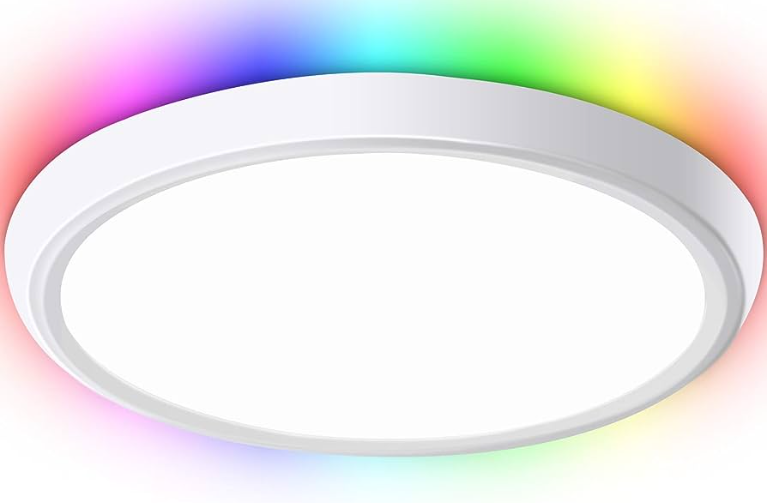
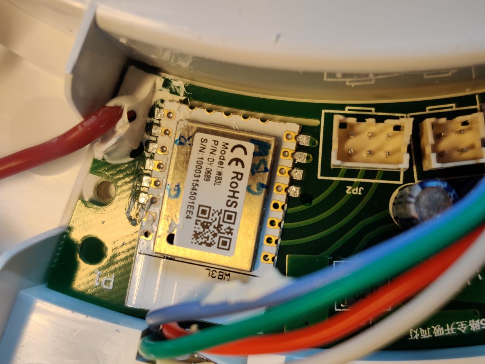
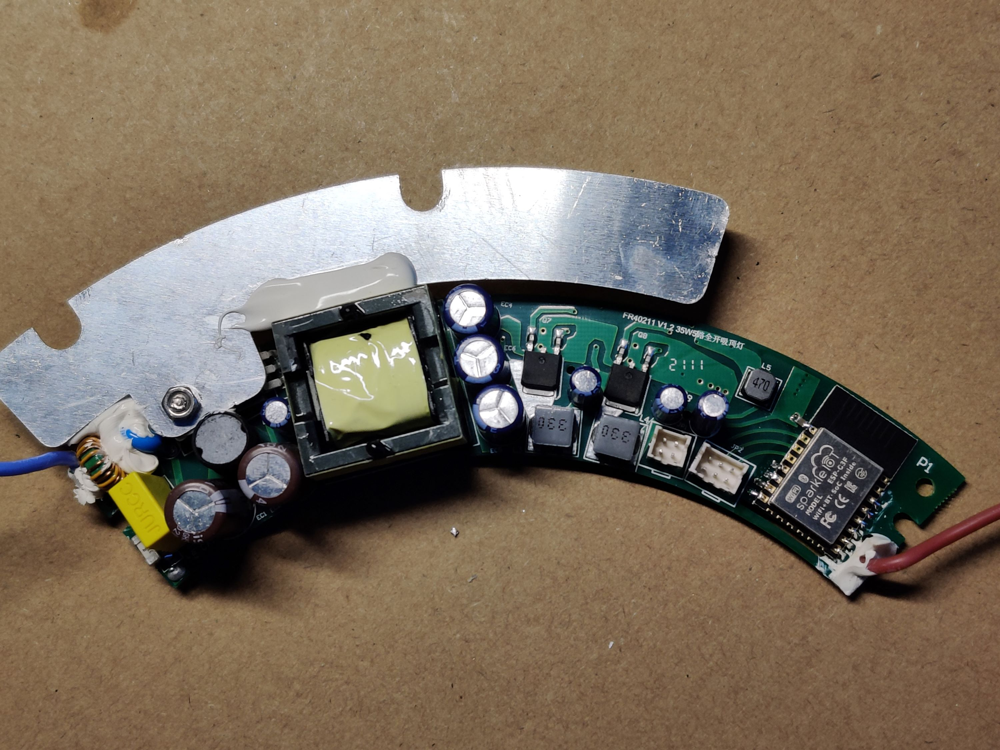

Smart ceiling light with a CW center light (2700K-6500K) and a RGB ring light. The part number is clb035-wn-c38-k1-ee-fff and advertised as either 30 or 35 watts, 100-240V AC 50/60Hz.

## Hardware Modification

This device uses a proprietary Tuya module [WB3L] and will need to be replaced with an ESP32-C3F before it can be used with ESPhome. This will require disassembly with a philips screwdriver, desoldering the module, soldering a new pre-programmed module.
The Picture below shows the proprietary module that comes with the unit. Removing the module will require heating each side with a piece of solid copper wire (18 AWG) to thermally short all pins. With one iron, a razor blade can help shim each side as it is heated to lift the module.


A Sparkleiot ESP32-C3F module is used here and was pre-programmed using an ESP test board before installing onto the light module. Compiled using Arduino framework and default qio flash mode without issue using ESPhome CLI. **It was observed that the light does not connect the reset line and this caused the ESP32 to not power up, a 0.1 uF 0805 capacitor is added between reset pin of the ESP32 and ground pad to hold the reset longer as a solution.**


## PWM Settings

Each set of LEDs (R,G,B,C,W) is controlled by a PWM output. The max duty cycle was measured with an oscilloscope from the Tuya module.

## YAML File

```yaml
substitutions:
  device_name: masterlight
  friendly_name: "Master Bedroom Overhead"

esphome:
  name: ${device_name}
  friendly_name: ${friendly_name}

esp32:
  board: esp32-c3-devkitm-1
    
# OTA flashing
ota:
  - platform: esphome

wifi: # Your Wifi network details
  
# Enable fallback hotspot in case wifi connection fails  
  ap:

# Enabling the logging component
logger:

# Enable Home Assistant API
api:

# Enable the captive portal
captive_portal:

# Enable NTP
time:
  - platform: sntp
    id: my_time

# General Config
text_sensor:
  - platform: version
    name: "${device_name} Version"
  - platform: wifi_info
    ip_address:
      name: "${device_name} IP Address"
    ssid:
      name: "${device_name} SSID"
    bssid:
      name: "${device_name} BSSID"

sensor:
  - platform: wifi_signal
    name: "${device_name} WiFi Signal"
    update_interval: 60s
    filters:
      - delta: 0.01
      - throttle: 300s
  - platform: uptime
    name: "${device_name} Uptime"
    filters:
      - throttle: 300s

light:
  # RGB Mood Light
  - platform: rgb
    name: "RGB Light"
    red: output_pwm1
    green: output_pwm2
    blue: output_pwm3
    restore_mode: RESTORE_DEFAULT_OFF
  # Temperature controlled light
  - platform: cwww
    name: "Room Light"
    cold_white: output_pwm4
    warm_white: output_pwm5
    cold_white_color_temperature: 6500 K
    warm_white_color_temperature: 2700 K
    constant_brightness: True
    restore_mode: RESTORE_DEFAULT_ON

output:
  # Red PWM
  - platform: ledc
    id: output_pwm1
    pin: GPIO10
    zero_means_zero: True
  # Green PWM
  - platform: ledc
    id: output_pwm2
    pin: GPIO3
    max_power: 70%
    zero_means_zero: True
  # Blue PWM
  - platform: ledc
    id: output_pwm3
    pin: GPIO4
    max_power: 75%
    zero_means_zero: True
  # Cool PWM
  - platform: ledc
    id: output_pwm4
    pin: GPIO18
    zero_means_zero: True
  # Warm PWM
  - platform: ledc
    id: output_pwm5
    pin: GPIO5
    zero_means_zero: True
```
