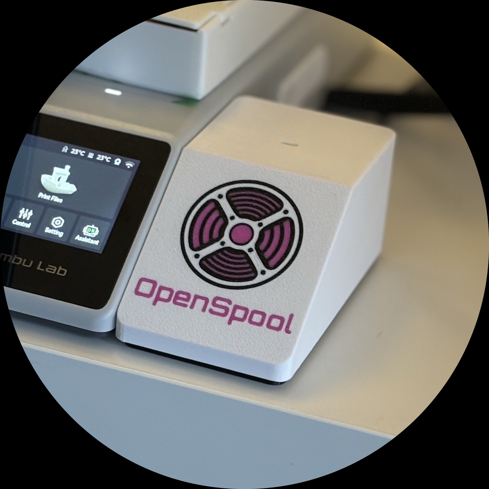
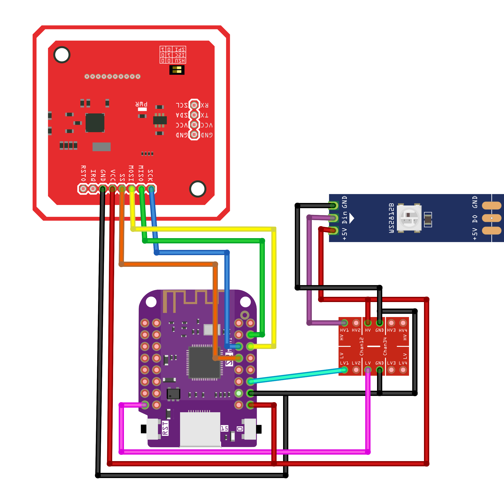
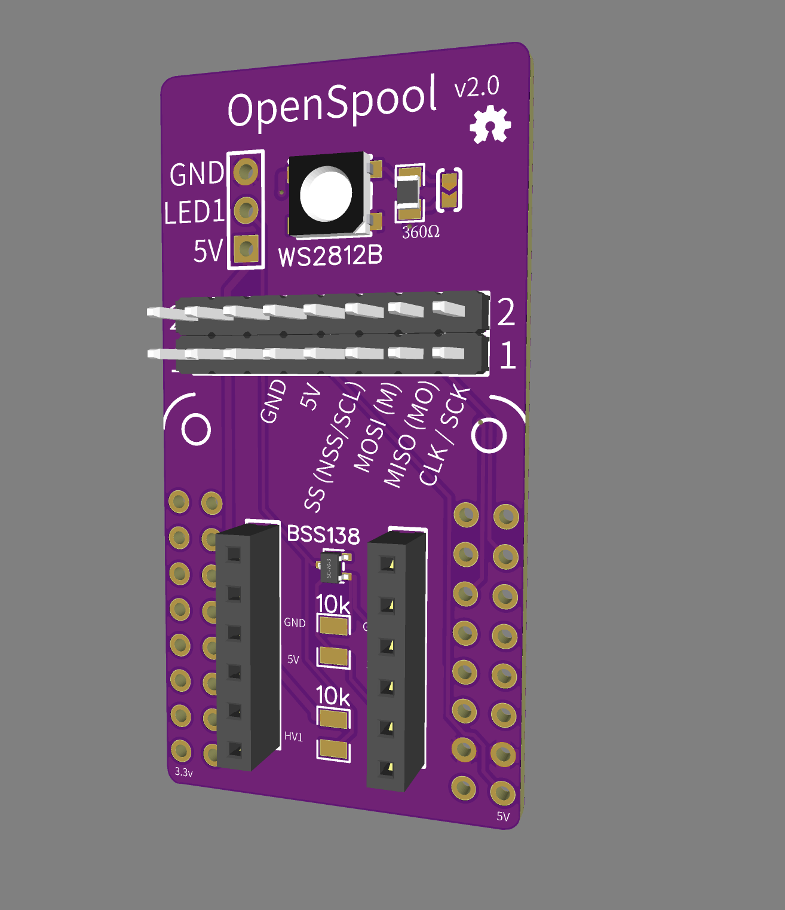

OpenSpool is an open source RFID reader for 3d printer filament spools.
It synchronizes the type/color with bambu 3d printers.

## Hardware

- Esp32-s2
- PN532 RFID Reader
- Led Strip
- NTAG 215 - NFC tags

### Images

  

## Resources

- Documentation/Firmware: [https://openspool.io](https://openspool.io)
- Code: [github.com/spuder/OpenSpool](https://github.com/spuder/OpenSpool)
