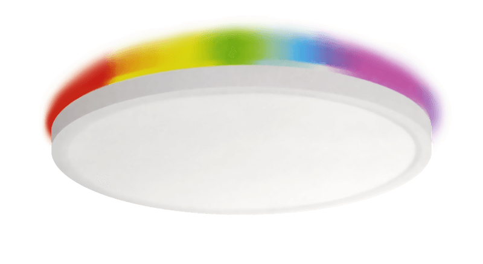
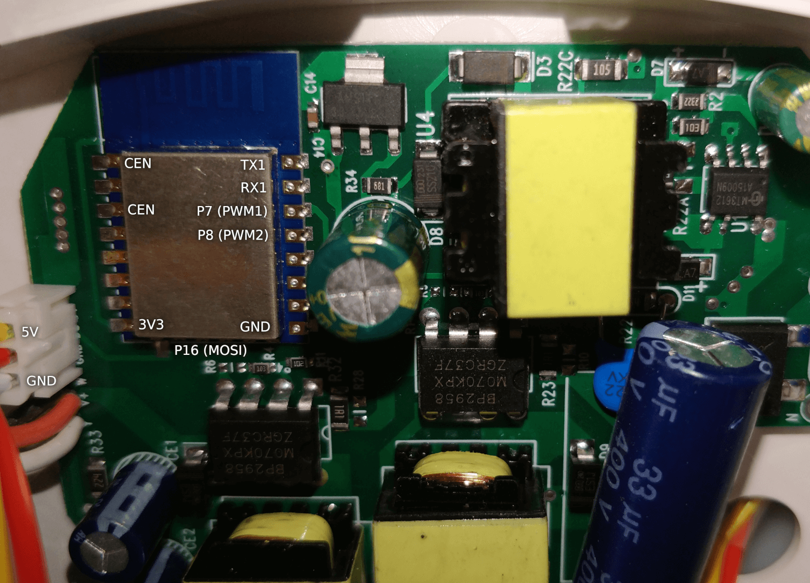

Available on Amazon ([DE](https://www.amazon.de/Oyajia-Deckenleuchte-Bluetooth-Wifi-Fernbedienung-Deckenlampe/dp/B0BN65QGFP), [FR](https://www.amazon.fr/intelligente-t%C3%A9l%C3%A9commande-Bluetooth-Wifi-Contr%C3%B4lable-lapplication/dp/B0BN65QGFP), [IT](https://www.amazon.it/dimmerabile-telecomando-Bluetooth-intelligente-compatibile/dp/B0BN65QGFP))



Smart ceiling light with a CCT center light (2800K-6500K) and an addressable RGB ring light. The model number is AS105 and advertised as 4000 lm, 40 watts (30W white + 10W RGB), 85-265V AC.

This device contains an unmarked Tuya module based on the BK7231N. If you plan to replace this module please carefully check the pinout of the new module and the supported functions of each pin. The ESP8266 (ESP-12F) is not compatible with this lamp.

The included Bluetooth remote control is currently not compatible with ESPHome but this might change in the future.

## Flashing

There is no programming header on the circuit board. For serial flashing you need to solder wires directly to the Tuya module.



## PWM Settings

Each set of white LEDs (CW, WW) is controlled by a PWM output. A duty cycle of about 14% is required to turn on each light output channel.

## YAML File

```yaml
esphome:
  name: led-ceiling-light
  friendly_name: "LED Ceiling Light"
  project:
    name: "Oyajia.AS105"
    version: "AS105"
  on_boot:
    priority: 600
    then:
    - light.turn_on:
        id: white_light
        brightness: 70%
        color_temperature: 2800 K

bk72xx:
  board: generic-bk7231n-qfn32-tuya
    
# OTA flashing
ota:
  - platform: esphome

wifi: # Your Wifi network details
  
# Enable fallback hotspot in case wifi connection fails  
  ap:

# Enabling the logging component
logger:
  baud_rate: 2000000  # The original firmware uses the same baud rate for log outputs
  hardware_uart: UART1

# Enable Home Assistant API
api:

# Enable the captive portal
captive_portal:

external_components:
  - source: github://pr#6515
    components: [beken_spi_led_strip]
    refresh: always

light:
  - platform: cwww
    id: white_light
    name: "White Light"
    cold_white: output_cw
    warm_white: output_ww
    cold_white_color_temperature: 6500 K
    warm_white_color_temperature: 2800 K
    constant_brightness: true

  - platform: beken_spi_led_strip
    id: color_light
    name: "Color Light"
    pin: P16
    chipset: WS2812
    num_leds: 60
    rgb_order: GRB

output:
  - platform: libretiny_pwm
    id: output_cw
    pin: PWM1
    # min_power: 14%
    # zero_means_zero: True
  - platform: libretiny_pwm
    id: output_ww
    pin: PWM2
    # min_power: 14%
    # zero_means_zero: True

```
