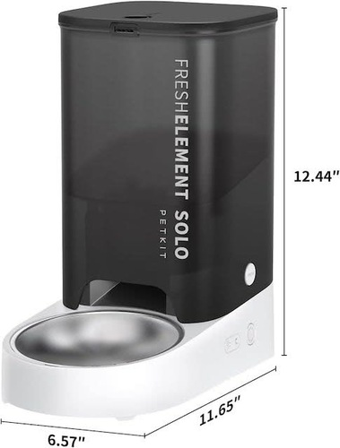

## Product description

This is an automatic pet feeder for cat/dog sized pets with a proprietary cloud based app. The mainboard has an ESP32-WROOM-32D chip on it and thus can be flashed with an ESPHome firmware to be controlled locally.

The feeder comes with a US power adapter and a barrel connector if ordered from [Amazon US](https://www.amazon.com/dp/B0CFV4B369), but can be powered by any 5V power adapter with a barrel connector.

Official product [page](https://petkit.com/products/fresh-element-solo).

## Dissasembly

The feeder base has to be taken apart to access the mainboard. This requires removal of four screws at the bottom side, hidden under the rubber feet. The rubber feet have to be partially peeled off to access the screws. Once the screws are removed, gently remove the base. Quite a lot of force may be required, as the red glue (pictured in the section below) used to secure the connectors in place may be adhered to the base. A heat gun on low or a hair dryer might help to loosen up the adhesive.

## Flashing

There are two (known) revisions of the mainboard:

### Revision A

See the the wiring diagram for flashing below (borrowed from the Reddit [comment](https://www.reddit.com/r/Esphome/comments/v19c7p/comment/jvl91mi/)). Press and hold the right button (the wifi button) while plugging the adapter in, and release after a second or two to enter boot mode.


### Revision B

This board revision is covered in silicone on the front, but there are testing pads on the bottom that can be soldered to for flashing.


As with Revision A, hold the wifi button while plugging in the serial adapter and release after a couple seconds to enter boot mode.

Revision B appears to otherwise have the same pinout as Revision A.

### Internal pinout

| Pin    | Function                      |
| ------ | ----------------------------- |
| GPIO5  | Status LED                    |
| GPIO16 | RTTTL Buzzer                  |
| GPIO34 | Feed button                   |
| GPIO27 | Feeder motor sensor           |
| GPIO14 | Food optical sensor           |
| GPIO19 | Feeder motor control*         |
| GPIO33 | Feeder sensors control*       |
| GPIO18 | Feed forward control*         |
| GPIO17 | Reverse feed control*         |

\* *purpose of some of these pins is unclear*

## Config

The config below is intended to make the feeder tolerant to the Home Assistant failures, by supporting HA-offline schduling capabaility (but it still requires WiFi and Internet connection to synchronize time with SNTP servers, or the schdule won't work).

It exposes multiple entites that can be used to configure the feeding schedule for every hour of the day.\
User can set a number of scoops to be dispensed at particular hour of a day (if set to 0 - no food will be dispensed).

Food can be also dispensed manually either via hardware button on the right side of the feeder, or via the switch entity.\
The portion size of the manual dispense is configured separately using a slider.

Low food level threshold value allows the feeder to dispatch an `esphome.feeder_food_low` event with the message containing the firendly feeder name (handy if multiple feeders are in use), when a food sensor counts per scoop gets below the threshold.\
Feeder will also play a siren sound hourly between 7am and 10pm (7 and 22) inclusively, unless sounds are muted via dedicated switch.\
An automation can be configured to listen to the event and notify users about low food level (example is at the end).

```yaml
substitutions:
  name: fresh-element-solo
  friendly_name: Petkit Fresh Element Solo
  device_description: "Petkit Fresh Element Solo Pet Feeder"
  default_scoops: "1"
  min_scoops: "0"
  max_scoops: "6"
  name_add_mac_suffix: "false"

esphome:
  name: $name
  friendly_name: $friendly_name
  name_add_mac_suffix: $name_add_mac_suffix
  comment: $device_description
  on_boot:
    - light.turn_on:
        id: led
        effect: fast_blink  

esp32:
  board: esp32dev
  framework:
    type: arduino

logger:
  level: INFO
  baud_rate: 0

web_server:
  port: 80

globals:
  - id: scoops_count
    type: int
  - id: max_scoops
    type: int
  - id: food_sensor_count
    type: int
  - id: last_food_sensor_count
    type: int  
    initial_value: '0'
    restore_value: True
  - id: last_food_scoops_count
    type: int  
    initial_value: '0'
    restore_value: True

script:
  - id: play_rtttl
    parameters:
      song_str: string
    then:
      - if:
          condition:
            lambda: return !(id(mute_sounds).state);
          then:
            - rtttl.play:
                rtttl: !lambda 'return song_str;'
  - id: actuate_feeder
    parameters:
      scoops: int
    then:
      - if:
          condition:
            lambda: return scoops > 0;
          then:
            - logger.log:
                level: INFO
                format: "Serving %d scoops"
                args: [ scoops ]
            - lambda: |-
                id(play_rtttl)->execute("two_shorts:d=4,o=5,b=100:16e6,16e6");
                id(scoops_count) = 0;
                id(food_sensor_count) = 0;
                id(max_scoops) = scoops;
            - switch.turn_on: feed_forward
  - id: dispatch_feeder_food_dispensed_event
    parameters:
      event_message: string
    then:
      - homeassistant.event:
          event: esphome.feeder_food_dispensed
          data:
            message: !lambda return event_message;
  - id: dispatch_feeder_food_low_event
    parameters:
      event_message: string
    then:
      - homeassistant.event:
          event: esphome.feeder_food_low
          data:
            message: !lambda return event_message;
  - id: check_food_level
    parameters:
      food_dispensed: bool
      play_sound: bool
      send_event: bool
    then:
      lambda: |-
        if (id(last_food_scoops_count) > 0 && id(last_food_sensor_count) / id(last_food_scoops_count) < id(low_food_threshold).state) {
          if (play_sound) {
            id(play_rtttl)->execute("siren:d=8,o=5,b=100:d,e,d,e,d,e,d,e");  
          }
          if (send_event) {
            id(dispatch_feeder_food_low_event)->execute("${friendly_name} food level is low. Check the hopper.");
          }
          id(feeder_state).publish_state("Food level is low");
          ESP_LOGI("main", "Food level is low");
        } else if (food_dispensed) {
          id(feeder_state).publish_state("Food dispensed");
          id(play_rtttl)->execute("one_short:d=4,o=5,b=100:16e6");
          if (id(last_food_scoops_count) == 1) {
            id(dispatch_feeder_food_dispensed_event)->execute("${friendly_name} dispensed 1 scoop of food.");
          } else {
            id(dispatch_feeder_food_dispensed_event)->execute("${friendly_name} dispensed " + to_string(id(scoops_count)) + " scoops of food.");
          }
        }

light:
  - platform: binary
    id: led
    output: led_output
    effects:
      - strobe:
          name: fast_blink
          colors:
            - state: True
              duration: 125ms
            - state: False
              duration: 125ms
    internal: True

output:
  - id: led_output
    platform: gpio
    pin: GPIO5
  - platform: ledc
    pin: GPIO16
    id: rtttl_output

rtttl:
  output: rtttl_output

interval:
  - interval: 1s
    then:
      if:
        condition:
          wifi.connected:
        then:
          - light.turn_on:
              id: led
              effect: None
        else:
          - light.turn_on:
              id: led
              effect: fast_blink

uart:
  tx_pin: GPIO1
  rx_pin: GPIO3
  baud_rate: 9600

number:
  - platform: template
    id: default_scoops
    name: "Manual dispense scoops"
    icon: mdi:cup
    entity_category: config
    min_value: 1
    max_value: $max_scoops
    initial_value: 1
    optimistic: true
    step: 1
    restore_value: true
    unit_of_measurement: scoops
    mode: slider
  - platform: template
    id: low_food_threshold
    # Minimum food quantity per scoop (specific to a particular dry food).
    name: "Low food threshold"
    icon: mdi:cup-outline
    entity_category: config
    min_value: 1
    max_value: 10
    initial_value: 5
    optimistic: true
    step: 1
    restore_value: true
    mode: slider
  - platform: template
    id: schedule_cups_0000
    name: "00:00 cups"
    icon: mdi:cup
    entity_category: config
    min_value: $min_scoops
    max_value: $max_scoops
    initial_value: 0
    optimistic: true
    step: 1
    restore_value: true
    unit_of_measurement: scoops
    mode: slider
  - platform: template
    id: schedule_cups_0100
    name: "01:00 cups"
    icon: mdi:cup
    entity_category: config
    min_value: $min_scoops
    max_value: $max_scoops
    initial_value: 0
    optimistic: true
    step: 1
    restore_value: true
    unit_of_measurement: scoops
    mode: slider
  - platform: template
    id: schedule_cups_0200
    name: "02:00 cups"
    icon: mdi:cup
    entity_category: config
    min_value: $min_scoops
    max_value: $max_scoops
    initial_value: 0
    optimistic: true
    step: 1
    restore_value: true
    unit_of_measurement: scoops
    mode: slider
  - platform: template
    id: schedule_cups_0300
    name: "03:00 cups"
    icon: mdi:cup
    entity_category: config
    min_value: $min_scoops
    max_value: $max_scoops
    initial_value: 0
    optimistic: true
    step: 1
    restore_value: true
    unit_of_measurement: scoops
    mode: slider
  - platform: template
    id: schedule_cups_0400
    name: "04:00 cups"
    icon: mdi:cup
    entity_category: config
    min_value: $min_scoops
    max_value: $max_scoops
    initial_value: 0
    optimistic: true
    step: 1
    restore_value: true
    unit_of_measurement: scoops
    mode: slider
  - platform: template
    id: schedule_cups_0500
    name: "05:00 cups"
    icon: mdi:cup
    entity_category: config
    min_value: $min_scoops
    max_value: $max_scoops
    initial_value: 0
    optimistic: true
    step: 1
    restore_value: true
    unit_of_measurement: scoops
    mode: slider
  - platform: template
    id: schedule_cups_0600
    name: "06:00 cups"
    icon: mdi:cup
    entity_category: config
    min_value: $min_scoops
    max_value: $max_scoops
    initial_value: 0
    optimistic: true
    step: 1
    restore_value: true
    unit_of_measurement: scoops
    mode: slider
  - platform: template
    id: schedule_cups_0700
    name: "07:00 cups"
    icon: mdi:cup
    entity_category: config
    min_value: $min_scoops
    max_value: $max_scoops
    initial_value: 0
    optimistic: true
    step: 1
    restore_value: true
    unit_of_measurement: scoops
    mode: slider
  - platform: template
    id: schedule_cups_0800
    name: "08:00 cups"
    icon: mdi:cup
    entity_category: config
    min_value: $min_scoops
    max_value: $max_scoops
    initial_value: 0
    optimistic: true
    step: 1
    restore_value: true
    unit_of_measurement: scoops
    mode: slider
  - platform: template
    id: schedule_cups_0900
    name: "09:00 cups"
    icon: mdi:cup
    entity_category: config
    min_value: $min_scoops
    max_value: $max_scoops
    initial_value: 0
    optimistic: true
    step: 1
    restore_value: true
    unit_of_measurement: scoops
    mode: slider
  - platform: template
    id: schedule_cups_1000
    name: "10:00 cups"
    icon: mdi:cup
    entity_category: config
    min_value: $min_scoops
    max_value: $max_scoops
    initial_value: 0
    optimistic: true
    step: 1
    restore_value: true
    unit_of_measurement: scoops
    mode: slider
  - platform: template
    id: schedule_cups_1100
    name: "11:00 cups"
    icon: mdi:cup
    entity_category: config
    min_value: $min_scoops
    max_value: $max_scoops
    initial_value: 0
    optimistic: true
    step: 1
    restore_value: true
    unit_of_measurement: scoops
    mode: slider
  - platform: template
    id: schedule_cups_1200
    name: "12:00 cups"
    icon: mdi:cup
    entity_category: config
    min_value: $min_scoops
    max_value: $max_scoops
    initial_value: 0
    optimistic: true
    step: 1
    restore_value: true
    unit_of_measurement: scoops
    mode: slider
  - platform: template
    id: schedule_cups_1300
    name: "13:00 cups"
    icon: mdi:cup
    entity_category: config
    min_value: $min_scoops
    max_value: $max_scoops
    initial_value: 0
    optimistic: true
    step: 1
    restore_value: true
    unit_of_measurement: scoops
    mode: slider
  - platform: template
    id: schedule_cups_1400
    name: "14:00 cups"
    icon: mdi:cup
    entity_category: config
    min_value: $min_scoops
    max_value: $max_scoops
    initial_value: 0
    optimistic: true
    step: 1
    restore_value: true
    unit_of_measurement: scoops
    mode: slider
  - platform: template
    id: schedule_cups_1500
    name: "15:00 cups"
    icon: mdi:cup
    entity_category: config
    min_value: $min_scoops
    max_value: $max_scoops
    initial_value: 0
    optimistic: true
    step: 1
    restore_value: true
    unit_of_measurement: scoops
    mode: slider
  - platform: template
    id: schedule_cups_1600
    name: "16:00 cups"
    icon: mdi:cup
    entity_category: config
    min_value: $min_scoops
    max_value: $max_scoops
    initial_value: 0
    optimistic: true
    step: 1
    restore_value: true
    unit_of_measurement: scoops
    mode: slider
  - platform: template
    id: schedule_cups_1700
    name: "17:00 cups"
    icon: mdi:cup
    entity_category: config
    min_value: $min_scoops
    max_value: $max_scoops
    initial_value: 0
    optimistic: true
    step: 1
    restore_value: true
    unit_of_measurement: scoops
    mode: slider
  - platform: template
    id: schedule_cups_1800
    name: "18:00 cups"
    icon: mdi:cup
    entity_category: config
    min_value: $min_scoops
    max_value: $max_scoops
    initial_value: 0
    optimistic: true
    step: 1
    restore_value: true
    unit_of_measurement: scoops
    mode: slider
  - platform: template
    id: schedule_cups_1900
    name: "19:00 cups"
    icon: mdi:cup
    entity_category: config
    min_value: $min_scoops
    max_value: $max_scoops
    initial_value: 0
    optimistic: true
    step: 1
    restore_value: true
    unit_of_measurement: scoops
    mode: slider
  - platform: template
    id: schedule_cups_2000
    name: "20:00 cups"
    icon: mdi:cup
    entity_category: config
    min_value: $min_scoops
    max_value: $max_scoops
    initial_value: 0
    optimistic: true
    step: 1
    restore_value: true
    unit_of_measurement: scoops
    mode: slider
  - platform: template
    id: schedule_cups_2100
    name: "21:00 cups"
    icon: mdi:cup
    entity_category: config
    min_value: $min_scoops
    max_value: $max_scoops
    initial_value: 0
    optimistic: true
    step: 1
    restore_value: true
    unit_of_measurement: scoops
    mode: slider
  - platform: template
    id: schedule_cups_2200
    name: "22:00 cups"
    icon: mdi:cup
    entity_category: config
    min_value: $min_scoops
    max_value: $max_scoops
    initial_value: 0
    optimistic: true
    step: 1
    restore_value: true
    unit_of_measurement: scoops
    mode: slider
  - platform: template
    id: schedule_cups_2300
    name: "23:00 cups"
    icon: mdi:cup
    entity_category: config
    min_value: $min_scoops
    max_value: $max_scoops
    initial_value: 0
    optimistic: true
    step: 1
    restore_value: true
    unit_of_measurement: scoops
    mode: slider

time:
  - id: sntp_time
    platform: sntp
    on_time:
      # Hourly
      - hours: 7-22
        minutes: 0
        seconds: 0
        then:
          - lambda: |-
              id(check_food_level)->execute(/* food_dispensed = */ false, /* play_sound = */ true, /* send_event = */ false);
      - hours: '*'
        minutes: 0
        seconds: 0
        then:
          - lambda: |-
              auto hour = id(sntp_time).now().hour;
              switch (hour) {
                case 0: id(actuate_feeder)->execute((int) id(schedule_cups_0000).state); break;
                case 1: id(actuate_feeder)->execute((int) id(schedule_cups_0100).state); break;
                case 2: id(actuate_feeder)->execute((int) id(schedule_cups_0200).state); break;
                case 3: id(actuate_feeder)->execute((int) id(schedule_cups_0300).state); break;
                case 4: id(actuate_feeder)->execute((int) id(schedule_cups_0400).state); break;
                case 5: id(actuate_feeder)->execute((int) id(schedule_cups_0500).state); break;
                case 6: id(actuate_feeder)->execute((int) id(schedule_cups_0600).state); break;
                case 7: id(actuate_feeder)->execute((int) id(schedule_cups_0700).state); break;
                case 8: id(actuate_feeder)->execute((int) id(schedule_cups_0800).state); break;
                case 9: id(actuate_feeder)->execute((int) id(schedule_cups_0900).state); break;
                case 10: id(actuate_feeder)->execute((int) id(schedule_cups_1000).state); break;
                case 11: id(actuate_feeder)->execute((int) id(schedule_cups_1100).state); break;
                case 12: id(actuate_feeder)->execute((int) id(schedule_cups_1200).state); break;
                case 13: id(actuate_feeder)->execute((int) id(schedule_cups_1300).state); break;
                case 14: id(actuate_feeder)->execute((int) id(schedule_cups_1400).state); break;
                case 15: id(actuate_feeder)->execute((int) id(schedule_cups_1500).state); break;
                case 16: id(actuate_feeder)->execute((int) id(schedule_cups_1600).state); break;
                case 17: id(actuate_feeder)->execute((int) id(schedule_cups_1700).state); break;
                case 18: id(actuate_feeder)->execute((int) id(schedule_cups_1800).state); break;
                case 19: id(actuate_feeder)->execute((int) id(schedule_cups_1900).state); break;
                case 20: id(actuate_feeder)->execute((int) id(schedule_cups_2000).state); break;
                case 21: id(actuate_feeder)->execute((int) id(schedule_cups_2100).state); break;
                case 22: id(actuate_feeder)->execute((int) id(schedule_cups_2200).state); break;
                case 23: id(actuate_feeder)->execute((int) id(schedule_cups_2300).state); break;
              }

binary_sensor:
  - id: manual_feed_button
    internal: true
    platform: gpio
    pin:
      number: GPIO34
      inverted: true
    on_press:
      then:
        - lambda: id(actuate_feeder)->execute((int) id(default_scoops).state);
  - id: motor_sensor
    internal: true
    platform: gpio
    pin:
      number: GPIO27
      inverted: true
    on_press:
      then:
        - lambda: |-
            id(scoops_count) += 1;
            if (id(scoops_count) >= id(max_scoops)) {
              id(feed_forward).turn_off();
              id(last_food_sensor_count) = id(food_sensor_count);
              id(last_food_scoops_count) = id(scoops_count);
              id(check_food_level)->execute(/* food_dispensed = */ true, /* play_sound = */ true, /* send_event = */ true);
            }
        - logger.log:
            level: INFO
            format: "%d/%d scoops served"
            args: [ id(scoops_count), id(max_scoops) ]

  - id: feed_sensor
    internal: true
    platform: gpio
    pin:
      number: GPIO14
    on_press:
      then:
        - lambda: |-
            id(food_sensor_count) += 1;

text_sensor:
  - platform: template
    name: "State"
    id: feeder_state
    entity_category: diagnostic

switch:
  - id: enable_sensors
    internal: true
    platform: gpio
    pin:
      number: GPIO33
    restore_mode: ALWAYS_ON
    disabled_by_default: true

  - id: enable_feeder_motor
    internal: true
    platform: gpio
    pin:
      number: GPIO19
    restore_mode: ALWAYS_OFF
    disabled_by_default: true

  - id: feed_forward
    internal: true
    interlock: &interlock_group [feed_forward, feed_reverse]
    platform: gpio
    pin:
      number: GPIO18
    restore_mode: ALWAYS_OFF
    on_turn_on:
      then:
        - switch.turn_on: enable_feeder_motor
    on_turn_off:
      then:
        - switch.turn_off: enable_feeder_motor

  - id: feed_reverse
    internal: true
    interlock: *interlock_group
    platform: gpio
    pin:
      number: GPIO17
    restore_mode: ALWAYS_OFF

  - id: mute_sounds
    name: Mute sounds
    icon: mdi:volume-off
    optimistic: true
    platform: template

sensor:
  - platform: wifi_signal
    name: "Signal"
    update_interval: 60s
  - platform: template
    id: dispensed_food_quantity
    name: "Dispensed food quantity"
    icon: mdi:cup
    entity_category: diagnostic
    state_class: "measurement"
    accuracy_decimals: 0
    lambda: |-
      return id(last_food_sensor_count);
  - platform: template
    id: dispensed_food_scoops
    name: "Dispensed food scoops"
    icon: mdi:cup
    entity_category: diagnostic
    state_class: "measurement"
    accuracy_decimals: 0
    lambda: |-
      return id(last_food_scoops_count);

button:
  - name: "Dispense food"
    id: dispense_food
    icon: mdi:food-turkey
    platform: template
    on_press:
      - lambda: id(actuate_feeder)->execute((int) id(default_scoops).state);
  - platform: restart
    name: "Restart"
    disabled_by_default: true
```

## Automation example

```yaml
alias: Pet feeder notifications
description: ""
trigger:
  - platform: event
    event_type: esphome.feeder_food_low
    id: food_low
  - platform: event
    event_type: esphome.feeder_food_dispensed
    id: food_dispensed
condition: []
action:
  - if:
      - condition: trigger
        id:
          - food_low
    then:
      - service: notify.notify
        metadata: {}
        data:
          message: "{{ trigger.event.data.message }}"
      - service: notify.persistent_notification
        metadata: {}
        data:
          message: "{{ trigger.event.data.message }}"
mode: single
```

*Note: currently, `esphome.feeder_food_dispensed event` is ignored to not spam the users with multiple notifications about food being dispensed multiple times a day. Only `esphome.feeder_food_low` will result in persistent notification in Home Assistant and mobile app notifications.*
